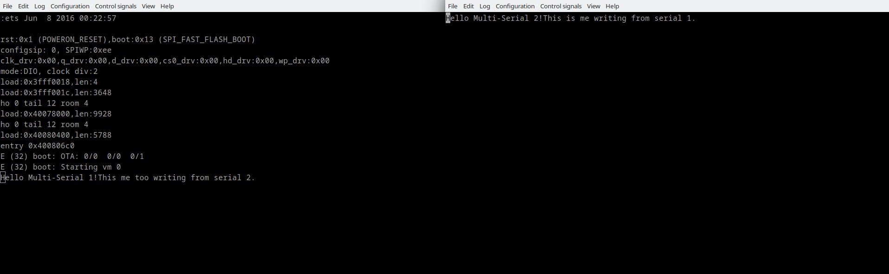

## Hello Zerynth

The simplest demo which uses serial port and GPIO to toggle the LED. After the initialization it prints "Hello Zerynth" message using the serial port, then inside the infinite loop, it toggles the GPIO pins and in the same time prints the polarity of the pins. For more information about pinout for your development board navigate to Device Pinmap using Zerynth Studio.

More information about modules used in this demo:
- [GPIO](https://docs.zerynth.com/latest/reference/core/stdlib/docs/gpio/)
- [Streams](https://docs.zerynth.com/latest/reference/core/stdlib/docs/streams/)

```python
# Import the streams module.
import streams

# Initialize appropriate pins used to drive LED as output.
pinMode(D0,OUTPUT)
pinMode(D2,OUTPUT)

# Open the default serial port.
streams.serial()

# Print initial message.
print("Hello Zerynth!")

# Infinite loop.
while True:

    print("Drive Pins HIGH")
    digitalWrite(D0, HIGH)
    digitalWrite(D2, HIGH)
    sleep(1000)

    print("Drive Pins LOW")
    digitalWrite(D0, LOW)
    digitalWrite(D2, LOW)
    sleep(1000)
```


## Multi Serial

The demonstration of multiple serial ports usage via Zerynth multi-threading. All data written to port 1 will be printed to port 2 and vice versa. There are two threads and each thread is polling the single serial port. If there is data available on the particular port it will be printed to other serial port. Due to usage of the same serial ports from different threads Lock is involved in order to achieve synchronization between threads on same object usage.

More information about modules used in this demo:
- [Streams](https://docs.zerynth.com/latest/reference/core/stdlib/docs/streams/)
- [Threading](https://docs.zerynth.com/latest/reference/core/stdlib/docs/threading/)

```py
# Import the streams and threading modules.
import streams
import threading

# Open the default serial port (SERIAL0,115200).
s1 = streams.serial(rxsize=16, txsize=16)

# Open the other serial port with custom baudrate.
s2 = streams.serial(SERIAL1, 57600, rxsize=16, txsize=16)

# Create a lock for each serial port.
slock1 = threading.Lock()
slock2 = threading.Lock()

# Print initial message.
s1.write("Hello Multi-Serial 1!")
s2.write("Hello Multi-Serial 2!")

def thread_1():
    while True:
        slock1.acquire()
        length=s1.available()
        if (length > 0):
            data=s1.read(length)

            # Lock serial 2 when using from thread 1.
            slock2.acquire()
            s2.write(data,length)
            slock2.release()

        slock1.release()

def thread_2():
    while True:
        slock2.acquire()
        length=s2.available()
        if (length > 0):
            data=s2.read(length)

            # Lock serial 1 when using from thread 2.
            slock1.acquire()
            s1.write(data,length)
            slock1.release()

        slock2.release()

# Start both threads.
thread(thread_1)
thread(thread_2)
```



## Multi Thread Basic


The basic demonstration of Zerynth multi-threading. Two threads are running in parallel, each thread toggle the single LED and in same time print the message about which thread toggle the LED and polarity of the GPIO pin.

More information about modules used in this demo:
- [Threading](https://docs.zerynth.com/latest/reference/core/stdlib/docs/threading/)
- [GPIO](https://docs.zerynth.com/latest/reference/core/stdlib/docs/gpio/)
- [Streams](https://docs.zerynth.com/latest/reference/core/stdlib/docs/streams/)

```python
# Import the streams module.
import streams

# Initialize appropriate pins used to drive LED as output.
pinMode(D0,OUTPUT)
pinMode(D2,OUTPUT)

# Open the default serial port.
streams.serial()

# Print initial message.
print("Hello Multi-Threading!")

def thread_1():
    while True:

        # Toggle appropriate first pin from infinite loop.
        print("Thread 1 - Drive Pin HIGH")
        digitalWrite(D0, HIGH)
        sleep(1000)
        print("Thread 1 - Drive Pin LOW")
        digitalWrite(D0, LOW)
        sleep(1000)

def thread_2():
    while True:

        # Toggle appropriate second pin from infinite loop.
        print("Thread 2 - Drive Pin HIGH")
        digitalWrite(D2, HIGH)
        sleep(300)
        print("Thread 2 - Drive Pin LOW")
        digitalWrite(D2, LOW)
        sleep(300)

# Start both threads.
thread(thread_1)
thread(thread_2)
```


## C Language Interface

The demonstration of how to write the C code function inside separate file which is then wrapped in python code. C functions are implemented to do basic operations of multiplying and addition of the two variables. Then inside main module they are wrapped with python functions and called in order to add and multiply two numbers.

More information about content used in this demo:
- [C Language Interface](https://docs.zerynth.com/latest/reference/guide/docs/clang/)

File which carries C source code `c_file.c` should be placed inside project folder.

```c
#include "zerynth.h"

C_NATIVE( c_addition )
{
    C_NATIVE_UNWARN();

    int32_t a;
    int32_t b;

    if ( parse_py_args( "ii", nargs, args, &a, &b ) != 2 )
    {
        return ERR_TYPE_EXC;
    }

    * res = PSMALLINT_NEW( a + b );

    return ERR_OK;
}

C_NATIVE( c_multiply )
{
    C_NATIVE_UNWARN();

    int32_t a;
    int32_t b;

    if ( parse_py_args( "ii", nargs, args, &a, &b ) != 2 )
    {
        return ERR_TYPE_EXC;
    }

    * res = PSMALLINT_NEW( a * b );

    return ERR_OK;
}
```

File which carries python code `main.py` placed inside project folder.

```py
# Import necessary modules.
import streams

# Wrap C function for adding two numbers in python.
@c_native("c_addition", ["c_file.c"], [])
def py_addition(a, b):
        pass

# Wrap C function for multiplying two numbers in python.
@c_native("c_multiply", ["c_file.c"], [])
def py_multiply(a, b):
        pass

# Open the default serial port.
streams.serial()

print("Hello C Language Interface")

A = 1
B = 1

while True:

    # Call wrapper functions and print result.
    add = py_addition(A, B)
    multiply = py_multiply(A, B)
    print("A = ", A, " B = ", B, " Added = ", add, " Multiplied = ", multiply)
    A = A + 1
    B = B + 1
    sleep(2000)
```


## ADC

This demonstration of ADC usage. During first ADC readout, single sample will be read and then converted to the real voltage based on ADC resolution and reference voltage. During second readout, 4 samples will be read from the single analog pin with default sampling period. During the third readout, 4 samples will be read from two analog pins.

More information about modules used in this demo:
- [ADC](https://docs.zerynth.com/latest/reference/guide/docs/vhal/#adc)

```py
# Import necessary modules.
import streams
import adc

# Reference voltage and ADC resolution values.
VOLTAGE_REFERENCE = 3.3
ADC_RESOLUTION = 4095

# Open the default serial port.
streams.serial()

# Print initial message.
print("Hello ADC!")

while True:

    # Single ADC sample read from A0 pin.
    val = adc.read(A0)
    print("Single sample: ", val)

    # Convert ADC read to voltage.
    voltage = val * VOLTAGE_REFERENCE / ADC_RESOLUTION.
    print("Voltage: ", val, " V")

    # Acquire 4 samples with default sampling period.
    samples = adc.read(A0, 4)
    print("Samples: ", samples)

    # Acquire 4 samples from 2 analog pins with default sampling period.
    more_samples = adc.read([A0, A1], 4)
    print("More samples A0, A1: ", more_samples)
    sleep(300)
```


## I2C

The demonstration of i2c module usage, where BME260 sensor by Bosch is used as slave device. After the initialization of the I2C bus we are reading the device ID from the sensor in three different ways - each way is implemented in separated thread. Also every thread uses lock mechanism to prevent interferences. For this particular sensor device id is placed inside register on address 0x0D and the content of the register should be 0x60.

More information about modules used in this demo:

- [I2C](https://docs.zerynth.com/latest/reference/core/stdlib/docs/i2c/)

```py
# Import the streams and i2c modules.
import streams
import i2c

# I2C address of the sensor
BME260_ADDRESS = 0x76

# Open the default seral for print
streams.serial()

# Create sensor object
sensor = i2c.I2C(I2C2, BME260_ADDRESS, 400000)
sensor.start()

# Print initial message.
sleep(1000)
print("I2C bus for BME260 Initialized")

# All threads read one byte from register on address 0x00.

def thread_1():
    while True:
        sensor.lock()

        # Write register address first.
        sensor.write(0xD0)

        # Read one byte which carry content of the register.
        id = sensor.read(1)
        sensor.unlock()

        # Print the data read.
        print("Thread 1 - Sensor ID: ", hex(id[0]))
        sleep(800)

def thread_2():
    while True:
        sensor.lock()

        # Write register address first.
        sensor.write_bytes(0xD0)

        # Read one byte which carry content of the register.
        id = sensor.read(1)
        sensor.unlock()

        # Print the data read.
        print("Thread 2 - Sensor ID: ", hex(id[0]))
        sleep(1000)

def thread_3( ):
    while True:
        sensor.lock()

        # Write register address, hen read one byte.
        id = sensor.write_read(0xD0, 1)
        sensor.unlock()

        # Print the data read.
        print("Thread 3 - Sensor ID: ", hex(id[0]))
        sleep(1200)

thread(thread_1)
thread(thread_2)
thread(thread_3)
```


## SPI

The demonstration of spi module usage, where BME260 sensor by Bosch is for communication. After the initialization of the SPI bus we are reading the device ID from the sensor in two different ways - each way is implemented in separated thread. Also every thread uses lock mechanism to prevent interferences. For this particular sensor device id is placed inside register on address `0x0D` and the content of the register should be `0x60`.

More information about modules used in this demo:
- [SPI](https://docs.zerynth.com/latest/reference/core/stdlib/docs/spi/)


```py
# Import the streams and i2c modules.
import streams
import spi

# Open the default seral for print
streams.serial()

# Create sensor object from SPI class.
sensor = spi.Spi(D0)

# Print initial message.
sleep(1000)
print("SPI bus for BME260 Initialized")

# All threads read one byte from register on address 0xD0.

def thread_1():

    # Create buffer for IO operations.
    input = bytearray(1)
    output = bytearray(1)
    input[0] = 0xD0

    while True:
        sensor.lock()

        # Select sensor (CS) and write register address.
        sensor.select()
        sensor.write(input)

        # Read one byte which carry content of the register.
        output = sensor.read(1)
        sensor.unselect()
        sensor.unlock()

        # Print the data read.
        print("Thread 1 - Sensor ID: ", hex(output[0]))
        sleep(800)

def thread_2( ):

    # Create buffer for IO operations.
    input = bytearray(2)
    output = bytearray(2)
    input[0] = 0xD0

    while True:
        sensor.lock()

        # Select sensor (CS).
        sensor.select()

        # Exchange two bytes of data.
        output = sensor.exchange(input)
        sensor.unselect()
        sensor.unlock()

        # Print the data read.
        print("Thread 2 - Sensor ID: ", hex(output[1]))
        sleep(1000)

thread(thread_1)
thread(thread_2)
```


## Watchdog

The demonstration of how to use watchdog. It is necessary to have "Secure Firmware" VM enabled to run this demo successfully. After we initialized the watchdog to reset the MCU after 15000 milliseconds, inside the loop we increasing the delay time between watchdog kicks. When delay time become higher then 15000 ms the MCU - watchdog will reset the MCU.

More information about modules used in this demo:
- [Watchdog](https://docs.zerynth.com/latest/reference/core/stdlib/docs/sfw/#watchdogs)

```python
# Import necessary modules.
import streams
import sfw

# Set Watchdog timeout after 15 seconds.
sfw.watchdog(0, 15000)

# Open the default serial port.
streams.serial()

print("Hello Watchdog!")

# Check is the watchdog triggered.
trig = sfw.watchdog_triggered()
print("Triggered: ", trig)

delay = 1000

while True:
    print("Delaying for ", delay)
    sleep(delay)
    sfw.kick()
    delay = delay + 8000
```


## ZDM Simple

The simplest demonstration of how to use ZDM. As a preparation step it is necessary to create the device on the [ZDM Cloud](https://zdm.zerynth.com) and to store device credentials in the project folder by downloading the `zdevice.json` file. After we initialized the watchdog and default serial port, the WiFi is initialized and connected with provided parameters. Once device connect to the network the ZDM device is created locally and connected to the ZDM cloud. Then inside infinite loop we are generating some random values, creating the payload and publishing it to the ZDM cloud each 5 seconds.

More information about modules used in this demo:
- [WiFi](https://docs.zerynth.com/latest/reference/core/stdlib/docs/wireless_wifi/)
- [ZDM](https://docs.zerynth.com/latest/deploy/)

```py
# Import necessary modules.
from bsp.drivers import wifi
import streams
import sfw
from zdm import zdm

MY_SSID = "***SSID Name***"
MY_PASS = "***Network Password***"
payload_tag = "weather"

# Initialize watchdog and open the default seral for print.
sfw.watchdog(0, 15000)
sfw.kick()
streams.serial()

print("Hello simple ZDM!")

# Initialize WiFi and connect to the network.
wifi.init()
interface = wifi.interface()
interface.link( MY_SSID, interface.WIFI_WPA2, MY_PASS)
print("Connected to WiFi")

# Create a ZDM Device and connected to ZDM cloud.
device = zdm.Device()
device.connect()
print("Connected to ZDM")

while True:
    sfw.kick()

    # Get some random values as temperature and humidity.
    temp = random(19, 38)
    hum = random(50, 70)

    # Composed and send the payload.
    payload = {"temp": temp, "hum": hum}
    device.publish(payload, payload_tag)
    print("Published: ", payload)
    sleep(5000)
```

