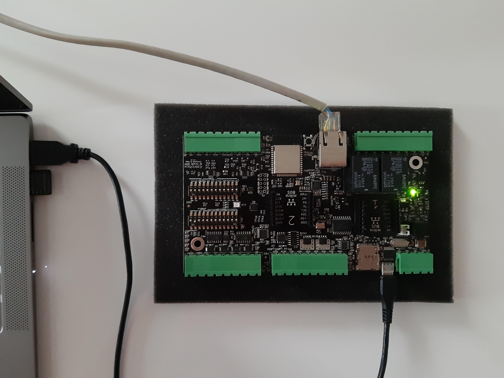
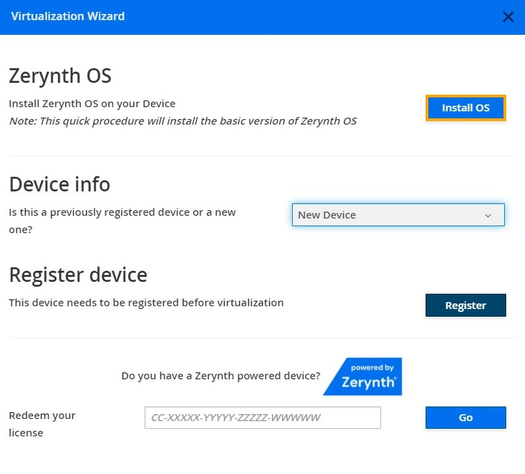
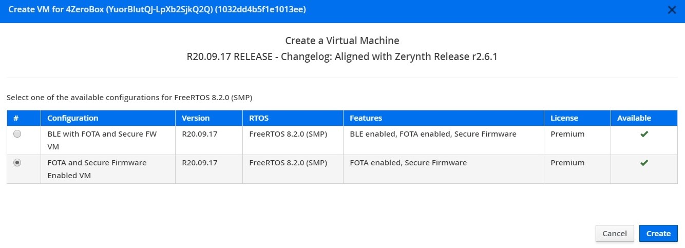
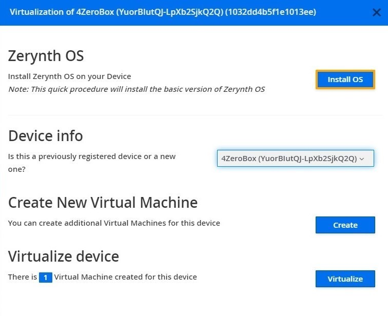
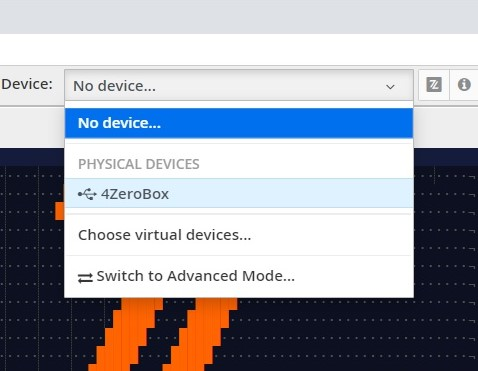
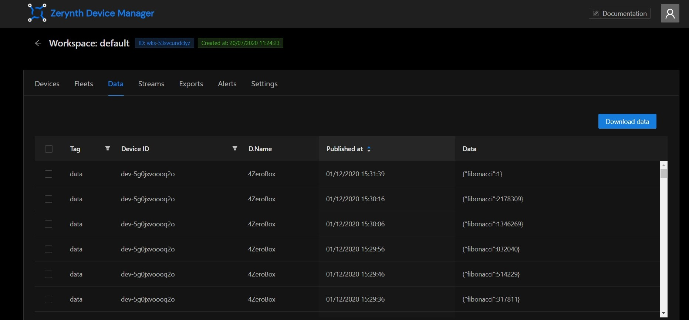
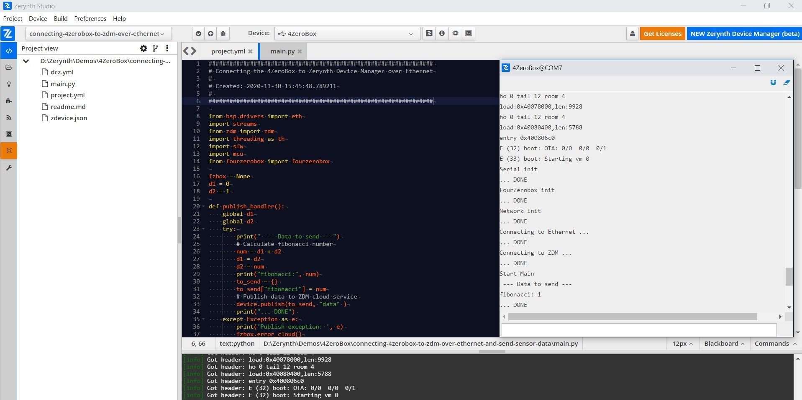

# Connecting the 4Zerobox to Zerynth Device Manager over Ethernet

In this tutorial, we will show you how to connect the 4ZeroBox to the Zerynth Device Manager sending data to a cloud service over ethernet.

Zerynth Device Manager (ZDM) is a device and data management service that makes it easy to securely register, organize, monitor, and remotely manage IoT devices at scale. 
With Zerynth Device Manager, you can manage large and diverse device fleets such as operational technology systems, machines, appliances, vehicles, and more.

In this example, we will be using:

1. [Zerynth OS](https://www.zerynth.com/zos/) - a **multithreaded Real-Time OS** that provides real hardware independence, allowing code reuse on a wide range of 32-bit microcontrollers, in a very small footprint;
2. [Zerynth SDK](https://www.zerynth.com/zsdk/) - the gateway to our platform which includes:
    - [Zerynth Toolchain](https://docs.zerynth.com/latest/reference/core/toolchain/docs/) – a command-line interface that integrates all the essential functions for the development with [Zerynth OS](https://www.zerynth.com/zos/) and the management of the Zerynth Device Manager cloud service.
    - [Zerynth Studio](https://docs.zerynth.com/latest/develop/) – an advanced [IDE](https://docs.zerynth.com/latest/reference/core/studio/docs/) for the Zerynth Toolchain. It includes development and debugging tools and numerous code examples.
3. [Zerynth Device Manager (ZDM)](https://testdocs.zerynth.com/latest/deploy/) -it helps you register, organize, monitor, and remotely manage IoT devices at scale. ZDM allows managing devices and also collects and aggregates the data they produce. ZDM integrates with all primary cloud service providers to easily connect devices to the cloud and other devices so you can remotely control your fleet. You can use ZDM to take mitigating actions such as pushing security fixes. You can also easily send firmware-over-the-air (FOTA) updates to your Zerynth OS powered devices, such as the latest software version or a new firmware update.
4. [4ZeroBox](/latest/4zp/4ZeroBox/) - a modular hardware electronic unit that simplifies the development of Industrial IoT applications allowing rapid integration with sensors, actuators, and Cloud services. 4ZeroBox is programmable in Python (or hybrid C/Python) thanks to the Zerynth SDK.

## Hardware Setup

First, connect the 4ZeroBox and PC with a USB cable and UTP cable, as shown below:



## Board setup

Regarding the power supply, you can use a USB or external 24V power supply.

Compared to the previous versions of the 4ZeroBox, there are no jumpers, so just connect the desired power supply and continue with board setup.

## Software setup

The 4ZeroBox comes with a serial-to-usb chip on board that allows programming and opening the UART of the ESP32 module. The CH340 USB to UART chip is also connected to the boot pins of the module, allowing a seamless virtualization of the device.

!!! note
    For Linux Platform: to allow the access to the serial ports the user needs read/write access to the serial device file. Adding the user to the group that owns this file, gives the required read/write access: Ubuntu distribution –> dialout group; Arch Linux distribution –> uucp group.

Once connected on a USB port, if the drivers have been correctly installed, the 4ZeroBox device is recognized by Zerynth Studio.
Now, the user can download and Install [Zerynth Studio r.2.6.2](https://www.zerynth.com/zsdk).

Once Zerynth is installed, the user can Connect, Register, and Virtualize the device.

**1. Register the device**



**2. Create a Virtual Machine according to the requirements**



**3. Virtualize this virtual machine**



After virtualization, the 4ZeroBox is ready to be programmed and the Zerynth scripts uploaded. Just Select the virtualized device from the “Device Management Toolbar” and click the dedicated “upload” button of Zerynth Studio.



## Zerynth Device Manager Web App

In this step by step tutorial we will explain how to program the 4ZeroBox with the Zerynth SDK and connect it to the Zerynth Device Manager.

**1. Create an account**

Register or login to the [ZDM](https://zdm.zerynth.com/). The first time you access the ZDM, a default workspace and a default fleet are created for you. Workspaces and fleets are ways of organizing your devices in the ZDM. Open the workspace by clicking on it.


2. Create a device

Having accessed the workspace, it's time to create your first device! Go to the Devices tab in the workspace page, then click on the Add device button. In the popup you can provide a human readable name for the device and choose the fleet it will live in. For now, just accept the default by clicking on the Add button.


Once the device is created, it needs a set of credentials to access the ZDM endpoints in a secure way. Choosing credential types and the security level can be a daunting task. Luckily the ZDM presents you a pop-up with sensible defaults. Just press the OK button and you get a medium level of security just out of the box.


Once the credentials are ready, you can download them into a zdevice.json file. Keep it around, you will need it shortly.


## Implementation

In this section, we will run a very simple application which will connect the 4ZeroBox to the Zerynth Device Manager and send fibonacci numbers as data to the cloud service. At the same time data will be printed on the console, so you can monitor both ZDM devices and physical devices in parallel. 

So, let’s start with the implementation.

**1. Create and setup the advanced project configuration**

Let’s create a new project by clicking Project, then New and choose the location and name for your project. After it is created and appears in the project view. Double click the ‘project.yml’ to open it in the editor. Now replace the `config: {}` with this text.

```py
config:
	# enable ethernet connection
	NETWORK_ETH: true
	# enable wifi connection
	NETWORK_WIFI: null
	# enable gsm connection
	NETWORK_GSM: null
	# enable ADC 0-10v/4-20mA peripheral
	ADC_010_420: null
	# enable ADC resistive peripheral
	ADC_RESISTIVE: null
	# enable ADC current peripheral
	ADC_CURRENT: null
	# enable can peripheral
	CAN_ENABLE: null
	# enable RS485 peripheral
	RS485_ENABLE: null
	# enable RS232 peripheral
	RS232_ENABLE: null
	# enable SD Card
	SDCARD_ENABLED: null
	# enable DEBUG for fourzerobox
	DEBUG_FZB: null
```

By pasting this inside `project.yml` we have enabled the usage of Ethernet - as you can see ethernet has the value `true` compared to others which are `null`.

**Copy the `zdevice.json` saved in previous steps to the project folder.**

**2. System Initialization** 

Let’s first import all necessary modules and create a sequence which will initialize the system. 

In this example, we are using a watchdog timer that must be reset every pre-defined period. Alongside with that we will initialize serial and create an instance of the fourzerobox class.

```py
from bsp.drivers import eth
import streams
from zdm import zdm
import threading as th
import sfw
import mcu
from fourzerobox import fourzerobox

fzbox = None

# Initialize system
sfw.watchdog(0, 60000)
streams.serial()
print("Serial init\r\n... DONE")
try:
    print("FourZerobox init")
    fzbox = fourzerobox.FourZeroBox()
    print("... DONE")
except Exception as e:
    print('Init exception: ', e)
    mcu.reset()
```
**3. Setup Ethernet connection and connect to the ZDM**

Now let’s initialize the ethernet connection and setup the connection to the ZDM. 

```py
# Setup connection
try:
    print("Network init")
    fzbox.net_init()
    print("... DONE")
    print("Connecting to Ethernet ...")
    fzbox.net_connect()
    print("... DONE")
    print("Connecting to ZDM ...")
    device = zdm.Device()
    device.connect()
    print("... DONE")
except Exception as e:
    print('Connect exception: ', e)
    fzbox.pulse('R', 10000)
    mcu.reset()
```

As you can see, it is pretty simple, except for network parameters there are no hardcoded strings needed to make a connection between a physical hardware device and a virtual cloud device - all of that is automatically provided from the zdevice.json file, which we copied in the previous steps.

**4. Publish function**

In this step we will create the function which will publish the data to the cloud. As we said before, for the sake of simplicity, there is no sensor which provides us with some measurements so we will implement the simple algorithm which calculates the fibonacci sequence.

```py
def publish_handler():
	global d1
	global d2
	try:
    		print(" --- Data to send ---")
    	# Calculate fibonacci number
    		num = d1 + d2
    	d1 = d2
    		d2 = num
    	print("fibonacci:", num)
    	to_send = {}
    		to_send["fibonacci"] = num
    	# Publish data to ZDM cloud service
    		device.publish(to_send, "data" )
    	print("... DONE")
	except Exception as e:
    		print('Publish exception: ', e)
    	fzbox.error_cloud()
    		mcu.reset()
```

As you can see - sending is pretty easy - the single method call is enough to send data to the cloud. 

**5. Main loop**

As a final step it remains to implement a main loop. For that purpose we need nothing more than a simple `while ` loop executed each 10 seconds, for example.

```py
# Main Loop
try:
    print("Start Main")
    while True:
        publish_handler()
        sfw.kick()
        sleep(10000)
except Exception as e:
    print('Run exception: ', e)
    fzbox.pulse('R', 10000)
    mcu.reset()
```
Here, you can see a picture of the folder structure:


After compilation of the code and uplinking to the 4ZeroBox you will be able to monitor the fibonacci sequence on the Console and ZDM web application in parallel. 





## Summary

As you can see, in this tutorial, connecting your device to ZDM is very simple. Of course, for some real use-cases it is necessary to implement additional things like sensor readings etc. but the purpose of this tutorial was to show you the basics.

We hope you enjoyed our new demo. Feel free to join our community forum if you have any additional questions.

The complete 4ZeroBox documentation is available at: https://docs.zerynth.com/latest/4zp/4ZeroBox/.

The user can find the complete 4ZeroBox documentation at this [link](/latest/4zp/4ZeroBox/).

[Here](https://docs.zerynth.com/latest/demos/4zerobox/Hello_4ZeroBox/) is the link for all available 4ZeroBox demos.

Other useful documents are:

- [Quick Guide](https://www.zerynth.com/download/15283/),
- [Brochure](https://www.zerynth.com/download/13895/),
- [Examples](/latest/reference/libs/zerynth/zdm/docs/examples/).

We have a [5 minute tutorial](https://testdocs.zerynth.com/latest/gettingstarted/) to get you started with the ZDM.

ZDM can be easily accessed via the Web App at https://zdm.zerynth.com or, for more advanced usages, via the ZDM Command Line Interface integrated in the Zerynth SDK (download from https://www.zerynth.com/zsdk/).

You can also follow the tutorial on the ZDM [Web Interface](https://docs.zerynth.com/latest/deploy/web_interface/) for finding your way around.

The code is available in our [GitHub repository](https://github.com/zerynth/demos-4zerobox/tree/main/connecting-the-4zerobox-to-zdm-over-ethernet).

