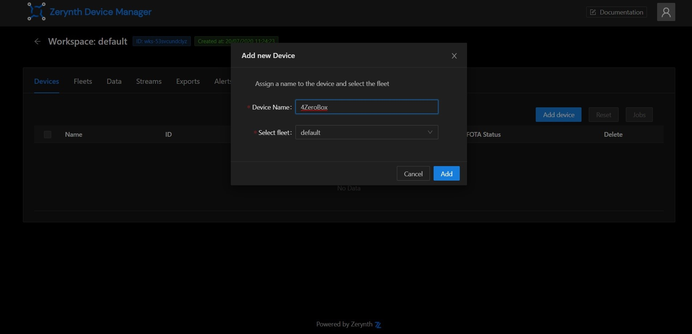

# Firmware over the air Updates for 4ZeroBox over Wifi

In this tutorial, we will show how the user can connect the 4ZeroBox to the Zerynth Device Manager sending data to a cloud service and how to use the FOTA (Firmware Over The Air) update procedure to update the firmware on the 4ZeroBox device.

Zerynth Device Manager (ZDM) is a device and data management service that makes it easy to securely register, organize, monitor, and remotely manage IoT devices at scale. 
With Zerynth Device Manager, you can manage large and diverse device fleets such as operational technology systems, machines, appliances, vehicles, and more.

In this example, we will be using:

1. [Zerynth OS](https://www.zerynth.com/zos/) - a **multithreaded Real-Time OS** that provides real hardware independence, allowing code reuse on a wide range of 32-bit microcontrollers, in a very small footprint;
2. [Zerynth SDK](https://www.zerynth.com/zsdk/) - the gateway to our platform which includes:
    - [Zerynth Toolchain](https://docs.zerynth.com/latest/reference/core/toolchain/docs/) – a command-line interface that integrates all the essential functions for the development with [Zerynth OS](https://www.zerynth.com/zos/)  and the management of the Zerynth Device Manager cloud service.
    - [Zerynth Studio](https://docs.zerynth.com/latest/develop/) – an advanced [IDE](https://docs.zerynth.com/latest/reference/core/studio/docs/) for the Zerynth Toolchain. It includes development and debugging tools and numerous code examples.
3. [Zerynth Device Manager(ZDM)](https://testdocs.zerynth.com/latest/deploy/) -it helps you register, organize, monitor, and remotely manage IoT devices at scale. ZDM allows managing devices and also collects and aggregates the data they produce. ZDM integrates with all primary cloud service providers to easily connect devices to the cloud and other devices so you can remotely control your fleet. You can use ZDM to take mitigating actions such as pushing security fixes. You can also easily send firmware-over-the-air (FOTA) updates to your Zerynth OS powered devices, such as the latest software version or a new firmware update.
4. [4ZeroBox](https://docs.zerynth.com/latest/hardware/4ZeroBox/) - a modular hardware electronic unit that simplifies the development of Industrial IoT applications allowing rapid integration with sensors, actuators, and Cloud services. 4ZeroBox is programmable in Python and C, thanks to the Zerynth SDK.

## Hardware Setup

First, connect the 4ZeroBox and PC with a USB cable, as shown below:

## Board setup:

Regarding the power supply, you can use a USB or external 24V power supply.
Compared to the previous versions of the 4ZeroBox, there are no jumpers, so just connect the desired power supply and continue with board setup.

## Software setup

The 4ZeroBox comes with a serial-to-usb chip on board that allows programming and opening the UART of the ESP32 module. The CH340 USB to UART chip is also connected to the boot pins of the module, allowing a seamless virtualization of the device.

!!! note
    For Linux Platform: to allow the access to the serial ports the user needs read/write access to the serial device file. Adding the user to the group that owns this file, gives the required read/write access: Ubuntu distribution –> dialout group; Arch Linux distribution –> uucp group.

Once connected to a USB port, if the drivers have been correctly installed, the 4ZeroBox device is recognized by Zerynth Studio.
Now, the user can download and Install [Zerynth Studio r.2.6.2](https://www.zerynth.com/zsdk). If you have already installed and virtualized your 4ZeroBox you can skip to the Implementation section.

Once Zerynth is installed, the user can Connect, Register, and Virtualize the device.

**1. Register the device**

**2. Create a Virtual Machine according to the requirements**

**3. Virtualize this virtual machine**

After virtualization, the 4ZeroBox is ready to be programmed and the Zerynth scripts uploaded. Just Select the virtualized device from the “Device Management Toolbar” and click the dedicated “upload” button of Zerynth Studio.

## Zerynth Device Manager Web App

In this step by step tutorial we will explain how to program the 4ZeroBox with the Zerynth SDK and connect it to the Zerynth Device Manager.

**1. Create an account**
   
Register or login to the [ZDM](https://zdm.zerynth.com/). The first time you access the ZDM, a default workspace and a default fleet are created for you. Workspaces and fleets are ways of organizing your devices in the ZDM. Open the workspace by clicking on it.

**2. Create a device**
   
Having accessed the workspace, it's time to create your first device! Go to the Devices tab in the workspace page, then click on the Add device button. In the popup you can provide a human readable name for the device and choose the fleet it will live in. For now, just accept the default by clicking on the Add button.

**3. Device security**
   
Once the device is created, it needs a set of credentials to access the ZDM endpoints in a secure way. Choosing credential types and the security level can be a daunting task. Luckily the ZDM presents you a pop-up with sensible defaults. Just press the OK button and you get a medium level of security just out of the box.

**4. Download configuration file**

Once the credentials are ready, you can download them into a zdevice.json file. Keep it around, you will need it shortly.

## FOTA

The FOTA (Firmware Over The Air) update procedure is used to update the firmware of one or more devices remotely.

!!! important
    In order to perform the FOTA of a device, you need to virtualize it with a “Fota Enabled” virtual machine.

The first step to start a FOTA update on your devices is to prepare and upload firmware to the ZDM cloud. To upload your firmware, open the Zerynth Studio (Zerynth studio v. 2.5.0 or higher is required). 

Open the project you want to compile and use for the FOTA (https://github.com/zerynth/demos-4zerobox/tree/main/connecting-4zerobox-to-zdm-over-wifi) and click on the Connected Devices icon on the left vertical menu.

Now click on the **ZDM FOTA Prepare** orange button and then:

1. select the ZDM device you want to update,
2. select the firmware’s project location in your local file system you want to use with FOTA (https://github.com/zerynth/demos-4zerobox/tree/main/multi-blinking-demo),
3. indicate a unique firmware version identifier, click **prepare**.

Fota has been prepared correctly! Well done!

Now click on the **open ZDM GUI** button and you will be redirected to the ZDM selected device page.

Now, choose your firmware ID and click on the **Start** button.

Your FOTA started successfully! Well done.

Now, you can check your device's FOTA state to verify the result.

And this is our result:

## Summary

Thanks to Firmware Over-the-Air (FOTA) technology, users are untethered from hardwired machines and no longer need expert technicians to manually update devices. Transmitting the information wirelessly makes FOTA fast, convenient, safe, cost-effective, and responsive. Since the implementation of FOTA is very complex, now, thanks to Zerynth ZDM, the user needs only one click to start FOTA and there is no need to write any code.

We hope you enjoyed our new demo. Feel free to join our community forum if you have any additional questions.

The complete 4ZeroBox documentation is available [here](/latest/hardware/4ZeroBox/).

The user can find the complete 4ZeroBox documentation at this [link](/latest/hardware/4ZeroBox/).

[Here](/latest/demos/4zerobox/Hello_4ZeroBox/) is the link for all available 4ZeroBox demos.

Other useful documents are:

- [Quick Guide](https://www.zerynth.com/download/15283/),
- [Brochure](https://www.zerynth.com/download/13895/),
- [Examples](/latest/reference/libs/zerynth/zdm/docs/examples/).

We have a [5 minute tutorial](/latest/gettingstarted/) to get you started with the ZDM.

ZDM can be easily accessed via the Web App at https://zdm.zerynth.com or, for more advanced usages, via the ZDM Command Line Interface integrated in the Zerynth SDK (download from https://www.zerynth.com/zsdk/).

You can also follow the tutorial on the ZDM [Web Interface](/latest/deploy/web_interface/) for finding your way around.

Both codes used for this tutorial are available at our [GitHub repository](https://github.com/zerynth/demos-4zerobox).

