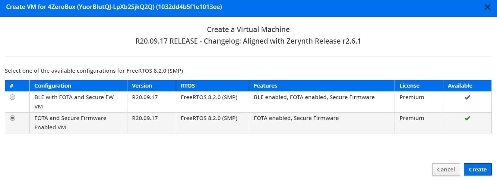
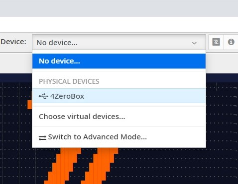

# Hello 4ZeroBox

In this tutorial, we will demonstrate how to get the 4ZeroBox up and running starting with the famous Hello Zerynth example.

In this example, we will be using:

1. [Zerynth OS](https://www.zerynth.com/zos/) - a **multithreaded Real-Time OS** that provides real hardware independence, allowing code reuse on a wide range of 32-bit microcontrollers, in a very small footprint;
   
2. [Zerynth SDK](https://www.zerynth.com/zsdk/) - the gateway to our platform which includes:
   
- **Zerynth Toolchain** – a command-line interface that integrates all the essential functions for the development with Zerynth OS  and the management of the Zerynth Device Manager cloud service.
- **Zerynth Studio** – an advanced IDE for the Zerynth Toolchain. It includes development and debugging tools and numerous code examples.
  
3. [4ZeroBox](/latest/4zp/4ZeroBox/) - a modular hardware electronic unit that simplifies the development of Industrial IoT applications allowing rapid integration with sensors, actuators, and Cloud services. 4ZeroBox is programmable in Python (or hybrid C/Python) thanks to the Zerynth SDK.

## Hardware Setup

First, connect the display and PC with a USB cable, as shown below:


## Board setup

Regarding the power supply, you can use a USB or external 24V power supply.
Compared to the previous versions of the 4ZeroBox, there are no jumpers, so just connect the desired power supply and continue with board setup.
Please, configure SW1 and SW2 as shown below. Make sure pin 11 on SW2 is ON.


For more infos about electrical connections, and how to use 4ZeroBox with sensors and other hardware, see the [User manual](https://www.zerynth.com/download/13894/), and the [Datasheet](https://www.zerynth.com/download/13895/).

## Software setup

The 4ZeroBox comes with a serial-to-usb chip on board that allows programming and opening the UART of the ESP32 module. The CH340 USB to UART chip is also connected to the boot pins of the module, allowing a seamless virtualization of the device.

!!! note
    For Linux Platform: to allow the access to the serial ports the user needs read/write access to the serial device file. Adding the user to the group that owns this file, gives the required read/write access: Ubuntu distribution –> dialout group; Arch Linux distribution –> uucp group.

Once connected on a USB port, if the drivers have been correctly installed, the 4ZeroBox device is recognized by Zerynth Studio.
Now, the user can download and Install [Zerynth Studio r.2.6.1](https://www.zerynth.com/zsdk).

Once Zerynth is installed, the user can Connect, Register, and Virtualize the device.

**1. Register the device**


**2. Create a Virtual Machine according to the requirements**



**3. Virtualize this virtual machine**


After virtualization, the 4ZeroBox is ready to be programmed and the Zerynth scripts uploaded. Just Select the virtualized device from the “Device Management Toolbar” and click the dedicated “upload” button of Zerynth Studio.



## Implementation

For the first demo, we will run a simple Hello Zerynth example using Zerynth SDK “Hello 4ZeroBox!” printing on the console.

Here is the code with an explanations:

```py
###############################################################################
# Hello 4ZeroBox
#
# Created: 2020-09-10 15:45:48.789211
#
################################################################################

# import the streams module, it is needed to send data around
import streams
import sfw

# Set Watchdog timeout
sfw.watchdog(0, 60000)

# open the default serial port, the output will be visible in the serial console
streams.serial()  

# loop forever
while True:
    print("Hello Zerynth 4ZeroBox!")   # print automatically knows where to print!
    sleep(1000)
    # Reset Watchdog timer
    sfw.kick()
```
Watchdog timers are enabled by default, so we are Kicking the timer on every While iteration.


## Summary

We hope that this first demo will be the first step towards creating more interesting and complex projects in the future.

The user can find the complete 4ZeroBox documentation at this [link](/latest/4zp/4ZeroBox/).

Other useful documents are: [Quick Guide](https://www.zerynth.com/download/15283/), [Brochure](https://www.zerynth.com/download/13895/), [Examples](/latest/reference/libs/zerynth/zdm/docs/examples/).

It's important to note that the user needs to have the latest version of the [Zerynth Device Manager](https://www.zerynth.com/zsdk/) to develop this project.

The code is available in our [GitHub repository](https://github.com/zerynth/demos-4zerobox/tree/main/hello-4zerobox).

Enjoy the coding!
