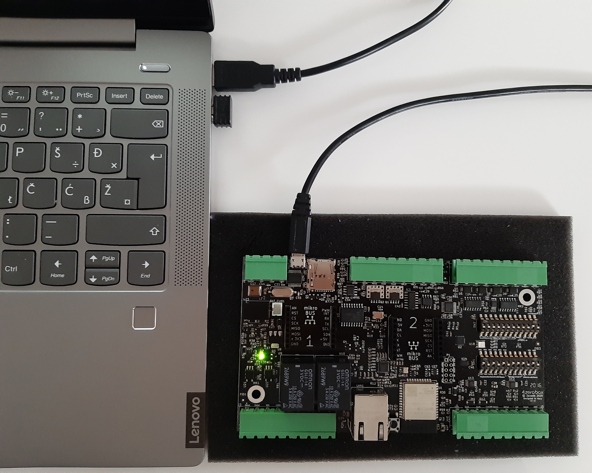
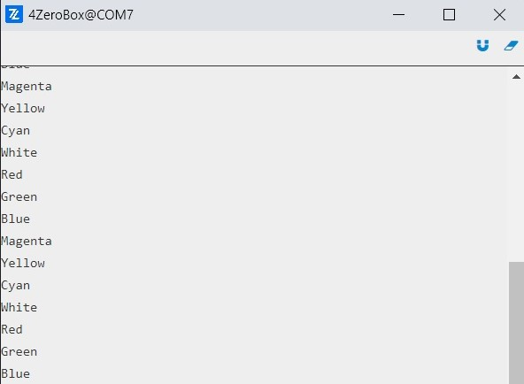

# Multi-Blinking Demo

In this tutorial, we will demonstrate how easy it is to set several different colors of the status LEDs on the 4ZeroBox, using Python and Zerynth OS.

In this example, we will be using:

1. [Zerynth OS](https://www.zerynth.com/zos/) - a **multithreaded Real-Time OS** that provides real hardware independence, allowing code reuse on a wide range of 32-bit microcontrollers, in a very small footprint;   
2. [Zerynth SDK](https://www.zerynth.com/zsdk/) - the gateway to our platform which includes:   
    - [Zerynth Toolchain](https://docs.zerynth.com/latest/reference/core/toolchain/docs/) – a command-line interface that integrates all the essential functions for the development with [Zerynth OS](https://www.zerynth.com/zos/)  and the management of the Zerynth Device Manager cloud service.
    - [Zerynth Studio](https://docs.zerynth.com/latest/develop/) – an advanced [IDE](https://docs.zerynth.com/latest/reference/core/studio/docs/) for the Zerynth Toolchain. It includes development and debugging tools and numerous code examples.  
3. [4ZeroBox](/latest/4zp/4ZeroBox/) - a modular hardware electronic unit that simplifies the development of Industrial IoT applications allowing rapid integration with sensors, actuators, and Cloud services. 4ZeroBox is programmable in Python (or hybrid C/Python) thanks to the Zerynth SDK.

## Hardware Setup

First, connect the 4ZeroBox and PC with a USB cable, as shown below:



## Board setup

Regarding the power supply, you can use a USB or external 24V power supply.
Compared to the previous versions of the 4ZeroBox, there are no jumpers, so just connect the desired power supply and continue with board setup.
Please, configure SW1 and SW2 as shown below. Make sure pin 11 on SW2 is ON.


For more infos about electrical connections, and how to use 4ZeroBox with sensors and other hardware, see the [User manual](https://www.zerynth.com/download/13894/), and the [Datasheet](https://www.zerynth.com/download/13895/).

## Software setup

The 4ZeroBox comes with a serial-to-usb chip on board that allows programming and opening the UART of the ESP32 module. The CH340 USB to UART chip is also connected to the boot pins of the module, allowing a seamless virtualization of the device.

!!! note
    For Linux Platform: to allow the access to the serial ports the user needs read/write access to the serial device file. Adding the user to the group that owns this file, gives the required read/write access: Ubuntu distribution –> dialout group; Arch Linux distribution –> uucp group.

Once connected on a USB port, if the drivers have been correctly installed, the 4ZeroBox device is recognized by Zerynth Studio.
Now, the user can download and Install [Zerynth Studio r.2.6.2](https://www.zerynth.com/zsdk).

Once Zerynth is installed, the user can Connect, Register, and Virtualize the device.

**1. Register the device**


**2. Create a Virtual Machine according to the requirements**


**3. Virtualize this virtual machine**


After virtualization, the 4ZeroBox is ready to be programmed and the Zerynth scripts uploaded. Just Select the virtualized device from the “Device Management Toolbar” and click the dedicated “upload” button of Zerynth Studio.


## Implementation

In this demo, we will show how to set several different color LEDs on the board using the [FourZeroBox class](https://docs.zerynth.com/latest/reference/libs/zerynth/4zerobox/docs/module/). When the project is verified and uplinked, the five LEDs flash alternately in predefined intervals (1 second in our example).

First, we are going to import the FourZeroBox module and create an instance of the FourZeroBox class. 

```py
import streams                          # Import the streams module.
from fourzerobox import fourzerobox     # Import the FourZeroBox.

streams.serial()                        # Open the default serial port.
fzbox = fourzerobox.FourZeroBox()       # Create 4ZeroBox Object.
```
The 4ZeroBox device is completely described by the FourZeroBox class and more details can be found in the [module documentation](https://docs.zerynth.com/latest/reference/libs/zerynth/4zerobox/docs/module/). For this demo we will use only one of the available methods for the LED color control - ```set_led()```. This function sets the LED status to a custom color.

Let’s set the first color LED - red. After the red LED blinks, the message “Red” appears on the console.

```py
while True:                             # Loop through all available colors.
       fzbox.set_led('R')               # Set the LED color.
       print("Red")                     # Print the LED color.
       sleep(1000)
```
And here is the result:


Now, the user can use the same code to set the other colors. Pretty easy, isn’t it?

```py
while True:                             # Loop through all available colors.
       fzbox.set_led('R')               # Set the LED color.
       print("Red")                     # Print the LED color.
       sleep(1000)                      # Delay one second.
       fzbox.set_led('G')
       print("Green")
       sleep(1000)
       fzbox.set_led('B')
       print("Blue")
       sleep(1000)
       fzbox.set_led('M')
       print("Magenta")
       sleep(1000)
       fzbox.set_led('Y')
       print("Yellow")
       sleep(1000)
       fzbox.set_led('C')
       print("Cyan")
       sleep(1000)
       fzbox.set_led('W')
       print("White")
       sleep(1000)
```
Then something like this will appear on the serial console:



Now, let’s take a look at these colorful palette LEDs.


## Summary

We hope that this demo will be an inspiration for creating more exciting and colorful projects in the future.

The user can find the complete 4ZeroBox documentation at this [link](/latest/4zp/4ZeroBox/).

[Here](https://docs.zerynth.com/latest/demos/4zerobox/Hello_4ZeroBox/) is the link for all available 4ZeroBox demos.

Other useful documents are:

- [Quick Guide](https://www.zerynth.com/download/15283/),
- [Brochure](https://www.zerynth.com/download/13895/),
- [Examples](/latest/reference/libs/zerynth/zdm/docs/examples/).

The code is available in our [GitHub repository](https://github.com/zerynth/demos-4zerobox/tree/main/multi-blinking-demo).

Happy coding!
