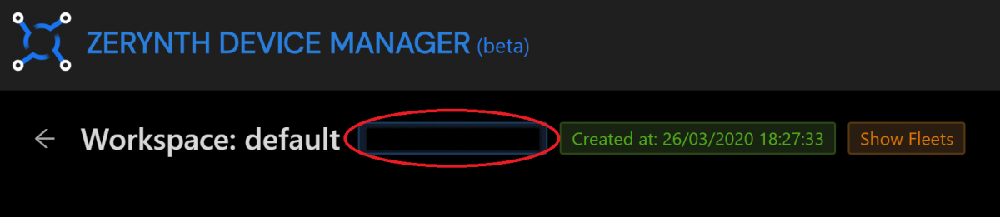
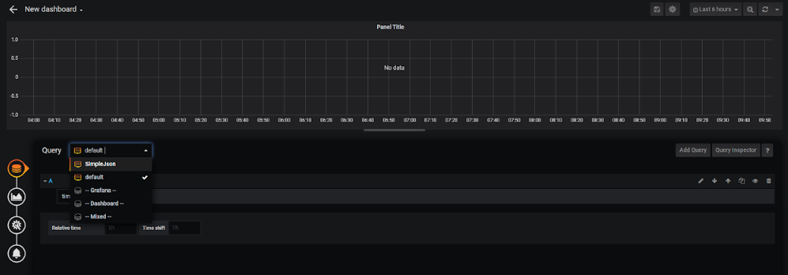
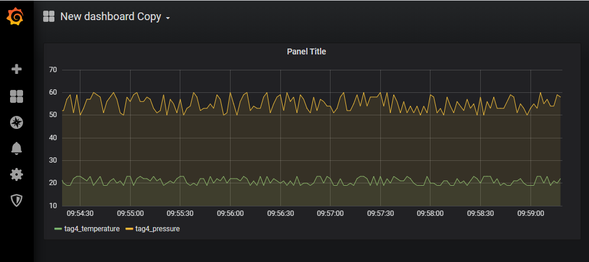

# Connect Zerynth Device Manager with Grafana for IoT data Visualization

This guide shows how to connect Grafana with the Zerynth Device Manager and retrieve IOT device data using the ZDM API.

Grafana is an analytics and interactive visualization software that allows building dashboards thanks to the connection with various data sources. It is expandable through a plug-in system allowing users to create complex visualization using an intuitive and interactive query builder.

Components required:

- [Grafana](https://grafana.com/docs/grafana/latest/guides/getting_started/),
- [Python Flask lib](https://pypi.org/project/Flask/),
- [Python Requests lib](https://pypi.org/project/requests/),
- [Python Pytz lib](https://pypi.org/project/pytz/).

First of all, it’s necessery to install the Grafana simple JSON data source plugin following this [guide](https://grafana.com/grafana/plugins/grafana-simple-json-datasource/installation).

Then, to download the ZDM simple JSON connector Python (ZDMgrafana.py) file we prepared from [here](https://github.com/zerynth/zdm-grafana-bridge).

The user then needs to add their Zerynth security token. It can be retrieved from https://backend.zerynth.com//v1/sso.

Also, it’s necessary to insert the ID of the ZDM workspace that the user wants to use as a data source. To retrieve the ZDM workspace ID, it’s required to open the ZDM web interface at https://zdm.zerynth.com/, click on the workspace that’s going to be used, and copy the Workspace ID from the blue box located in the top-left area of the interface.

Save and launch the ZDMgrafana.py file.

Finally, the user can open their Grafana web interface and click add data source, select simple JSON and insert in the URL http://127.0.0.1:5000, save and test. 

The user can now retrieve his ZDM data!

!!! note
    If the Simple Json can’t be found in the installed data sources window, it’s necessary to manually restart the Grafana service.

Now it's easy to create a new dashboard by clicking on the + button and then on Dashboard.

It’s then required to click Add query, then open the Query menu and select SimpleJson.

Now, to open the Select Metric Menu and choose the ZDM Tag that is going to be used as an IOT data source for the visualization the user is building.

If any tag can’t be seen, it means that the user doesn't have any data in the ZDM storage and no devices streaming. To launch a Python client device this [guide](/latest/deploy/getting_started_with_rpi/) can be used, to connect a Zerynth IOT device this [guide](/latest/deploy/getting_started_with_sdk/) can be followed.

Here it is,a ZDM data plotted in Grafana!

*Acknowledgement: Thanks to [Francesco Pirro](https://www.linkedin.com/checkpoint/challengesV2/AQE0B9fhEcgJOgAAAXOPQHU_zPS1d39svKS8YuHM25Y7ih9uRvZ8cOn_6F-bej4xezII6d4VwB2Eatpim_bErtfblHG0okwBew) for the contribution in the development of the  ZDM simple JSON connector.*

