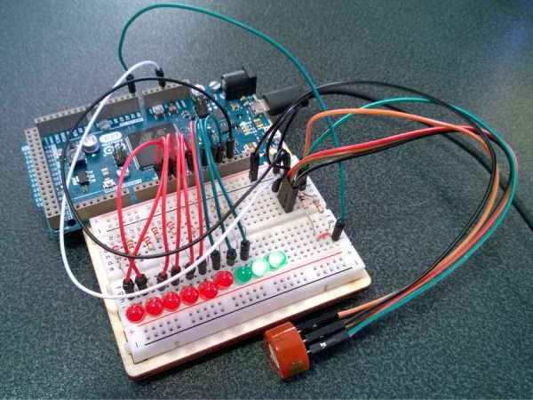
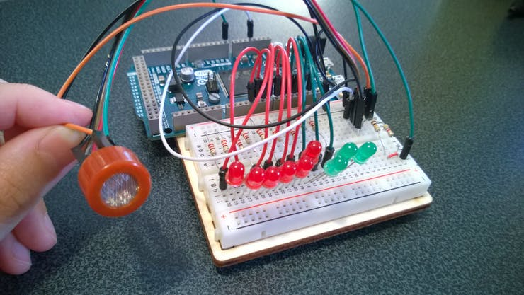
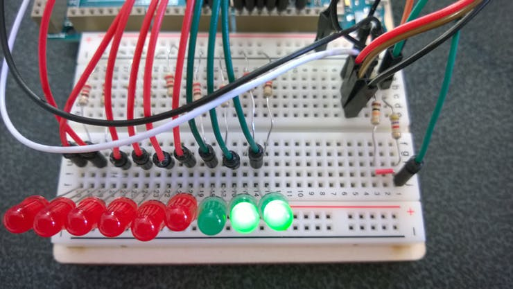
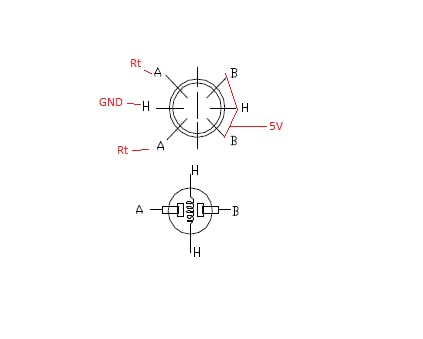
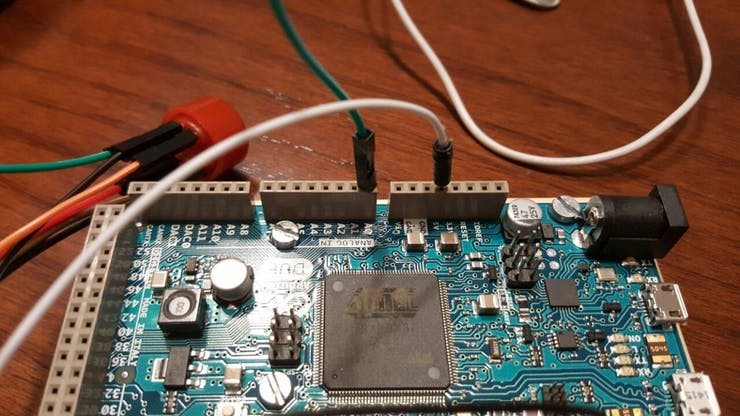
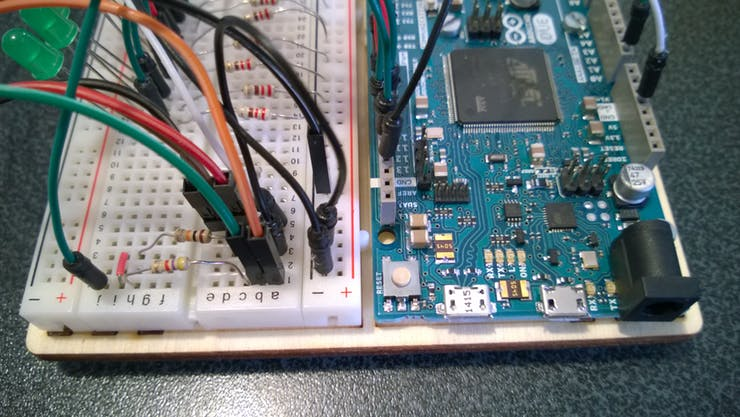
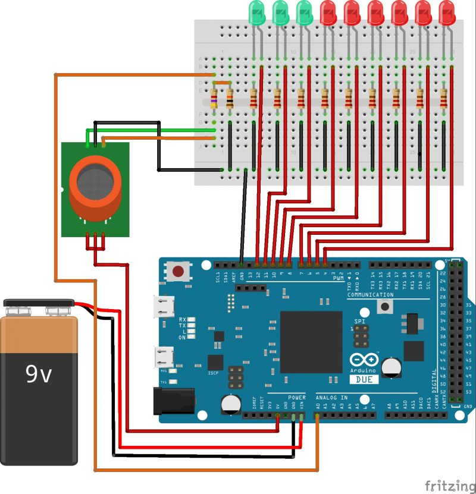

# An alcohol tester with LED lights

How to build a device for estimating blood alcohol content from a breath sample. Developed with Zerynth and an ARM board.



# Things used in this project

## Hardware components

| Arduino Due            | x1 |
|------------------------|----|
| MQ-3 Alcool Gas Sensor | 1x |
| Resistor 4.7K ohm      | 1x |
| Resistor 10K ohm       | 1x |
| LED (generic)          | 9x |
| Resistor 220 ohm       | 9x |

## Software apps and online services

| [Zerynth Studio](https://www.zerynth.com/zos/) | x1 |
|----------------|----|

# Story

In this project we will explain how to create a breathalyzer for estimating blood alcohol content from a breath sample using Zerynth to program the board.

We used an Arduino Due but it is possible to use another ARM board as Particle Core and Photon and ST Nucleo, with the same code because Zerynth is multiboard.



Our breathalyzer has 9 LEDs; 3 green and 6 red. They light according to the alcohol concentration read by the sensor MQ-3. The system must be calibrated by setting the values of the calibration array in the code and through the resistors. Otherwise the user can use a potentiometer. The aim is having only the 3 green LED lights when the concentration is under a fixed level.

## Hardware Setup

1. First, it’s necessary to connect the power to the Vin pin and ground rails to the GND pin on the Arduino Due.

2. Then, to connect the anode of the LED to the pin 4 (to re-use our code) and the cathode to the ground rail of the breadboard using a 220Ω resistor. The circuit diagram has more details. After this, the user can repeat this to connect the other LED’s from pin 5 to 12.



3. The user can then connect the sensor, as shown in the specified scheme: 




- As can be seen from the image, it’s necessary to connect the B pins and one of the H pins of the sensor to the 5V output of the board.



- And to connect the other H pin to the ground.



- Then, to connect the A pins to the breadboard before the two serial resistors (4.7K and 10K ohm) as in the scheme.
- Next, it’s necessary to connect the A0 analog into the breadboard among the two serial resistors (4.7K and 10K ohm).
- Finally, the user can connect the end of the serial resistors to the ground (as in the scheme).

The Hardware is ready!

## Download Zerynth Studio

Next, the user can download and install Zerynth Studio from https://www.zerynth.com/zsdk/ (it runs on Windows, Linux and MAC OS).

Zerynth allows developers to program ARM boards such as Arduino Due, Particle Core and Photon, ST Nucleo in Python. 

So, next the user can paste the code in the IDE, virtualize their board and upload the code to the board.

The breathalyzer is ready to use!

DISCLAIMER

This project is not accurate enough to register the exact value of blood alcohol concentration. It also is sensitive to environment temperature and humidity. It isn’t a professional instrument. So we recommend: if you drink, don’t drive!

# Schematics



# Code

```python

import streams
import adc

q=streams.serial()

digitalout=[D4,D5,D6,D7,D8,D9,D10,D11,D12]
calibration=[2000,1800,1600,1400,1200,1100,900,750,500]
min=750

for pin in digitalout:
    pinMode(pin,OUTPUT)

while true:
        alcool=adc.read(A0)

        if(alcool<=calibration[8]):
            on=[D12]
            for d in digitalout:
                if d in on:
                    digitalWrite(d,HIGH)
                else:
                    digitalWrite(d,LOW)
        if(alcool<=calibration[7] and alcool>calibration[8]):
            on=[D11,D12]
            for d in digitalout:
                if d in on:
                    digitalWrite(d,HIGH)
                else:
                    digitalWrite(d,LOW)
        if(alcool<=calibration[6] and alcool>calibration[7]):
            on=[D10,D11,D12]
            for d in digitalout:
                if d in on:
                    digitalWrite(d,HIGH)
                else:
                    digitalWrite(d,LOW)
        if(alcool<=calibration[5] and alcool>calibration[6]):
            on=[D9,D10,D11,D12]
            for d in digitalout:
                if d in on:
                    digitalWrite(d,HIGH)
                else:
                    digitalWrite(d,LOW)
        if(alcool<=calibration[4] and alcool>calibration[5]):
            on=[D8,D9,D10,D11,D12]
            for d in digitalout:
                if d in on:
                    digitalWrite(d,HIGH)
                else:
                    digitalWrite(d,LOW)
        if(alcool<=calibration[3] and alcool>calibration[4]):
            on=[D7,D8,D9,D10,D11,D12]
            for d in digitalout:
                if d in on:
                    digitalWrite(d,HIGH)
                else:
                    digitalWrite(d,LOW)
        if(alcool<=calibration[2] and alcool>calibration[3]):
            on=[D6,D7,D8,D9,D10,D11,D12]
            for d in digitalout:
                if d in on:
                    digitalWrite(d,HIGH)
                else:
                    digitalWrite(d,LOW)
        if(alcool<=calibration[1] and alcool>calibration[2]):
            on=[D5,D6,D7,D8,D9,D10,D11,D12]
            for d in digitalout:
                if d in on:
                    digitalWrite(d,HIGH)
                else:
                    digitalWrite(d,LOW)
        if(alcool>calibration[0]):
            on=[D4,D5,D6,D7,D8,D9,D10,D11,D12]
            for d in digitalout:
                if d in on:
                    digitalWrite(d,HIGH)
                else:
                    digitalWrite(d,LOW)
        sleep(500)
        print(alcool)
```