# Combining IoT and Blockchain Using Simple Python

This tutorial will be exploring the potential of combining IoT and blockchain using simple Python directly on microcontrollers.

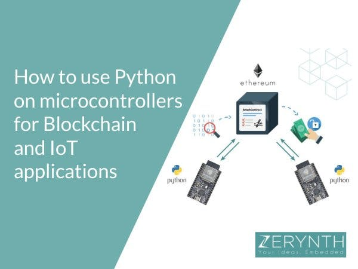

# Things used in this project

## Hardware components

| ESP32-DevKitC | x1 |
|---------------|----|

## Software apps and online services

| [Zerynth Studio](https://www.zerynth.com/zos/) | x1 |
|----------------|----|
| MetaMask       | x1 |
| Infura         | x1 |

# Story

This tutorial will be exploring the potential of **combining IoT and blockchain using simple Python directly on microcontrollers**, thanks to Zerynth tools.

In particular, the [Zerynth Ethereum library](/latest/reference/libs/blockchain/ethereum/docs/) allows microcontrollers, the heart of IoT solutions, to generate and sign Ethereum transactions in a few lines of Python. This empowers IoT developers to easily connect to the **Ethereum blockchain**, use Smart Contracts and seamlessly integrate IoT devices with DApps (decentralized applications).

A high-level interface is made available with this library, granting to anyone the possibility to start using blockchain and secure any kind of IoT application.

For those new to Zerynth, it allows to program [the most popular 32-bit microcontrollers](https://www.zerynth.com/integrations/) in Python and connect them to the [top Cloud infrastructures](https://www.zerynth.com/zdm/), with high-level standards of security.

## Why blockchain for embedded and IoT solutions

Having the possibility to generate, sign and send transactions from the inside of a microcontroller enables any device capable of running the cryptography algorithms to directly take advantage of smart contracts, removing centralized gateways and points of failure.

This can be applied to many different fields and increments trust from consumers and third parties.

For example, a **supply chain** can be monitored from the inside removing any single central authority storing the data and offering to final customers a certificate of the process goods are gone through. Going further, it can enable the **economy of things**, i.e. objects that can actually receive payments and offer services in exchange on-demand – like smart electricity meters offering a completely transparent service for the users.

To get a better grasp on the advantages of using Blockchain with Embedded Systems, take a look at this tech talk by [BARR Group](https://barrgroup.com/tech-talks).

And here are the use cases for logistics made by [TOI – Things on Internet](https://www.zerynth.com/use-cases/blockchain-enabled-iot-shipment-tracking-system/), the company that develops 4ZeroBox, an ESP32 board “powered by Zerynth” and tailored for Industrial IoT applications.

[](https://www.youtube.com/watch?v=kIjS6R5yIW4 "Video Title"){:target="_blank"}

## The Zerynth Ethereum module – open source Python library for Ethereum and Smart Contracts

The **Zerynth Ethereum library** takes advantage of the JSON-RPC interface available to interact with an Ethereum node and sending transaction. It also implements the RLP (Recursive Length Prefix)encoding scheme, and exposes some high-level API to call the more common methods (e.g. getting the balance of an address). For the hashing and signatures, the [Zerynth crypto module](/latest/reference/core/stdlib/docs/crypto/) is used.

The main class available is RPC. From an RPC object, it’s possible to fetch network status information and make transactions. To get a higher level interface there are also two companion classes: Transaction and Contract. The first helps to build a correct signed transaction ready to be sent, and the latter can be used to register a smart contract and its methods for calling them later.

For more info, here is the [official documentation page](https://docs.zerynth.com/latest/). The source code of the library is also on [GitHub](https://github.com/zerynth/lib-blockchain-ethereum)!

In the following examples, both of these are shown in a real Ethereum test network.

## Description of the examples: “Simple Transaction” and “Dice Game”

There are two examples available, showing how to make a simple transaction and how to configure and use a real smart contract.

In both examples the Ropsten test network is used, so no real value is actually being transferred, but it acts exactly the same way that it would be in the real Ethereum network.

## Example 1: “Simple Transaction”

This example shows how to transfer value (Ether) from an address to another through an Ethereum transaction. After signing and sending the transaction it’s possible to use an external tool like [https://ropsten.etherscan.io](https://ropsten.etherscan.io/) to monitor the status and the validity of it.

There is a snippet of the code below. The complete code and more info can be found at the related [documentation page](/latest/reference/libs/blockchain/ethereum/docs/examples/).


```python
import streams
# Ethereum modules
from blockchain.ethereum import ethereum
from blockchain.ethereum import rpc
# WiFi drivers
from espressif.esp32net import esp32wifi as net_driver # for ESP-32
# from broadcom.bcm43362 import bcm43362 as net_driver # for Particle Photon
from wireless import wifi
# SSL module for https
import ssl
# Configuration file
import config
# The SSL context is needed to validate https certificates
SSL_CTX = ssl.create_ssl_context(
   cacert=config.CA_CERT,
   options=ssl.CERT_REQUIRED|ssl.SERVER_AUTH
)
try:
   streams.serial()
   # Connect to WiFi network
   net_driver.auto_init()
   print("Connecting to wifi")
   wifi.link(config.WIFI_SSID, wifi.WIFI_WPA2, config.WIFI_PASSWORD)
   print("Connected!")
   print("Asking ethereum...")
   # Init the RPC node
   eth = rpc.RPC(config.RPC_URL, ssl_ctx=SSL_CTX)
   # Get our current balance
   balance = eth.getBalance(config.ADDRESS)
   print("Balance:", balance)
   if not balance:
       print(eth.last_error)
       raise Exception
   # Get network informations
   print("Gas Price:", eth.getGasPrice())
   nt = eth.getTransactionCount(config.ADDRESS)
   print("TCount:", nt)
   print("Chain:", eth.getChainId())
   # Prepare a transaction object
   tx = ethereum.Transaction()
   tx.set_value(config.WEI_AMOUNT, ethereum.WEI)
   tx.set_gas_price("0x430e23411")
   tx.set_gas_limit("0x33450")
   tx.set_nonce(nt)
   tx.set_receiver(config.RECEIVER_ADDRESS)
   tx.set_chain(ethereum.ROPSTEN)
   # Sign the transaction with the private key
   tx.sign(config.PRIVATE_KEY)
   # Print hex RLP representation
   print(tx.to_rlp(True))
   # Print hashes
   print(tx.hash(False).hexdigest())
   print(tx.hash(True).hexdigest())
   # Print full info
   print(tx)
   # Send the transaction
   tx_hash = eth.sendTransaction(tx.to_rlp(True))
   print("SENT!")
   print("Monitor your transaction at:\nhttps://ropsten.etherscan.io/tx/%s" % tx_hash)
except Exception as e:
   print(e)
while True:
   print(".")
   sleep(10000) 
```
## Dice Game

This example shows how to call some smart contract functions, get the return value, or transfer **Ether** to a payable function.

The smart contract used in this example acts as a shooter for a virtual 20-faces dice.

A player can ask the shooter to roll the dice paying any amount (with a minimum 5 Wei) using **the bet function**.

After rolling the dice, if the sum of the number is greater or equal to 14, the player wins the jackpot. In any case, his bet becomes part of the jackpot itself.

!!! note
    The smart contract source code it’s included in the example folder, that will be created after the cloning of the example via Zerynth Studio. A live version of the contract can be found on the Ropsten network at this address: 0xf7a270b24d2859002c0f414b0a0c97e4c794f5cc.

More info and source code can be found [here](/latest/reference/libs/blockchain/ethereum/docs/examples/#dicegame).

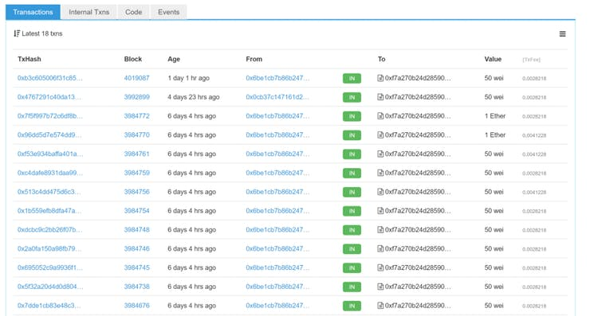

# Get started with Zerynth!

To get started and play with blockchain on microcontrollers just follow these simple steps:

1. Download and Install [Zerynth Studio](https://www.zerynth.com/zsdk/)

2. Connect, Register and Virtualize one of the [Zerynth supported boards](https://www.zerynth.com/integrations/). More info[here](/latest/#connect-register-and-virtualize-your-device).

For this tutorial, we’ve chosen the ESP32 DevKit C by our partner [Espressif Systems](https://www.zerynth.com/blog/zerynth-is-recommended-by-espressif-systems-as-firmware-toolkit-for-esp32/).

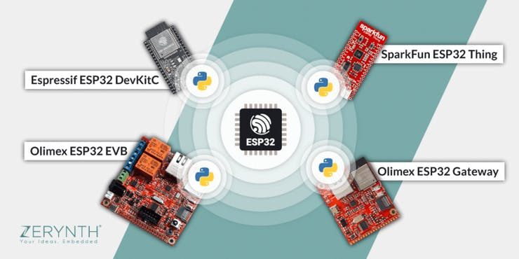

1. [Clone one of the examples](/latest/#clone-an-example-and-start-with-zerynth-python-scripts) mentioned before and uplink to your microcontroller.

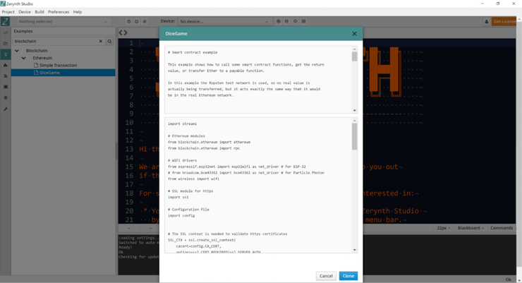

1. [Verify and Uplinkthe script](/latest/#verify-and-uplink-a-zerynth-project).

## Setup of Ethereum test network

The following steps are common to all the examples and help getting started in the Ethereum test network called Ropsten. After running the examples the user can reuse the same address to deploy their own contracts.

## Creating an address and get some Ether in it (MetaMask)

- First, the user should install the MetaMask browser extension from https://metamask.io/.

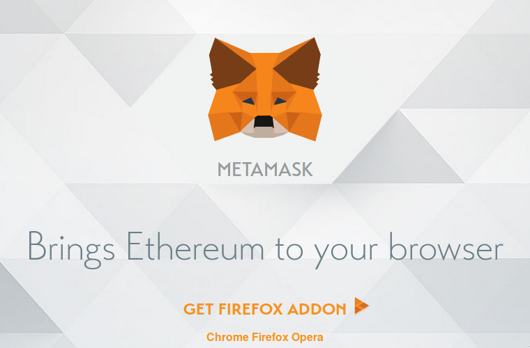

- Then, they should choose the Ropsten test network from the top-right corner (instead of the main network).

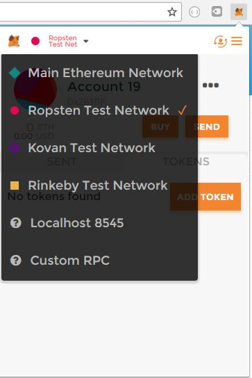

- Next, the user should request their first Ether from https://faucet.metamask.io/, since we are using the test network they have no real monetary value.

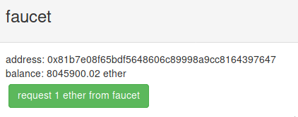

- Finally, the user can export and note their Ethereum private key from MetaMask pressing the three lines menu button, Details, and finally Export the private key (the user will be prompted for the password they created when they installed MetaMask).

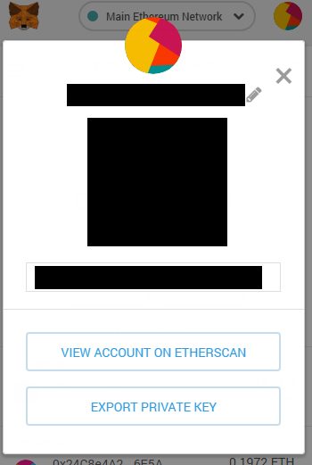

## Registering to an RPC node (Infura)

In order to interact with the Ethereum blockchain, an RPC node exposing API is needed. In this example, we’ll be using https://infura.io that offers this service for free. The user can register to their website and note their API key (e.g. 607c53ff4845226fa6c4b060fd1db12d).


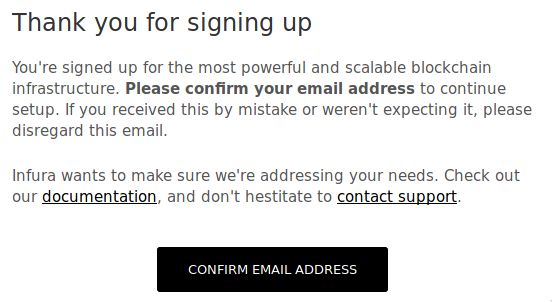

## Configuration
Both the examples have a config.py file to be edited with the information from the steps above and some example-specific variables.

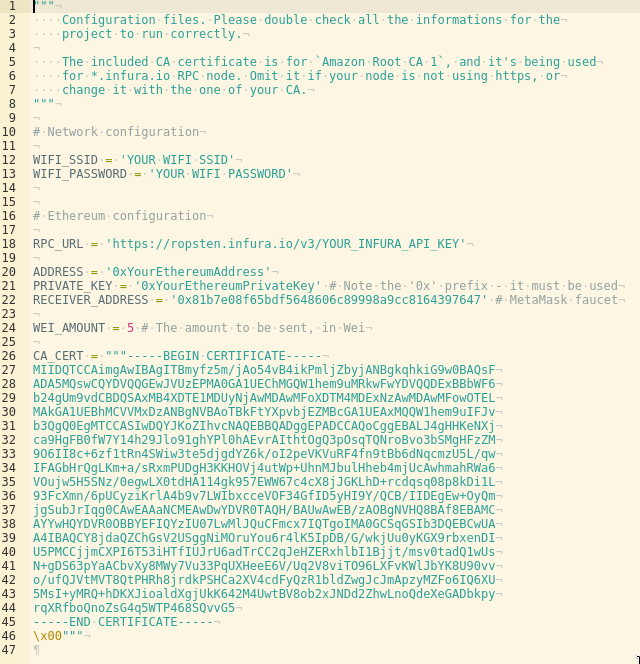

## Running the examples

From Zerynth Studio, after the user has uplinked the project to their microcontroller, they need to open the [serial monitor](https://ropsten.etherscan.io/) to check the progress of the execution.

- In the Simple Transaction example, the final output should be the transaction hash and a link pointing to the relative Etherscan page, a simple external tool to monitor the status of your transaction and check if it gets mined. It also shows other useful information like the waiting time and the used gas.
- In the Dice Game example, the output should be a link to the urer’s Etherscan transaction. After the transaction completes and gets mined, the smart contract will decide if the user won or not. The user can check their account balance or the internal transaction from Etherscan to see if they won. The user can reset their device to run the example again, and try another bet if they feel lucky.

# Schematics

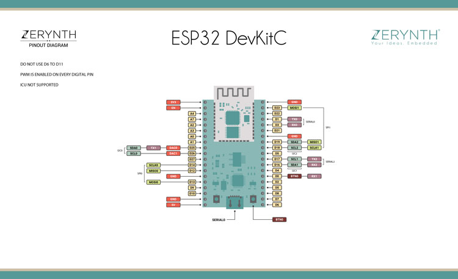

# Code

```python
# Simple Transaction

Transfer value from an address to another through an Ethereum transaction.

In this example the Ropsten test network is used, so no real value is 
actually being transferred, but it acts exactly the same way that it would
be in the real Ethereum network.


## Preparation

### Creating an address and get some Ether in it (MetaMask)

- Install the MetaMask browser extension from https://metamask.io/
- Choose the Ropsten test network from top-right corner (instead of the main
  network)
- Request your first Ether from https://faucet.metamask.io/, since we are
  using the test network, they have no real money value.
- Export and note your Ethereum private key from MetaMask pressing the three
  lines menu button, Details, Export private key (you will be promped for the
  password you created when you installed MetaMask)


### Registering to a RPC node (Infura)

- In order to interact with the Ethereum blockchain, a RPC node exposing API
  is needed. In this example we'll be using https://infura.io that offer this
  service for free. Register to their website and note your API key (e.g.
  607c53ff4845226fa6c4b060fd1db12d).


### Configuring the example

- Edit the `config.py` file and change your Wi-Fi informations.
- In the same file insert your Ethereum address and private key.
  This is the address that your microcontroller will be using to send some
  currency.
- You can also customize the receiver address (e.g. you can return some Ether
  to the faucet address that you can copy from https://faucet.metamask.io/)
  and the amount of Wei to be sent (note that 1e18 Wei = 1 Ether).


## Running the example
- After completing the previous part, you should be able to run the code and
  make your first transaction.
- You can use https://ropsten.etherscan.io to real time monitor your address or
  transactions status.
import streams

# Ethereum modules
from blockchain.ethereum import ethereum
from blockchain.ethereum import rpc

# WiFi drivers
from espressif.esp32net import esp32wifi as net_driver # for ESP-32
# from broadcom.bcm43362 import bcm43362 as net_driver # for Particle Photon
from wireless import wifi

# SSL module for https
import ssl

# Configuration file
import config


# The SSL context is needed to validate https certificates
SSL_CTX = ssl.create_ssl_context(
    cacert=config.CA_CERT,
    options=ssl.CERT_REQUIRED|ssl.SERVER_AUTH
)


try:
    streams.serial()

    # Connect to WiFi network
    net_driver.auto_init()
    print("Connecting to wifi")
    wifi.link(config.WIFI_SSID, wifi.WIFI_WPA2, config.WIFI_PASSWORD)
    print("Connected!")
    print("Asking ethereum...")

    # Init the RPC node
    eth = rpc.RPC(config.RPC_URL, ssl_ctx=SSL_CTX)

    # Get our current balance
    balance = eth.getBalance(config.ADDRESS)
    print("Balance:", balance)
    if not balance:
        print(eth.last_error)
        raise Exception

    # Get network informations
    print("Gas Price:", eth.getGasPrice())
    nt = eth.getTransactionCount(config.ADDRESS)
    print("TCount:", nt)
    print("Chain:", eth.getChainId())

    # Prepare a transaction object
    tx = ethereum.Transaction()
    tx.set_value(config.WEI_AMOUNT, ethereum.WEI)
    tx.set_gas_price("0x430e23411")
    tx.set_gas_limit("0x33450")
    tx.set_nonce(nt)
    tx.set_receiver(config.RECEIVER_ADDRESS)
    tx.set_chain(ethereum.ROPSTEN)

    # Sign the transaction with the private key
    tx.sign(config.PRIVATE_KEY)

    # Print hex RLP representation
    print(tx.to_rlp(True))

    # Print hashes
    print(tx.hash(False).hexdigest())
    print(tx.hash(True).hexdigest())

    # Print full info
    print(tx)

    # Send the transaction
    tx_hash = eth.sendTransaction(tx.to_rlp(True))
    print("SENT!")
    print("Monitor your transaction at:\nhttps://ropsten.etherscan.io/tx/%s" % tx_hash)

except Exception as e:
    print(e)

while True:
    print(".")
    sleep(10000)
```
