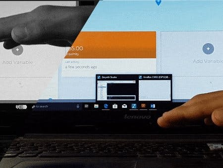
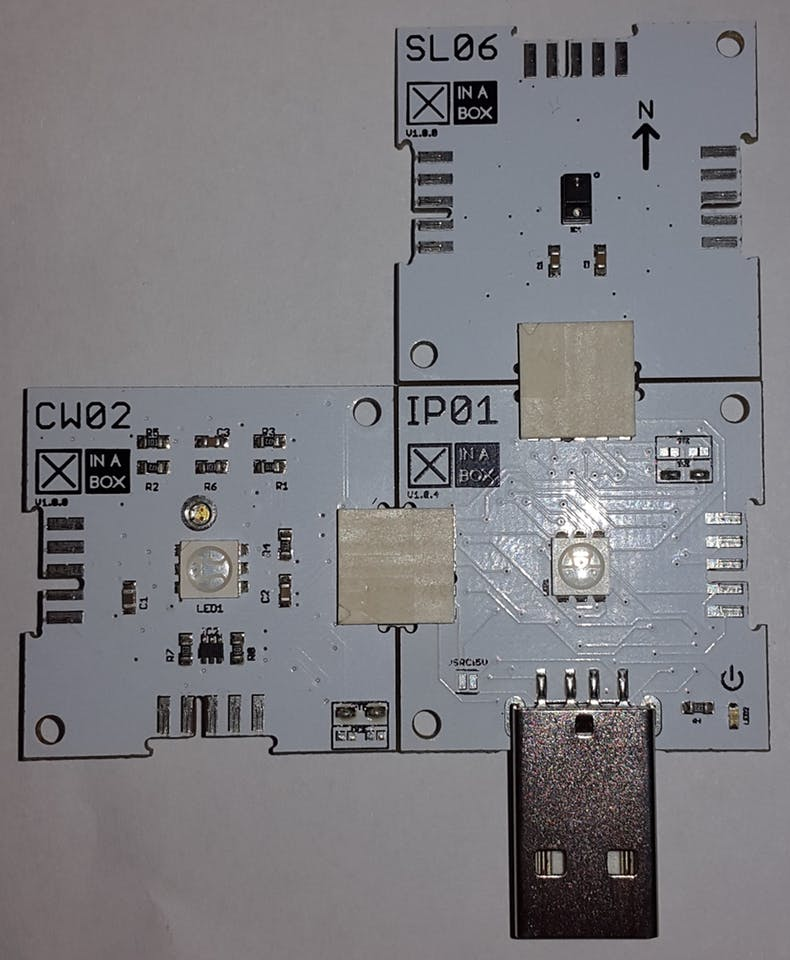
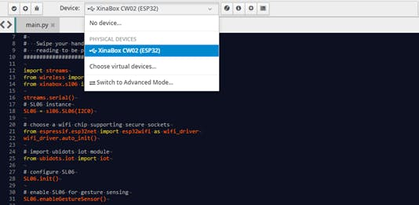
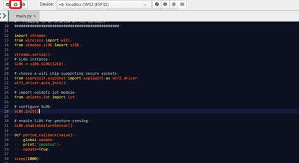

# Remote Proximity Sensing with XinaBox, Zerynth and Ubidots

How to monitor the proximity of an object to the XinaBox xChip SL06 (APDS-9960) remotely anywhere using Ubidots and Zerynth Studio..



# Things used in this project

## Hardware components

| [XinaBox CW02](https://www.hackster.io/xinabox/products/cw02?ref=project-7e2765) | x1 |
|--------------|----|
| [XinaBox IP01](https://www.hackster.io/xinabox/products/ip01?ref=project-7e2765) | x1 |
| [XinaBox XC10](https://www.hackster.io/xinabox/products/xc10?ref=project-7e2765) | x1 |
| [XinaBox SL06](https://www.hackster.io/xinabox/products/sl06?ref=project-7e2765) | x1 |

## Software apps and online services

| [Zerynth Studio](https://www.hackster.io/zerynth/products/zerynth-studio?ref=project-7e2765) | x1 |
|----------------|----|
| [Ubidots](https://www.hackster.io/ubidots/products/ubidots?ref=project-7e2765)        | x1 |

# Story

The xChip CW02 (ESP-WROOM-32 Wi-Fi and Bluetooth module) allows users to send data from XinaBox’s modular xChips to the Cloud, and control devices according to the obtained data.

The xChip SL06 uses APDS-9960 Gesture, Proximity, Ambient Light and Color sensor allows users to build smart appliance controlling. 
In this project we will explore Proximity functionality to detect how close an object is. We have made a short project tutorial on Remote hand Gesture sensing with Ubidots, with future projects planned to detect change in Ambient light with Ambient Light sensing.

By the end of this guide, users will be able to publish 10-bit proximity values to the Ubidots using XinaBox.

## Requirements

- 1x CW02 – WiFi and Bluetooth core (ESP-WROOM-32)
- 1x SL06 – Gesture(APDS-9960)
- 1x IP01 – USB Programming Interface (FT232R)
- 1x XC10 – 10-Pack xBUS Connectors
- Zerynth Studio
- Ubidots account

## Step-by-Step

1. Hardware Setup
2. Setting up the ZerynthStudio
3. Verify andUplink the code
4. Summary

## 1. Hardware Setup

First, the user needs to connect CW02, SL06 and IP01 together using the XC10 xBUS connectors. It can be connected as shown in the diagram below.It is advisable to see this guide on how to assemble xChips generally.



Then, the user can connect their device and PC through the IP01’s USB.

## 2. Setting up the Zerynth Studio

1. Download and Install [Zerynth Studio r.2.2.0](https://www.zerynth.com/zsdk/).

2. Once Zerynth is installed, the user can Connect, Register and Virtualize the device

3. Then it’s just a matter of selecting the XinaBox CW02 (ESP32) from the Device dropdown:



## 3. Verify and Uplink the Code

Before the next step it is necessary to make sure that the device is Connected, Registered and Virtualized.

Then to verify and uplink the code:



The user can then look for the SL06; when it’s brought near, the hand/object the ubidots variable is updated with greater value until 8-bit limit (255) is reached, and when it’s moved away from the SL06 the value is decreased until 0 is displayed.


4. Summary

In this tutorial, we have learned how to monitor remotely Proximity values anywhere on Ubidots. With XinaBox and Ubidots, it’s easy to make Proximity sensing to control/operate any electrical appliance! The tutorial is simple and can take up-to 10-15 minutes.

# Code

```python
import streams
from wireless import wifi
from xinabox.sl06 import sl06

streams.serial()

# SL06 instance
SL06 = sl06.SL06(I2C0)  

# choose a wifi chip supporting secure sockets
from espressif.esp32net import esp32wifi as wifi_driver
wifi_driver.auto_init()

# import ubidots iot module
from ubidots.iot import iot

# configure SL06
SL06.init()

# enable SL06 for proximity sensing
SL06.enableProximitySensor()

print('connecting to wifi...')
 
#Connect to the specified Wi-Fi device
while not wifi.is_linked():
    try:
    # FOR THIS EXAMPLE TO WORK, "Network-Name" AND "Wifi-Password" MUST BE SET
    # TO MATCH YOUR ACTUAL NETWORK CONFIGURATION
      wifi.link("SSID",wifi.WIFI_WPA2,"PASSWORD")
      print("Link Established")
    except Exception as e:
      print("ooops, something wrong while linking :(", e)
      print(".")
    sleep(1000)
 
print('connecting to mqtt broker...')
try:
    # create ubidots iot device instance, connect to mqtt broker, set       #variable update callback and start mqtt reception loop
 
    #Enter your DEVICE-NAME and Unique Ubidots TOKEN
    device = iot.Device('DEVICE-NAME','business','TOKEN')
    device.mqtt.connect()
    print("Connected to mqtt broker")
except Exception as e:
    print("ooops, something went wrong :(", e)
    while True:
       sleep(1000)
 
#Subscribe to the ‘direction’ variable     
device.mqtt.loop()

while True:
    prox = SL06.getProximity()  # read the proximity level
    print(prox)
    device.publish({"value":prox},variable="proximity")
    sleep(2000)
```