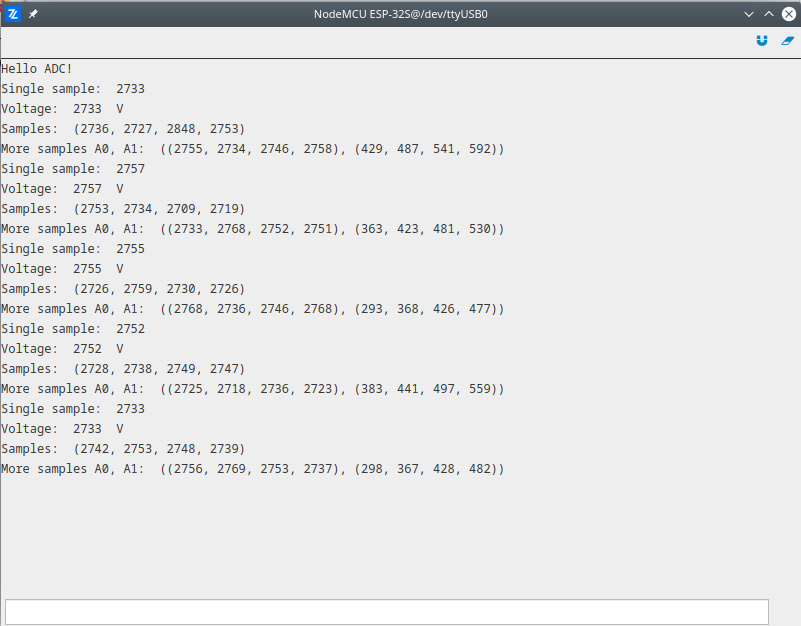

# ADC

This demonstration of ADC usage. During first ADC readout, single sample will be read and then converted to the real voltage based on ADC resolution and reference voltage. During second readout, 4 samples will be read from the single analog pin with default sampling period. During the third readout, 4 samples will be read from two analog pins.

More information about modules used in this demo:
- [ADC](latest/reference/guide/docs/vhal/#adc)

```py
# Import necessary modules.
import streams
import adc

# Reference voltage and ADC resolution values.
VOLTAGE_REFERENCE = 3.3
ADC_RESOLUTION = 4095

# Open the default serial port.
streams.serial()

# Print initial message.
print("Hello ADC!")

while True:

    # Single ADC sample read from A0 pin.
    val = adc.read(A0)
    print("Single sample: ", val)

    # Convert ADC read to voltage.
    voltage = val * VOLTAGE_REFERENCE / ADC_RESOLUTION.
    print("Voltage: ", val, " V")

    # Acquire 4 samples with default sampling period.
    samples = adc.read(A0, 4)
    print("Samples: ", samples)

    # Acquire 4 samples from 2 analog pins with default sampling period.
    more_samples = adc.read([A0, A1], 4)
    print("More samples A0, A1: ", more_samples)
    sleep(300)
```

