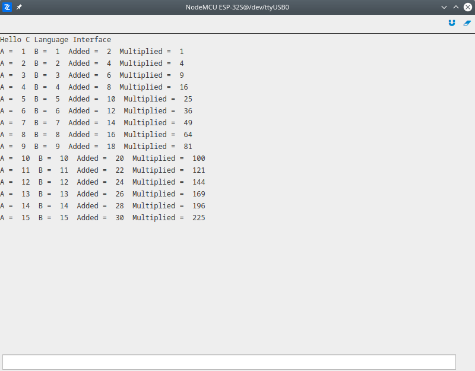

# C Language Interface

The demonstration of how to write the C code function inside separate file which is then wrapped in python code. C functions are implemented to do basic operations of multiplying and addition of the two variables. Then inside main module they are wrapped with python functions and called in order to add and multiply two numbers.

More information about content used in this demo:
- [C Language Interface](/latest/reference/guide/docs/clang/)

File which carries C source code `c_file.c` should be placed inside project folder.

```c
#include "zerynth.h"

C_NATIVE( c_addition )
{
    C_NATIVE_UNWARN();

    int32_t a;
    int32_t b;

    if ( parse_py_args( "ii", nargs, args, &a, &b ) != 2 )
    {
        return ERR_TYPE_EXC;
    }

    * res = PSMALLINT_NEW( a + b );

    return ERR_OK;
}

C_NATIVE( c_multiply )
{
    C_NATIVE_UNWARN();

    int32_t a;
    int32_t b;

    if ( parse_py_args( "ii", nargs, args, &a, &b ) != 2 )
    {
        return ERR_TYPE_EXC;
    }

    * res = PSMALLINT_NEW( a * b );

    return ERR_OK;
}
```

File which carries python code `main.py` placed inside project folder.

```py
# Import necessary modules.
import streams

# Wrap C function for adding two numbers in python.
@c_native("c_addition", ["c_file.c"], [])
def py_addition(a, b):
        pass

# Wrap C function for multiplying two numbers in python.
@c_native("c_multiply", ["c_file.c"], [])
def py_multiply(a, b):
        pass

# Open the default serial port.
streams.serial()

print("Hello C Language Interface")

A = 1
B = 1

while True:

    # Call wrapper functions and print result.
    add = py_addition(A, B)
    multiply = py_multiply(A, B)
    print("A = ", A, " B = ", B, " Added = ", add, " Multiplied = ", multiply)
    A = A + 1
    B = B + 1
    sleep(2000)
```

