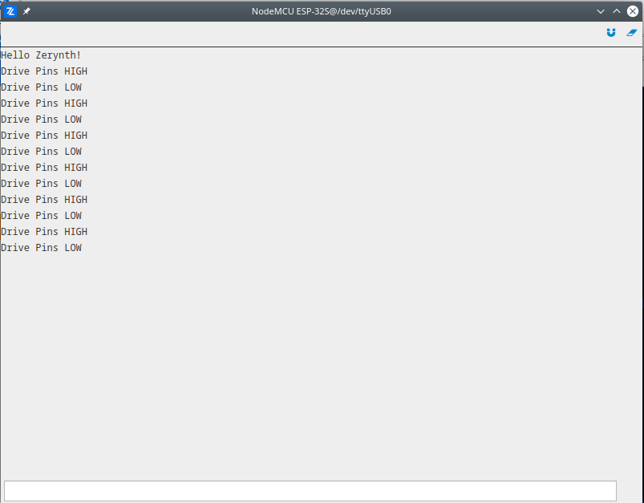

# Hello Zerynth

The simplest demo which uses serial port and GPIO to toggle the LED. After the initialization it prints "Hello Zerynth" message using the serial port, then inside the infinite loop, it toggles the GPIO pins and in the same time prints the polarity of the pins. For more information about pinout for your development board navigate to Device Pinmap using Zerynth Studio.

More information about modules used in this demo:
- [GPIO](latest/reference/guide/docs/vhal/#gpio)
- [Serial](latest/reference/guide/docs/vhal/#serial)

```python
# Import the streams module.
import streams

# Initialize appropriate pins used to drive LED as output.
pinMode(D0,OUTPUT)
pinMode(D2,OUTPUT)

# Open the default serial port.
streams.serial()

# Print initial message.
print("Hello Zerynth!")

# Infinite loop.
while True:

    print("Drive Pins HIGH")
    digitalWrite(D0, HIGH)
    digitalWrite(D2, HIGH)
    sleep(1000)

    print("Drive Pins LOW")
    digitalWrite(D0, LOW)
    digitalWrite(D2, LOW)
    sleep(1000)
```

