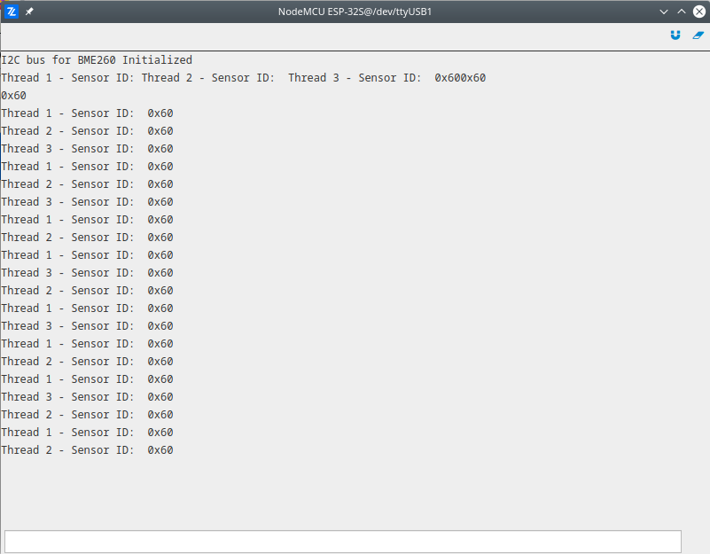

# I2C

The demonstration of i2c module usage, where BME260 sensor by Bosch is used as slave device. After the initialization of the I2C bus we are reading the device ID from the sensor in three different ways - each way is implemented in separated thread. Also every thread uses lock mechanism to prevent interferences. For this particular sensor device id is placed inside register on address 0x0D and the content of the register should be 0x60.

More information about modules used in this demo:

- [I2C](/latest/reference/core/stdlib/docs/i2c/#class-i2c)

```py
# Import the streams and i2c modules.
import streams
import i2c

# I2C address of the sensor
BME260_ADDRESS = 0x76

# Open the default seral for print
streams.serial()

# Create sensor object
sensor = i2c.I2C(I2C2, BME260_ADDRESS, 400000)
sensor.start()

# Print initial message.
sleep(1000)
print("I2C bus for BME260 Initialized")

# All threads read one byte from register on address 0x00.

def thread_1():
    while True:
        sensor.lock()

        # Write register address first.
        sensor.write(0xD0)

        # Read one byte which carry content of the register.
        id = sensor.read(1)
        sensor.unlock()

        # Print the data read.
        print("Thread 1 - Sensor ID: ", hex(id[0]))
        sleep(800)

def thread_2():
    while True:
        sensor.lock()

        # Write register address first.
        sensor.write_bytes(0xD0)

        # Read one byte which carry content of the register.
        id = sensor.read(1)
        sensor.unlock()

        # Print the data read.
        print("Thread 2 - Sensor ID: ", hex(id[0]))
        sleep(1000)

def thread_3( ):
    while True:
        sensor.lock()

        # Write register address, hen read one byte.
        id = sensor.write_read(0xD0, 1)
        sensor.unlock()

        # Print the data read.
        print("Thread 3 - Sensor ID: ", hex(id[0]))
        sleep(1200)

thread(thread_1)
thread(thread_2)
thread(thread_3)
```

