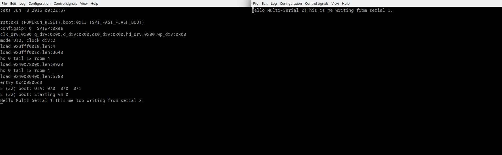

# Multi Serial

The demonstration of multiple serial ports usage via Zerynth multi-threading. All data written to port 1 will be printed to port 2 and vice versa. There are two threads and each thread is polling the single serial port. If there is data available on the particular port it will be printed to other serial port. Due to usage of the same serial ports from different threads Lock is involved in order to achieve synchronization between threads on same object usage.

More information about modules used in this demo:
- [Streams](/latest/reference/core/stdlib/docs/streams/)
- [Threading](/latest/reference/core/stdlib/docs/threading/)

```py
# Import the streams and threading modules.
import streams
import threading

# Open the default serial port (SERIAL0,115200).
s1 = streams.serial(rxsize=16, txsize=16)

# Open the other serial port with custom baudrate.
s2 = streams.serial(SERIAL1, 57600, rxsize=16, txsize=16)

# Create a lock for each serial port.
slock1 = threading.Lock()
slock2 = threading.Lock()

# Print initial message.
s1.write("Hello Multi-Serial 1!")
s2.write("Hello Multi-Serial 2!")

def thread_1():
    while True:
        slock1.acquire()
        length=s1.available()
        if (length > 0):
            data=s1.read(length)

            # Lock serial 2 when using from thread 1.
            slock2.acquire()
            s2.write(data,length)
            slock2.release()

        slock1.release()

def thread_2():
    while True:
        slock2.acquire()
        length=s2.available()
        if (length > 0):
            data=s2.read(length)

            # Lock serial 1 when using from thread 2.
            slock1.acquire()
            s1.write(data,length)
            slock1.release()

        slock2.release()

# Start both threads.
thread(thread_1)
thread(thread_2)
```

