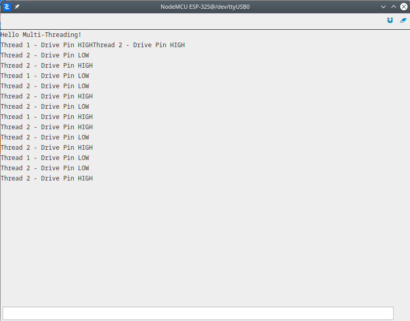

# Multi Thread Basic

The basic demonstration of Zerynth multi-threading. Two threads are running in parallel, each thread toggle the single LED and in same time print the message about which thread toggle the LED and polarity of the GPIO pin.

More information about modules used in this demo:
- [Threading](/latest/reference/core/stdlib/docs/threading/)
- [GPIO](/latest/reference/guide/docs/vhal/#gpio)
- [Serial](/latest/reference/guide/docs/vhal/#serial)

```python
# Import the streams module.
import streams

# Initialize appropriate pins used to drive LED as output.
pinMode(D0,OUTPUT)
pinMode(D2,OUTPUT)

# Open the default serial port.
streams.serial()

# Print initial message.
print("Hello Multi-Threading!")

def thread_1():
    while True:

        # Toggle appropriate first pin from infinite loop.
        print("Thread 1 - Drive Pin HIGH")
        digitalWrite(D0, HIGH)
        sleep(1000)
        print("Thread 1 - Drive Pin LOW")
        digitalWrite(D0, LOW)
        sleep(1000)

def thread_2():
    while True:

        # Toggle appropriate second pin from infinite loop.
        print("Thread 2 - Drive Pin HIGH")
        digitalWrite(D2, HIGH)
        sleep(300)
        print("Thread 2 - Drive Pin LOW")
        digitalWrite(D2, LOW)
        sleep(300)

# Start both threads.
thread(thread_1)
thread(thread_2)
```

