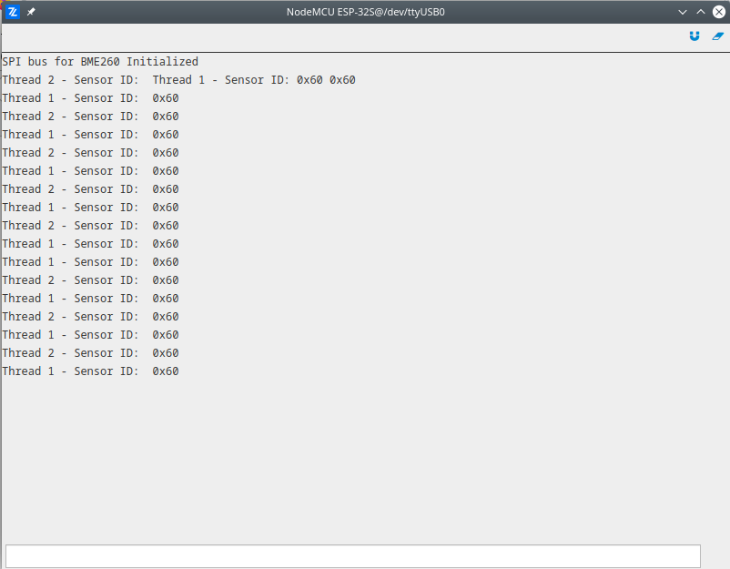

# SPI

The demonstration of spi module usage, where BME260 sensor by Bosch is for communication. After the initialization of the SPI bus we are reading the device ID from the sensor in two different ways - each way is implemented in separated thread. Also every thread uses lock mechanism to prevent interferences. For this particular sensor device id is placed inside register on address `0x0D` and the content of the register should be `0x60`.

More information about modules used in this demo:
- [SPI](latest/reference/core/stdlib/docs/i2c/#class-i2c)


```py
# Import the streams and i2c modules.
import streams
import spi

# Open the default seral for print
streams.serial()

# Create sensor object from SPI class.
sensor = spi.Spi(D0)

# Print initial message.
sleep(1000)
print("SPI bus for BME260 Initialized")

# All threads read one byte from register on address 0xD0.

def thread_1():

    # Create buffer for IO operations.
    input = bytearray(1)
    output = bytearray(1)
    input[0] = 0xD0

    while True:
        sensor.lock()

        # Select sensor (CS) and write register address.
        sensor.select()
        sensor.write(input)

        # Read one byte which carry content of the register.
        output = sensor.read(1)
        sensor.unselect()
        sensor.unlock()

        # Print the data read.
        print("Thread 1 - Sensor ID: ", hex(output[0]))
        sleep(800)

def thread_2( ):

    # Create buffer for IO operations.
    input = bytearray(2)
    output = bytearray(2)
    input[0] = 0xD0

    while True:
        sensor.lock()

        # Select sensor (CS).
        sensor.select()

        # Exchange two bytes of data.
        output = sensor.exchange(input)
        sensor.unselect()
        sensor.unlock()

        # Print the data read.
        print("Thread 2 - Sensor ID: ", hex(output[1]))
        sleep(1000)

thread(thread_1)
thread(thread_2)
```


