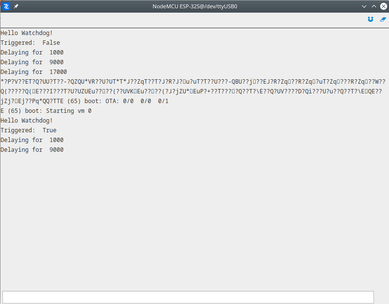

# Watchdog

The demonstration of how to use watchdog. It is necessary to have "Secure Firmware" VM enabled to run this demo successfully. After we initialized the watchdog to reset the MCU after 15000 milliseconds, inside the loop we increasing the delay time between watchdog kicks. When delay time become higher then 15000 ms the MCU - watchdog will reset the MCU.

More information about modules used in this demo:

- [Watchdog](/latest/reference/core/stdlib/docs/sfw/#watchdogs)

```python
# Import necessary modules.
import streams
import sfw

# Set Watchdog timeout after 15 seconds.
sfw.watchdog(0, 15000)

# Open the default serial port.
streams.serial()

print("Hello Watchdog!")

# Check is the watchdog triggered.
trig = sfw.watchdog_triggered()
print("Triggered: ", trig)

delay = 1000

while True:
    print("Delaying for ", delay)
    sleep(delay)
    sfw.kick()
    delay = delay + 8000
```

