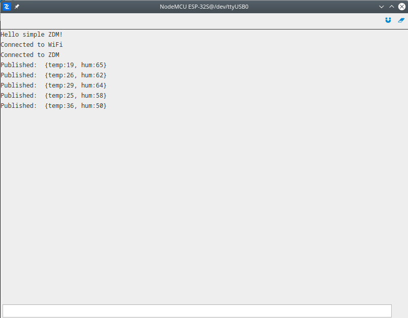

# ZDM Simple

The simplest demonstration of how to use ZDM. As a preparation step it is necessary to create the device on the [ZDM Cloud](https://zdm.zerynth.com) and to store device credentials in the project folder by downloading the `zdevice.json` file. After we initialized the watchdog and default serial port, the WiFi is initialized and connected with provided parameters. Once device connect to the network the ZDM device is created locally and connected to the ZDM cloud. Then inside infinite loop we are generating some random values, creating the payload and publishing it to the ZDM cloud each 5 seconds.

More information about modules used in this demo:

- [WiFi](/latest/reference/core/stdlib/docs/wireless_wifi/)
- [ZDM Device](/latest/reference/libs/zerynth/zdm/docs/zdm/#the-device-class)

```py
# Import necessary modules.
from bsp.drivers import wifi
import streams
import sfw
from zdm import zdm

MY_SSID = "***SSID Name***"
MY_PASS = "***Network Password***"
payload_tag = "weather"

# Initialize watchdog and open the default seral for print.
sfw.watchdog(0, 15000)
sfw.kick()
streams.serial()

print("Hello simple ZDM!")

# Initialize WiFi and connect to the network.
wifi.init()
interface = wifi.interface()
interface.link( MY_SSID, interface.WIFI_WPA2, MY_PASS)
print("Connected to WiFi")

# Create a ZDM Device and connected to ZDM cloud.
device = zdm.Device()
device.connect()
print("Connected to ZDM")

while True:
    sfw.kick()

    # Get some random values as temperature and humidity.
    temp = random(19, 38)
    hum = random(50, 70)

    # Composed and send the payload.
    payload = {"temp": temp, "hum": hum}
    device.publish(payload, payload_tag)
    print("Published: ", payload)
    sleep(5000)
```

