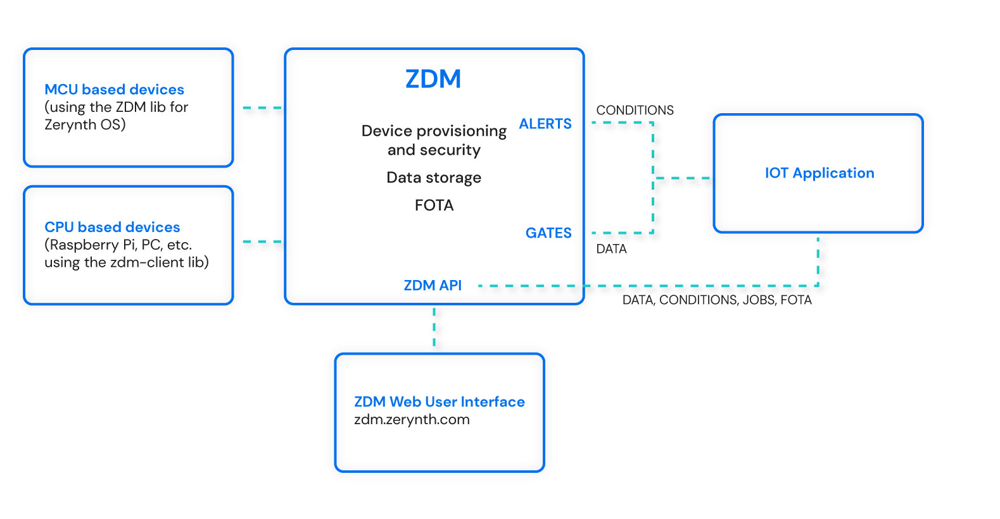

# Zerynth Device Manager

The Internet of Things is all about extracting valuable data from billions of connected devices. However, as developers and IoT product designers, we can't neglect the effort needed to deploy, manage and protect our devices for the entire duration of their life cycles.

For this often daunting task, we have developed the Zerynth Device Manager (ZDM). It is a device management service that speeds up the development of scalable, secure and reliable IoT solutions.
In particular, it takes care of the following tasks:

- **Onboarding and provisioning:** transfer or generate each device credentials choosing different levels of security, from simple tokens to a full-fledged public key infrastructure entirely under your control.
- **Lifecycle Management:** perform complex orchestration tasks by sending jobs and over-the-air updates via rich REST APIs.
- **Data Buffering:** avoid losing precious data by buffering it on the ZDM and forwarding it via convenient webhooks or API to the final IoT application.
- **Integrate:** automate integration with third-party data visualization and business intelligence engines like Grafana or PowerBI

ZDM adapts to all kinds of deployments, being available as a Software-as-a-Service hosted by Zerynth or as an on-premises containerized application.

ZDM is hardware and firmware independent, allowing the connection of both [microcontroller-based devices](https://docs.zerynth.com/latest/deploy/getting_started_with_sdk/) programmed with the Zerynth OS and [microprocessor-based devices](https://docs.zerynth.com/latest/deploy/getting_started_with_rpi/) such as the Raspberry Pi.

The Zerynth Device Manager is based on the following key concepts:

- A **Device** is the smallest entity you can find in the ZDM. It is represented by the physical IoT device connected to the ZDM.
- A **Workspace** is the entity that encloses devices and their data. You can imagine the workspace as the main folder of your project.
- A **Fleet** is a group of devices belonging to a Workspace. You can use fleets to group devices with similar features and applications. Fleets allow sending bulk device commands, OTA updates and jobs.
- A **Tag** is a data label used for querying data. Each device can publish its data on multiple Tags and the ZDM will take care of storing and retaining them.
- A **Gate** is an interface between the ZDM and an external service like your IoT application backend. Gates are used to stream data out of the ZDM.
- A **Condition** is an event on steroids. Conditions can be opened, updated and closed by devices to notify specific status (e.i. Battery status). Conditions can be monitored in real-time using the ZDM web interface or via API. 
- An **Alert** is a notification fired by a condition. Alerts are like GATES for conditions. Alerts can be notified via email or webhook allowing seamless integration with the IOT application backend.
- A **Job** is a command sent to a device. Jobs usually maps to firmware functions like reset, perform diagnostics, update firmware, etc...

If you want to know more, we have a [5 minutes tutorial](https://docs.zerynth.com/latest/deploy/getting_started_with_sdk/) to get you started with the ZDM.

ZDM can be easily accessed via the Web App at https://zdm.zerynth.com or, for more advanced usages, via the ZDM Command Line Interface integrated in the Zerynth SDK (download from https://www.zerynth.com/zsdk/).

You can also follow the tutorial on the ZDM [Web Interface](https://docs.zerynth.com/latest/deploy/web_interface/) for finding your way around.