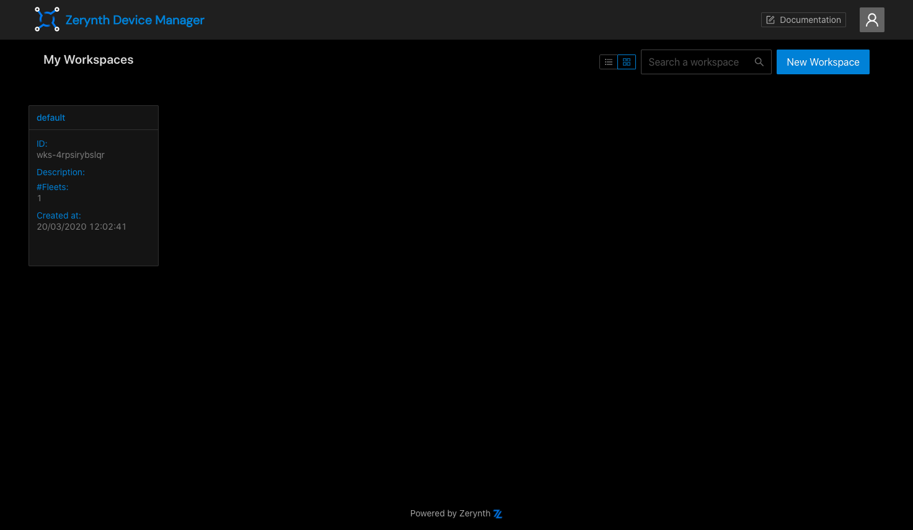
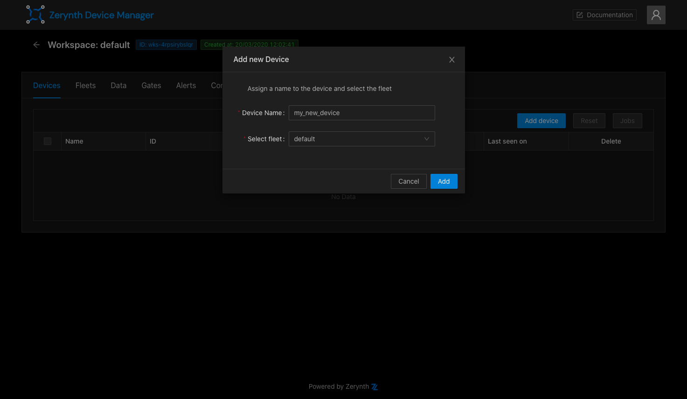
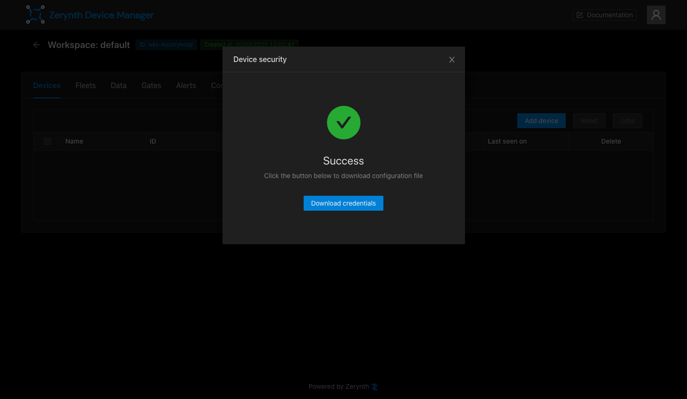

# ZDM - Getting started

This step by step guide explain how to start using ZDM and an *ESP32-DevKitC* microcontroller to see
data on ZDM web interface.

!!!Requirements
    1.  Zerynth account
    2.  Zerynth Studio 2.6.0
    3.  ESP32-DevKitC 
    
##Login
Login to the [ZDM](https://zdm.zerynth.com) using your Zerynth account.
Each account has a "Default" workspace containing a "Default" fleet created at the first login, click on it and open
the workspace page.

##Create a device
1.  To create a device, go to the **Devices** tab in the workspace page, then click on the "Add device" button.
then click on the "New Device" button to create a new device.
You can choose a custom name and fleet, or just simply click on the "Add" button with default values.
    
    

2.  Once the device has been created, the next step is to generate credentials to connect it to the ZDM.
In the **Device security** modal *Credentials type* *Endpoint type* are set by default, click on the "OK" button. 

    

3.  Now click on the **Download credentials** button to download the **zdevice.json** file
    containing device credentials and security configurations.

    

##Publish data to the ZDM
1.  Open *Zerynth Studio 2.6.0* and click on the lamp bulb to open the examples section, type **ZDM** in the search input box.

    
    
2.  Select and **Clone** the *ZDM Simple* example, then open the *main.py* file.
    
    
    
3.  Edit line *29* with your wifi-ssid and password to connect the *ESP32-DevKitC*.

4.  Open the **ZDM Simple** example directory and **paste the zdevice.json** file inside.

5.  **Uplink** the firmware clicking on the *up-arrow* button at the top

6.  Open the Zerynth Studio console, check the device started to publish random data to the ZDM.
    
    
    
##Data visualization
1.  Go back to the **ZDM Web Interface**, then open the device page clicking on the device name in the devices table.
    Data sent by the device are visible here!
    
    
    
    **Last hour activity** gives an idea of the device recent activity, the table below shows the published data.

    

