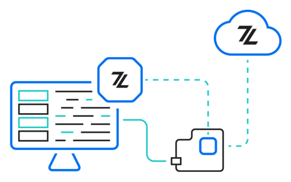

#Zerynth in a nutshell

Zerynth is a platform that simplifies and accelerates the development of Internet of Things (IoT) applications.
Zerynth offers developers, system integrators, and businesses a way to enable IoT for their products, rapidly.
Zerynth includes various tools, software and hardware units. The entry point to the Zerynth journey is not fixed, it depends on the user's needs and goals.

The development of IoT projects is a very long journey. Typically an IoT project requires a hardware platform, used as reference for the development of the IoT device. Zerynth can help you in this phase, thanks to the <a href="https://www.zerynth.com/powered-by-zerynth/" target="_blank">**Zerynth Hardware**</a> and the <a href="https://www.zerynth.com/powered-by-zerynth/" target="_blank">**Zerynth Powered Devices**</a>. Zerynth hardware are Zerynth officially commercialized devices that fully integrate with the Zerynth platform, providing users a seamless IoT development experience. Zerynth Powered Devices are third party hardware units that natively include the Zerynth OS, thus making it ready for being programmed and managed with the Zerynth platform. Zerynth also supports many other boards. A comprehensive list of all the supported boards, sensors, peripherals and libraries can be found [here](../reference/boards/index.md).

Once you have identified your IoT hardware it is time to develop the firmware for your embedded devices. The <a href="https://www.zerynth.com/zos/" target="_blank">**Zerynth OS (ZOS)**</a> is a real-time operating system that runs on a variety of 32 bit microcontrollers allowing for code portability within IoT hardware. It means that if you develop your firmware for Zerynth OS you can easily load it on all the Zerynth supported devices in a few clicks. Zerynth OS includes a Python Virtual Machine that allows developing IoT firmware in Python, or C and Python. For example, you can develop a motor control library in C in order to be meet fast control cycle constraints while developing the cloud connectivity code in Python.

  

For developing for Zerynth OS and programming your hardware’s firmware, you need to install the <a href="https://www.zerynth.com/zsdk/" target="_blank">**Zerynth SDK**</a>. The Zerynth SDK is a cross platform toolkit that includes [Zerynth Studio](../develop/index.md), the [Zerynth Toolchain](../reference/core/toolchain/docs/index.md) and various board programming tools, libraries and drivers.

Zerynth Studio is our IDE. It is a lightweight code editor fully integrated with the Zerynth platform that provides basic coding functionalities and all the pre-configured tool to program the hardware. If you are an expert programmer you can easily develop for Zerynth OS using your preferred IDE and then use the Zerynth Toolchain command for the compilation, upload and debug of your firmware.

We also have released and keep releasing various third party plugins that allow programming Zerynth firmwares with <a href="/latest/gettingstarted/#third-party-ide-plugins" target="_blank">**Visual Studio Code**</a>, Sublime Text and PyCharm.

The development of an IoT project is not finished with device firmware. An IoT device needs to be connected to in order to be able to stream data, receive commands and be easily updated, disabled or decommissioned if necessary.

  

IoT Device Management and Data collection is provided by Zerynth thanks to the [Zerynth Device Manager (ZDM)](../deploy/index.md). ZDM is a device management system that allows connecting IoT devices to various endpoints maintaining an intuitive but powerful management of fleets security and updates.  ZDM can also take care of devices data by buffering and retaining it and forwarding the streams to external services, databases or data visualization tools. Integrations exist for seamlessly formwarding data to top cloud providers (Azure, AWS, IBM and Google) via webhooks and simple REST APIs.

You are at the end of the IoT development journey, if you need more help on finalizing your project or in converting an IoT prototype into an industrial product just check our <a href="https://www.zerynth.com/services/" target="_blank">**R&D**</a> services.

  

If you are interested in ready to use vertical IoT solutions, you can check the **Zerynth 4ZeroBox**. The <a href="/latest/4zp/4ZeroBox/" target="_blank">**Zerynth 4ZeroBox**</a> is a ready to use industrial unit that allows to easily interface modern and legacy industrial machines to the cloud, thus building the “digital twin” of the Industry 4.0 paradigms. The 4ZeroBox can be connected to the Zerynth Device Manager and collected data visualized thanks to our <a href="https://www.zerynth.com/blog/connect-zerynth-device-manager-with-grafana-iot-data-visualization/" target="_blank">**Grafana**</a> and <a href="https://www.zerynth.com/blog/iot-tutorial-learn-how-to-connect-power-bi-to-the-zerynth-device-manager/" target="_blank">**Microsoft PowerBi**</a> integrations. The 4ZeroBox has been already used in various industrial use-cases you can find documented <a href="https://www.zerynth.com/use-cases/" target="_blank">**here**</a>. 
