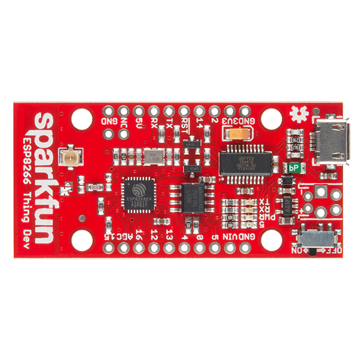

# Sparkfun Esp8266 Thing Dev

The SparkFun ESP8266 Thing Dev is a development board that has been solely designed around the ESP8266, with an integrated FTDI USB-to-Serial chip. The ESP8266 is a cost-effective, and very capable WiFi-enabled microcontroller.

The ESP8266 Thing Development device breaks out all of the module’s pins, and the USB-to-serial converter means you don’t need any peripheral components to program the chip. The device features 512 KB of flash memory, 80MHz of system clock, around 50k of usable RAM and an on chip Wifi Transceiver.

<p style="text-align:center;"></p>

## Pin Mapping


Official reference for Sparkfun Esp8266 Thing Dev can be found [here](https://www.sparkfun.com/products/13711).

## Flash Layout

The Esp8266 Thing Dev features a 512 KB (4 Mb) flash memory organized in sectors of 4k each. The flash memory address starts at 0x40200000 and can be read and written from a Zerynth program using the internal flash module.

!!! warning
	If flash memory must be used in a Zerynth program, it is recommended to begin using it from secure addresses towards the end the bytecode (start address of the bytecode can be found in the log console of Zerynth Studio during the ```uplink``` operation), leaving a minimum safe place to minimize the chance of clashes.

!!! note
	The internal flash of Sparkfun Esp8266 Thing Dev can be organized in different ways. The standard VM code beginning at 0x0000, followed by the esp8266 ir0m image at 0x20000 and the esp_init_data at 0x3fc000. The VM is based on the Espressif RTOS SDK 1.4.1.

!!! warning
	As reported in [Sparkfun reviews page](https://www.sparkfun.com/products/13711#product-review-4014), the Firmware Over The Air feature is not implementable because of small flash memory size.

## Device Summary


* Microcontroller: Tensilica 32-bit RISC CPU Xtensa LX106
* Operating Voltage: 3.3V
* Input Voltage: 2.5-6V
* Digital I/O Pins (DIO): 11
* Analog Input Pins (ADC): 1
* UARTs: 2
* SPIs: 1
* I2Cs: 1
* Flash Memory: 512 KB
* SRAM: 64 KB
* Clock Speed: 80 Mhz
* Wi-Fi: IEEE 802.11 b/g/n:
    * Integrated TR switch, balun, LNA, power amplifier and matching network
    * WEP or WPA/WPA2 authentication, or open networks

## Power

Power to the Esp8266 Thing Dev is supplied via the on-board USB Micro B connector or directly via the “VIN” pin. The power source is selected automatically.

Alternatively, it is possible to solder a variety of connectors into the VIN position to run the device on some other power external supply.

The device can operate on an external supply of 2.5 to 6 volts. If using more than 6V, the voltage regulator may overheat and damage the device.

!!! note
	After powering the device, make sure the ON/OFF switch is slid into the “ON” position, and you should see the “PWR” LED illuminate.

## Connect, Register, Virtualize and Program

The Sparkfun Esp8266 Thing Dev comes with a serial-to-usb chip on board that allows programming and opening the UART of the Esp8266 module. The FTDI FT231x is also connected to the boot pins of the module, allowing for a seamless virtualization of the device.

!!! note
	Drivers for the FT231x Module can be downloaded [here](http://www.ftdichip.com/Drivers/VCP.htm) and are needed for **Windows and Mac platforms**. In Linux systems, the Sparkfun Esp8266 Thing Dev should work out of the box.

!!! note
	**For Linux Platform**: to allow the access to serial ports the user needs read/write access to the serial device file. Adding the user to the group, that owns this file, gives the required read/write access: **Ubuntu** distribution –> dialout group; **Arch Linux** distribution –> uucp group.

Once connected to a USB port the Sparkfun Esp8266 Thing Dev can be seen as a Virtual Serial port and it is automatically recognized by Zerynth Studio. The next steps are:

* **Select** the Sparkfun Esp8266 Thing Dev on the **Device Management Toolbar** (disambiguate if necessary);
* **Register** the device by clicking the “Z” button from the Zerynth Studio;
* **Create** a Virtual Machine for the device by clicking the “Z” button for the second time;
* **Virtualize** the device by clicking the “Z” button for the third time.

!!! note
	No user intervention on the device is required for registration and virtualization process

After virtualization, the Sparkfun Esp8266 Thing Dev is ready to be programmed and the  Zerynth scripts **uploaded**. Just **Select** the virtualized device from the “Device Management Toolbar” and **click** the dedicated “upload” button of Zerynth Studio.

!!! note
	No user intervention on the device is required for the upload process.

!!! important
    To exploit the Wi-Fi chip functionalities of the Sparkfun Esp8266 Thing Dev, the [lib.espressif.esp8266wifi library](https://docs.zerynth.com/latest/official/lib.espressif.esp8266wifi/docs/index.html#esp8266wifi) must be installed (some example code is provided).

## Power Management

Power Management feature allows to optimize power consumption by putting the device in low consumption state. More information in [Power Management - ESP8266 section](https://docs.zerynth.com/latest/official/core.zerynth.stdlib/docs/official_core.zerynth.stdlib_pwr.html#pwr-esp8266).
<!--stackedit_data:
eyJoaXN0b3J5IjpbMTI3NTEwNDE0OCw4NzU4MTEwMjRdfQ==
-->
