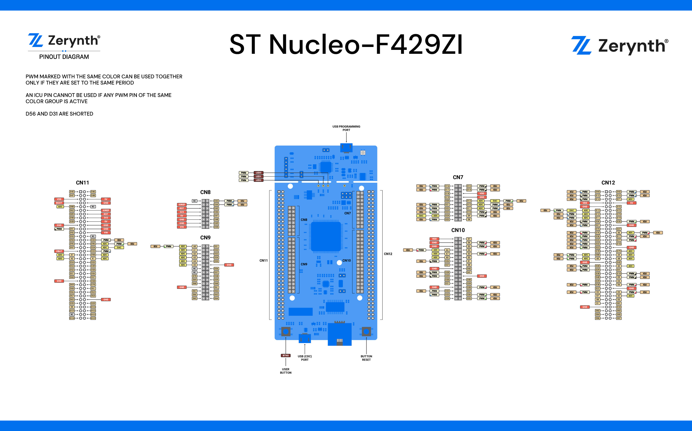

# ST Microelectronics Nucleo F429ZI

The [ST Nucleo F429ZI device](http://www.st.com/en/evaluation-tools/nucleo-f429zi.html) is an STM32 Nucleo-144 boards that provides an affordable and flexible way for users to try out new concepts and build prototypes, by choosing from the various combinations of performance and power consumption features provided by the STM32 microcontroller.

The ST Zio connector and the ST morpho headers provide an easy means of expanding the functionality of the Nucleo open development platform with a wide choice of specialized shields. The STM32 Nucleo-144 boards do not require any separate probe as they integrate the ST-LINK/V2-1 debugger/programmer.

The device needs a 5V power supply and features a [STM32F429 MCU](http://www.st.com/content/ccc/resource/technical/document/datasheet/03/b4/b2/36/4c/72/49/29/DM00071990.pdf/files/DM00071990.pdf/jcr:content/translations/en.DM00071990.pdf) running at 180MHz with 192Kb of RAM, 2Mb of flash.

## Pin Mapping

ST Nucleo F429ZI official manual is available [here](http://www.st.com/content/ccc/resource/technical/document/data_brief/group0/7b/df/1d/e9/64/55/43/8d/DM00247910/files/DM00247910.pdf/jcr:content/translations/en.DM00247910.pdf)

## Flash Layout

The internal flash of the ST Nucleo F429ZI is organized into two banks of 1Mb each. Each bank has sectors of different size according to the following table:

<table class="tg">
<thead>
  <tr>
    <th class="tg-zatc" colspan="3">Bank 1</th>
    <th class="tg-vfhj" colspan="3">Bank 2</th>
  </tr>
</thead>
<tbody>
  <tr>
    <td class="tg-zatc">Start address</td>
    <td class="tg-zatc">Size</td>
    <td class="tg-zatc">Content</td>
    <td class="tg-vfhj">Start address</td>
    <td class="tg-vfhj">Size</td>
    <td class="tg-vfhj">Content</td>
  </tr>
  <tr>
    <td class="tg-5ncm">0x8000000</td>
    <td class="tg-5ncm">16Kb</td>
    <td class="tg-5ncm">Virtual Machine</td>
    <td class="tg-wh69">0x8100000</td>
    <td class="tg-wh69">16Kb</td>
    <td class="tg-wh69">Bytecode Bank 7</td>
  </tr>
  <tr>
    <td class="tg-htbt">0x8004000</td>
    <td class="tg-htbt">16Kb</td>
    <td class="tg-htbt">Virtual Machine</td>
    <td class="tg-3me6">0x8104000</td>
    <td class="tg-3me6">16Kb</td>
    <td class="tg-3me6">Bytecode Bank 8</td>
  </tr>
  <tr>
    <td class="tg-5ncm">0x8008000</td>
    <td class="tg-5ncm">16Kb</td>
    <td class="tg-5ncm">Virtual Machine</td>
    <td class="tg-wh69">0x8108000</td>
    <td class="tg-wh69">16Kb</td>
    <td class="tg-wh69">Bytecode Bank 9</td>
  </tr>
  <tr>
    <td class="tg-3me6">0x800C000</td>
    <td class="tg-3me6">16Kb</td>
    <td class="tg-3me6">Virtual Machine</td>
    <td class="tg-3me6">0x810C000</td>
    <td class="tg-3me6">16Kb</td>
    <td class="tg-3me6">Bytecode Bank 10</td>
  </tr>
  <tr>
    <td class="tg-wh69">0x8010000</td>
    <td class="tg-wh69">64Kb</td>
    <td class="tg-wh69">Virtual Machine</td>
    <td class="tg-wh69">0x8110000</td>
    <td class="tg-wh69">64Kb</td>
    <td class="tg-wh69">Bytecode Bank 11</td>
  </tr>
  <tr>
    <td class="tg-3me6">0x8020000</td>
    <td class="tg-3me6">128kb</td>
    <td class="tg-3me6">Bytecode Bank 0</td>
    <td class="tg-3me6">0x8120000</td>
    <td class="tg-3me6">128kb</td>
    <td class="tg-3me6">Bytecode Bank 12</td>
  </tr>
  <tr>
    <td class="tg-wh69">0x8040000</td>
    <td class="tg-wh69">128kb</td>
    <td class="tg-wh69">Bytecode Bank 1</td>
    <td class="tg-wh69">0x8140000</td>
    <td class="tg-wh69">128kb</td>
    <td class="tg-wh69">Bytecode Bank 13</td>
  </tr>
  <tr>
    <td class="tg-3me6">0x8060000</td>
    <td class="tg-3me6">128kb</td>
    <td class="tg-3me6">Bytecode Bank 2</td>
    <td class="tg-3me6">0x8160000</td>
    <td class="tg-3me6">128kb</td>
    <td class="tg-3me6">Bytecode Bank 14</td>
  </tr>
  <tr>
    <td class="tg-wh69">0x8080000</td>
    <td class="tg-wh69">128kb</td>
    <td class="tg-wh69">Bytecode Bank 3</td>
    <td class="tg-wh69">0x8180000</td>
    <td class="tg-wh69">128kb</td>
    <td class="tg-wh69">Bytecode Bank 15</td>
  </tr>
  <tr>
    <td class="tg-3me6">0x80A0000</td>
    <td class="tg-3me6">128kb</td>
    <td class="tg-3me6">Bytecode Bank 4</td>
    <td class="tg-3me6">0x81A0000</td>
    <td class="tg-3me6">128kb</td>
    <td class="tg-3me6">Bytecode Bank 16</td>
  </tr>
  <tr>
    <td class="tg-wh69">0x80C0000</td>
    <td class="tg-wh69">128kb</td>
    <td class="tg-wh69">Bytecode Bank 5</td>
    <td class="tg-wh69">0x81C0000</td>
    <td class="tg-wh69">128kb</td>
    <td class="tg-wh69">Bytecode Bank 17</td>
  </tr>
  <tr>
    <td class="tg-3me6">0x80E0000</td>
    <td class="tg-3me6">128kb</td>
    <td class="tg-3me6">Bytecode Bank 6</td>
    <td class="tg-3me6">0x81E0000</td>
    <td class="tg-3me6">128kb</td>
    <td class="tg-3me6">Bytecode Bank 18</td>
  </tr>
</tbody>
</table>

## Device Summary

* Microcontroller: ARM 32-bit Cortex™-M4 CPU Core
* Operating Voltage: 3.3V
* Input Voltage: 7-12V
* Digital I/O Pins (DIO): 105
* Analog Input Pins (ADC): 19
* UARTs: 6
* SPIs: 5
* I2Cs: 3
* Flash Memory: 2Mb
* SRAM: 192 KB + 64Kb CCM
* Clock Speed: 180MHz

## Power

On the ST Nucleo F429ZI, the power supply is provided either by the host PC through the USB cable, or by an external Source: VIN (7V-12V), E5V (5V) or +3V3 power supply pins on CN11 or CN8. In case VIN, E5V or +3V3 is used to power the Nucleo device, using an external power supply unit or an auxiliary equipment, this power source must comply with the standard EN-60950-1: 2006+A11/2009, and must be Safety Extra Low Voltage (SELV) with limited power capability.

The ST-LINK/V2-1 supports USB power management allowing to request more than 100 mA current to the host PC. All parts of the STM32 Nucleo device and shield can be powered from the ST-LINK USB connector CN1 (U5V or VBUS).

!!! warning
	Depending on the type of power supply choosen, the jumper JP3 must be correclty selected:

* JP3 between pin 1 and pin 2 for E5V power supply;
* JP3 between pin 3 and pin 4 for U5V power supply (ST-Link VBUS);
* JP3 between pin 5 and pin 6 for VIN-5V power supply.

## Connect, Register, Virtualize and Program

The ST Nucleo F429ZI Programming port is connected to the ST-Link uploader creating a virtual COM port on a connected computer. To recognize the device, **Windows** machines requires drivers that can be downloaded from [the ST Nucleo download page](http://www.st.com/content/st_com/en/products/development-tools/software-development-tools/stm32-software-development-tools/stm32-utilities/stsw-link009.html), while **MAC OSX** and **Linux** machines will recognize the device automatically.

The St-Link is also connected to the STM32 hardware UART0.

Once connected on a USB port, if drivers have been correctly installed the ST Nucleo F429ZI device is recognized by Zerynth Studio and listed in the **Device Management Toolbar**. The next steps are:

* **Select** the ST Nucleo F429ZI on the **Device Management Toolbar** (disambiguate if necessary);
* **Register** the device by clicking the “Z” button from the Zerynth Studio;
* **Create** a Virtual Machine for the device by clicking the “Z” button for the second time;
* **Virtualize** the device by clicking the “Z” button for the third time.

!!! note
	  No user intervention on the device is required for registration and virtualization process.

After virtualization, the ST Nucleo F429ZI device is ready to be programmed and the  Zerynth scripts **uploaded**. Just **Select** the virtualized device from the “Device Management Toolbar” and **click** the dedicated “upload” button of Zerynth Studio and **reset** the device by pressing the Reset on-board button when asked.

!!! note
	  If the reset is not performed within 5 seconds the upload procedure fails.

!!! warning
	  Scripts uploading and serial console connection issues on St Nucleo devices have been reported. If the upload fails also with a correctly performed reset or if the device is not able to print on the console, disconnect the device from the USB port and plug it again on another USB socket.

If also this procedure fails, try to update the ST Nucleo firmware available at this [link](https://developer.mbed.org/teams/ST/wiki/Nucleo-Firmware)

## Firmware Over the Air update (FOTA)

The Firmware Over the Air feature allows to update the device firmware at runtime. Zerynth FOTA in the ST Nucleo F429ZI device is available for bytecode and VM.

Flash Layout is shown in table below:

| Start address | Size  | Content         |
|---------------|-------|-----------------|
| 0x08000000    | 128Kb | VM Slot 0       |
| 0x08020000    | 384kb | Bytecode Slot 0 |
| 0x08080000    | 128kb | VM Slot 1       |
| 0x080A0000    | 384kb | Bytecode Slot 1 |

!!! important
    FOTA Record (small segment of memory where the current and desired state of the firmware is store) for the ST Nucleo F429ZI device is allocated in 16kb sector inside the VM Slot 0 at 0x08004000 address.

## Power Management and Secure Firmware

Power Management feature allows to optimize power consumption by putting the device in low consumption state.

Secure Firmware feature allows to detect and recover from malfunctions and, when supported, to protect the running firmware (e.g. disabling the external access to flash or assigning protected RAM memory to critical parts of the system).

Both these features are strongly platform dependent; more information at [Power Management - STM32F section](https://docs.zerynth.com/latest/official/core.zerynth.stdlib/docs/official_core.zerynth.stdlib_pwr.html#pwr-stm32f) and [Secure Firmware - STM32F section](https://docs.zerynth.com/latest/official/core.zerynth.stdlib/docs/official_core.zerynth.stdlib_sfw.html#sfw-stm32f).
<!--stackedit_data:
eyJoaXN0b3J5IjpbLTEwMTA1NDU3MjcsLTg1MzU0Mjg1Nl19
-->
