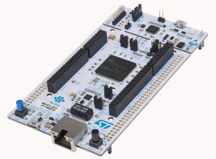

# ST Microelectronics Nucleo F746ZG

The [ST Microelectronics Nucleo F746ZG](https://www.st.com/en/evaluation-tools/nucleo-f746zg.html) boards provide an affordable and flexible way for users to try out new concepts and build prototypes by choosing from the various combinations of performance and power consumption features, provided by the STM32 microcontroller.

<p style="text-align:center;"></p>

The ST Zio connector, which extends the Arduino™ Uno V3 connectivity, and the ST morpho headers provide an easy means of expanding the functionality of the Nucleo open development platform with a wide choice of specialized shields.
The STM32 Nucleo-144 board does not require any separate probe as it integrates the ST-LINK debugger/programmer.

## Pin Mapping


## Flash Layout

The internal flash of the is ST Nucleo F746ZG is organized into sectors of different size according to the following table:

| Start address | Size  | Content         |
|---------------|-------|-----------------|
| 0x8000000     | 32Kb  | Virtual Machine |
| 0x8008000     | 32Kb  | Virtual Machine |
| 0x8010000     | 32Kb  | Virtual Machine |
| 0x8018000     | 32Kb  | Virtual Machine |
| 0x8020000     | 128Kb | Bytecode Bank 0 |
| 0x8040000     | 256kb | Bytecode Bank 1 |
| 0x8080000     | 256kb | Bytecode Bank 2 |
| 0x80C0000     | 256kb | Bytecode Bank 3 |

!!! warning
	If internal flash is used in a Zerynth program, it is suggested to begin using pages from the end of flash (bytecode bank 3) towards the virtual machine, to minimize the chance of clashes.

Since writing to a sector entails erasing it first, the write operation can be slow even for small chunks of data, depending on the size of the choosen sector.

## Device Summary


* Microcontroller: STM32F746 ARM®32-bit Cortex®-M7 CPU
* Operating Voltage: 3.3V
* Input Voltage: 7-12V
* Digital I/O Pins (DIO): 84
* Analog Input Pins (ADC): 9
* UARTs: 4
* SPIs: 2
* I2Cs: 2
* Flash Memory: 1024 KB
* SRAM: 320 KB

## Power

On the ST Nucleo F746ZG, the power supply is provided either by the host PC through the USB cable, or by an external Source: VIN (7V-12V), E5V (5V) or +3V3 power supply pins on CN11 or CN8. In case VIN, E5V or +3V3 is used to power the Nucleo device, using an external power supply unit or an auxiliary equipment, this power source must comply with the standard EN-60950-1: 2006+A11/2009, and must be Safety Extra Low Voltage (SELV) with limited power capability.

The ST-LINK/V2-1 supports USB power management allowing to request more than 100 mA current to the host PC. All parts of the STM32 Nucleo device and shield can be powered from the ST-LINK USB connector CN1 (U5V or VBUS).

!!! warning
	Depending on the type of power supply choosen, the jumper JP3 must be correclty selected:


* JP3 between pin 1 and pin 2 for E5V power supply;
* JP3 between pin 3 and pin 4 for U5V power supply (ST-Link VBUS);
* JP3 between pin 5 and pin 6 for VIN-5V power supply.

## Connect, Register, Virtualize and Program

The ST Nucleo F746ZG Programming port is connected to the ST-Link uploader creating a virtual COM port on a connected computer. To recognize the device, Windows machines requires drivers that can be downloaded from the [ST Nucleo download page](http://www.st.com/content/st_com/en/products/development-tools/software-development-tools/stm32-software-development-tools/stm32-utilities/stsw-link009.html) while MAC OSX and Linux machines will recognize the device automatically.

On **MAC OSX** and **Linux** USB drivers are not required.

!!! note
	**For Linux Platform**: to allow the access to serial ports the user needs read/write access to the serial device file. Adding the user to the group, that owns this file, gives the required read/write access: **Ubuntu** distribution –> dialout group; **Arch Linux** distribution –> uucp group.

    If the device is still not recognized or not working, the following udev rules may need to be added:

    ```bash
    #ST Nucleo F746ZG Device
    SUBSYSTEMS=="tty", ATTRS{idVendor}=="0483", ATTRS{idProduct}=="374b", MODE="0666", GROUP="users", ENV{ID_MM_DEVICE_IGNORE}="1"
    ```

* **Select** the ST Nucleo F746ZG on the **Device Management Toolbar** (Disambiguate if necessary);
* **Register** the device by clicking the “Z” button from the Zerynth Studio;
* **Create** a Virtual Machine for the device by clicking the “Z” button for the second time;
* **Virtualize** the device by clicking the “Z” button for the third time.

After virtualization, the ST Nucleo F746ZG device is ready to be programmed and the Zerynth scripts uploaded. Just Select the virtualized device from the “Device Management Toolbar” and click the dedicated “upload” button of Zerynth Studio and reset the device by pressing the Reset on-board button when asked.

## Missing Features

Not all features have been included in the ST Nucleo F746ZG support. In particular the following are missing:


* ICU
* Ethernet
* USB

<!--stackedit_data:
eyJoaXN0b3J5IjpbLTIxMDcyNDI1OCwtMTE1NzQxNDQ3NF19
-->
