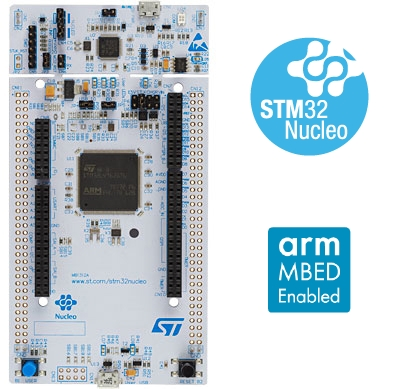
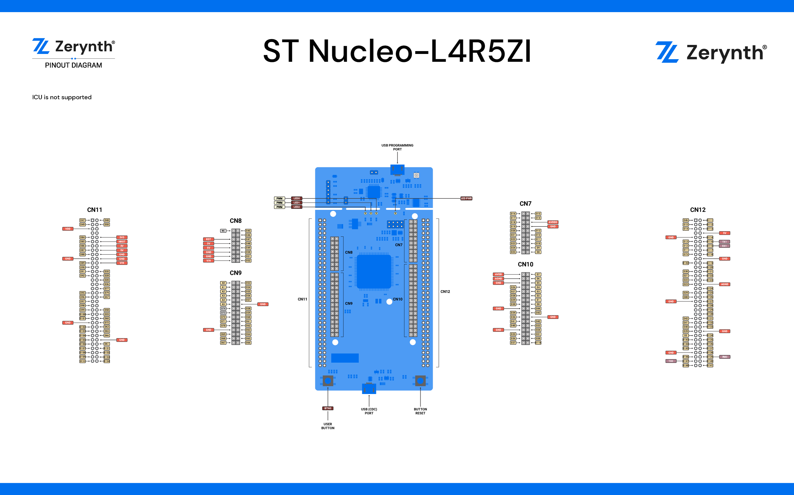

# ST Microelectronics Nucleo L4R5

The  [ST Nucleo L4R5 Nucleo Board](https://www.st.com/en/evaluation-tools/nucleo-l4r5zi.html)  features The STM32L4R5 Microcontroller, an ultra-low-power microcontrollers family (STM32L4+ Series) based on the high-performance Arm® Cortex®-M4 32-bit RISC core. They operate at a frequency of up to 120 MHz.

The STM32 Nucleo-144 board provides an affordable and flexible way for users to try out new concepts and build prototypes by choosing from the various combinations of performance and power consumption features, provided by the STM32 microcontroller.

The ST Zio connector and the ST morpho headers provide an easy means of expanding the functionality of the Nucleo open development platform with a wide choice of specialized shields. The STM32 Nucleo-144 boards do not require any separate probe as they integrate the ST-LINK/V2-1 debugger/programmer.

_St Microelectronics Nucleo L4R5. Copyright st.com_

## Pin Mapping

ST Nucleo L4R5 official manual is available  [here](https://www.st.com/en/microcontrollers-microprocessors/stm32l4r5zi.html)

## Flash Layout

The internal flash of the ST Nucleo L4R5 is organized into two banks of 1Mb each. Each bank has sectors of different size according to the following table:

Bank 1

Bank 2

Start address

Size

Content

Start address

Size

Content

0x8000000

16Kb

Virtual Machine

0x8100000

16Kb

Bytecode Bank 7

0x8004000

16Kb

Virtual Machine

0x8104000

16Kb

Bytecode Bank 8

0x8008000

16Kb

Virtual Machine

0x8108000

16Kb

Bytecode Bank 9

0x800C000

16Kb

Virtual Machine

0x810C000

16Kb

Bytecode Bank 10

0x8010000

64Kb

Virtual Machine

0x8110000

64Kb

Bytecode Bank 11

0x8020000

128kb

Bytecode Bank 0

0x8120000

128kb

Bytecode Bank 12

0x8040000

128kb

Bytecode Bank 1

0x8140000

128kb

Bytecode Bank 13

0x8060000

128kb

Bytecode Bank 2

0x8160000

128kb

Bytecode Bank 14

0x8080000

128kb

Bytecode Bank 3

0x8180000

128kb

Bytecode Bank 15

0x80A0000

128kb

Bytecode Bank 4

0x81A0000

128kb

Bytecode Bank 16

0x80C0000

128kb

Bytecode Bank 5

0x81C0000

128kb

Bytecode Bank 17

0x80E0000

128kb

Bytecode Bank 6

0x81E0000

128kb

Bytecode Bank 18

## Device Summary

-   Microcontroller: ARM 32-bit Cortex™-M4 CPU Core
-   Operating Voltage: 3.3V
-   Input Voltage: 7-12V
-   Digital I/O Pins (DIO): 133
-   Analog Input Pins (ADC): 9
-   UARTs: 1
-   SPIs: 1
-   I2Cs: 1
-   Flash Memory: 2Mb
-   SRAM: 640Kbyte
-   Clock Speed: 120MHz

## Power

On the ST Nucleo L4R5, the power supply is provided either by the host PC through the USB cable, or by an external Source: VIN (7V-12V), E5V (5V) or +3V3 power supply pins on CN11 or CN8. In case VIN, E5V or +3V3 is used to power the Nucleo device, using an external power supply unit or an auxiliary equipment, this power source must comply with the standard EN-60950-1: 2006+A11/2009, and must be Safety Extra Low Voltage (SELV) with limited power capability.

The ST-LINK/V2-1 supports USB power management allowing to request more than 100 mA current to the host PC. All parts of the STM32 Nucleo device and shield can be powered from the ST-LINK USB connector CN1 (U5V or VBUS).

Warning

Depending on the type of power supply choosen, the jumper JP3 must be correclty selected:

-   JP3 between pin 1 and pin 2 for E5V power supply;
-   JP3 between pin 3 and pin 4 for U5V power supply (ST-Link VBUS);
-   JP3 between pin 5 and pin 6 for VIN-5V power supply.

Please refer to the datasheet of the Nucleo-144 boards for more information on Power selection and Power supply.

## Connect, Register, Virtualize and Program

The ST Nucleo L4R5 Programming port is connected to the ST-Link uploader creating a virtual COM port on a connected computer. To recognize the device,  **Windows**  machines requires drivers that can be downloaded from  [the ST Nucleo download page](http://www.st.com/content/st_com/en/products/development-tools/software-development-tools/stm32-software-development-tools/stm32-utilities/stsw-link009.html), while  **MAC OSX**  and  **Linux**  machines will recognize the device automatically.

The St-Link is also connected to the STM32 hardware UART0.

Once connected on a USB port, if drivers have been correctly installed the ST Nucleo L4R5 device is recognized by Zerynth Studio and listed in the  **Device Management Toolbar**. The next steps are:

-   **Select**  the ST Nucleo L4R5 on the  **Device Management Toolbar**  (disambiguate if necessary);
-   **Register**  the device by clicking the “Z” button from the Zerynth Studio;
-   **Create**  a Virtual Machine for the device by clicking the “Z” button for the second time;
-   **Virtualize**  the device by clicking the “Z” button for the third time.

Note

No user intervention on the device is required for registration and virtualization process

After virtualization, the ST Nucleo L4R5 device is ready to be programmed and the Zerynth scripts  **uploaded**. Just  **Select**  the virtualized device from the “Device Management Toolbar” and  **click**  the dedicated “uplink” button of Zerynth Studio .. warning:: Scripts uploading and serial console connection issues on St Nucleo devices have been reported. If the upload fails also with a correctly performed reset or if the device is not able to print on the console, disconnect the device from the USB port and plug it again on another USB socket.

> If also this procedure fails, try to update the ST Nucleo firmware available at this  [link](https://developer.mbed.org/teams/ST/wiki/Nucleo-Firmware)

## Firmware Over the Air update (FOTA)

The Firmware Over the Air feature allows to update the device firmware at runtime. Zerynth FOTA in the ST Nucleo L4R5 device is available for bytecode and VM.

Flash Layout is shown in table below:

Start address

Size

Content

0x08000000

128Kb

VM Slot 0

0x08020000

384kb

Bytecode Slot 0

0x08080000

128kb

VM Slot 1

0x080A0000

384kb

Bytecode Slot 1

Important

FOTA Record (small segment of memory where the current and desired state of the firmware is store) for the ST Nucleo L4R5 device is allocated in 16kb sector inside the VM Slot 0 at 0x08004000 address.
<!--stackedit_data:
eyJoaXN0b3J5IjpbLTM5ODI1MTAxMCw2NjQwMzQ5ODksNzMwOT
k4MTE2XX0=
-->