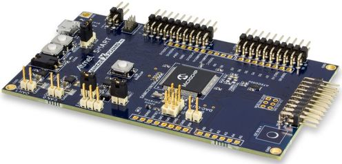
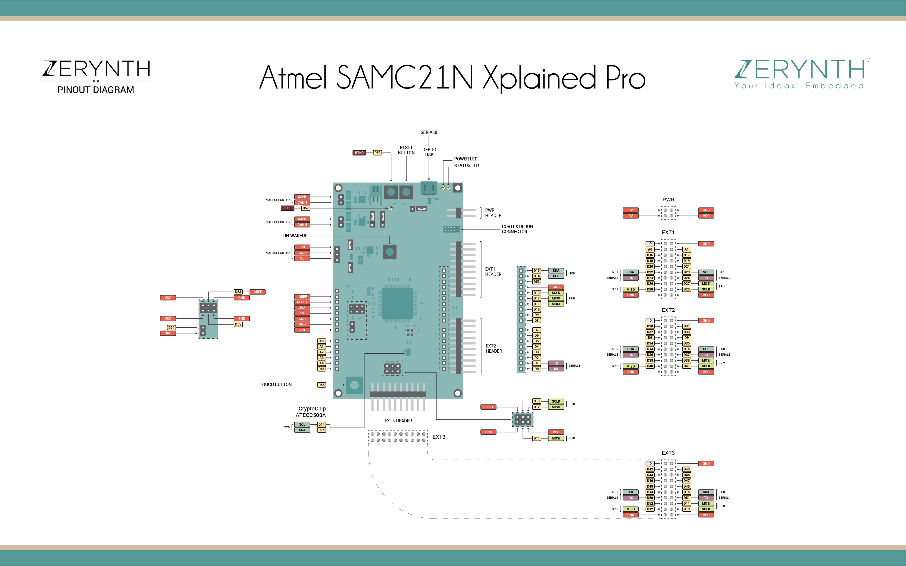

# Xplained Pro Sam C21N

The Xplained Pro Sam C21N is a microcontroller device based on the Atmel [SAMC21N18A ARM Cortex-M0+ CPU](http://ww1.microchip.com/downloads/en/DeviceDoc/SAM-C20C21-Family-Datasheet-DS60001479C.pdf). The Xplained Pro extension kits offers additional peripherals to extend the features of the device and ease the development of custom designs.

One of its most important features is the Atmel Embedded Debugger (EDBG), which provides a full debug interface without the need for additional hardware, significantly increasing the ease-of-use for software debugging. EDBG also supports a virtual COM port that can be used for device and bootloader programming.

<p style="text-align:center;"></p>

!!! note
	All the reported information are extracted from the official [Xplained Pro Sam C21N page](https://www.microchip.com/developmenttools/ProductDetails/atsamc21n-xpro), visit this page for more details and updates.

## Pin Mapping



Xplained Pro Sam C21N Official Schematic, Reference Design and Pin Mapping are available on the official [Atmel User Guide](http://ww1.microchip.com/downloads/en/DeviceDoc/70005318A.pdf).

## Flash Layout

The internal flash of the Xplained Pro Sam C21N is organized as a single bank of 256k. Zerynth VM starts at first address of the flash memory.

## Device Summary


* Microcontroller: ATSAMC21N18
* Operating Voltage: 3.3V or 5.0V
* USARTs: 4
* SPIs: 3
* I2Cs: 2
* Flash Memory: 256 KB
* SRAM: 32 KB
* Clock Speed: 48 MHz

## Power

The Xplained Pro Sam C21N can be powered via the USB connector or with an external power supply via “GND” and “5.0 IN” pins of the PWR header.

The device can operate on an external supply of 5V ±2% (±100mV) for USB host operation or from 4.3V to 5.5V if USB host operation is not required. Current recommended requirements, in external power supply mode, are:


* minimum 1A to be able to provide enough current for connected USB devices and the device itself.
* maximum is 2A due to the input protection maximum current specification

!!! note
	External power is required when 500mA from a USB connector is not enough to power the device with possible extension boards. A connected USB device in a USB host application might easily exceed this limit.

## Connect, Register, Virtualize and Program

The Xplained Pro Sam C21N debug port is connected to EDBG, which provides a virtual COM port to software on a connected computer. To recognize the device, all **Windows** (automatic driver software installation), **OSX** and **Linux** machines will recognize the device as a COM port automatically.

!!! note
	**For Linux Platform**: to allow the access to serial ports the user needs read/write access to the serial device file. Adding the user to the group, that owns this file, gives the required read/write access: **Ubuntu** distribution –> dialout group; **Arch Linux** distribution –> uucp group.

    If the device is still not recognized or not working, the following udev rules may need to be added:

    ```bash
    # Check SUBSYSTEM
    SUBSYSTEMS=="hidraw", KERNEL=="hidraw*", MODE="0666", GROUP="dialout"

    # Xplained Pro SamC21N Device
    SUBSYSTEMS=="usb", ATTRS{idVendor}=="03eb", ATTRS{idProduct}=="2111", MODE="0666", GROUP="users", ENV{ID_MM_DEVICE_IGNORE}="1"
    SUBSYSTEMS=="tty", ATTRS{idVendor}=="03eb", ATTRS{idProduct}=="2111", MODE="0666", GROUP="users", ENV{ID_MM_DEVICE_IGNORE}="1"
    ```

EDBG is also connected to the SAMC21N hardware UART. Serial on pins RX0 and TX0 provides Serial-to-USB communication for programming the device through Atmel EDBG.

Once connected on a USB port the Xplained Pro Sam C21N device is recognized by Zerynth Studio. The next steps are:

* **Select** the Xplained Pro Sam C21N on the **Device Management Toolbar**;
* **Register** the device by clicking the “Z” button from the Zerynth Studio;
* **Create** a Virtual Machine for the device by clicking the “Z” button for the second time;
* **Virtualize** the device by clicking the “Z” button for the third time.

!!! note
	No user intervention on the device is required for registration and virtualization process

After virtualization, the Xplained Pro Sam C21N is ready to be programmed and the Zerynth scripts **uploaded**. Just **Select** the virtualized device from the “Device Management Toolbar” and **click** the dedicated “upload” button of Zerynth Studio and **reset** the device by pressing the Reset on-board button when asked.

## Firmware Over the Air update (FOTA)

The Firmware Over the Air feature allows to update the device firmware at runtime. Zerynth FOTA in the Xplained Pro Sam C21 device is available for bytecode only.

Flash Layout is shown in table below:

| Start address | Size | Content         |
|---------------|------|-----------------|
| 0x00002000    | 88Kb | VM Slot         |
| 0x00018000    | 80Kb | Bytecode Slot 0 |
| 0x0002C000    | 80Kb | Bytecode Slot 1 |

## Secure Firmware

Secure Firmware feature allows to detect and recover from malfunctions and, when supported, to protect the running firmware (e.g. disabling the external access to flash or assigning protected RAM memory to critical parts of the system).

This feature is strongly platform dependent; more information at [Secure Firmware - Microchip SAMC21 section](https://docs.zerynth.com/latest/official/core.zerynth.stdlib/docs/official_core.zerynth.stdlib_sfw.html#sfw-samd21).

## Missing features

Not all features have been included in the Xplained Pro SamC21 support. In particular the following are missing:


* ICU
* Powersave firmware
<!--stackedit_data:
eyJoaXN0b3J5IjpbLTU4NDYzMDAyMl19
-->
