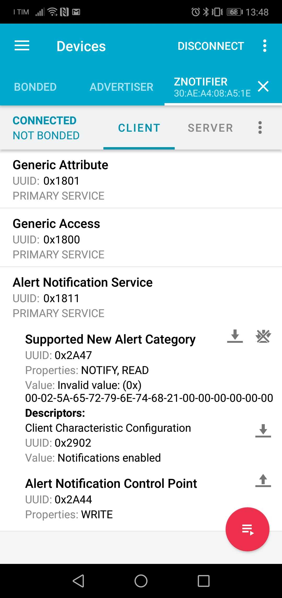
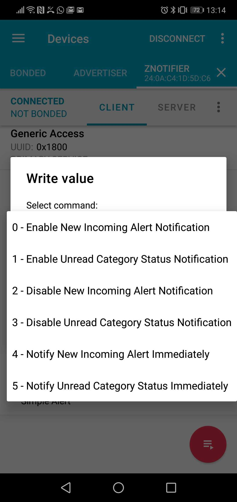

# Espressif ESP32 BLE

This module implements the BLE driver for ESP32. It includes support for secure pairing and scanning.

The module implements only the peripheral role functionalities, while the central role ones are not included. The module is also compatible with the Wifi and Ethernet drivers and the radio coexistence is entirely managed by the VM in a balanced mode.

Many examples are available going from a simple scanner, to beacons to a more advanced GATT server. To test the examples it is suggested to use a BLE app like the [nRF Connect](https://play.google.com/store/apps/details?id=no.nordicsemi.android.mcp&hl=en) and a Beacon scanner like [Beacon Scanner](https://play.google.com/store/apps/details?id=com.bridou_n.beaconscanner&hl=en_US).

Some screenshots related to the examples:

Contents:

-   [ESP32 BLE](/latest/reference/libs/espressif/esp32ble/docs/esp32ble/)
-   [Examples](/latest/reference/libs/espressif/esp32ble/docs/examples/)
    -   [BLE Alerts](/latest/reference/libs/espressif/esp32ble/docs/examples/#ble-alerts)
    -   [BLE Scanner](/latest/reference/libs/espressif/esp32ble/docs/examples/#ble-scanner)
    -   [Eddystone Beacon](/latest/reference/libs/espressif/esp32ble/docs/examples/#eddystone-beacon)
    -   [iBeacon Beacon](/latest/reference/libs/espressif/esp32ble/docs/examples/#ibeacon)
    -   [Eddystone Reader](/latest/reference/libs/espressif/esp32ble/docs/examples/#eddystone-reader)
    -   [iBeacon Reader](/latest/reference/libs/espressif/esp32ble/docs/examples/#ibeacon-reader)
    -   [BLE Alerts Secure 1](/latest/reference/libs/espressif/esp32ble/docs/examples/#ble-alerts-with-security-1)
    -   [BLE Alerts Secure 2](/latest/reference/libs/espressif/esp32ble/docs/examples/#ble-alerts-with-security-2)
    -   [BLE Wifi](/latest/reference/libs/espressif/esp32ble/docs/examples/#ble-wifi)
<!--stackedit_data:
eyJoaXN0b3J5IjpbMTkzNTU0MzU1OSwtMTQ3Mzg0NzIwMl19
-->
