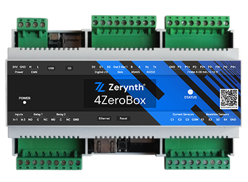
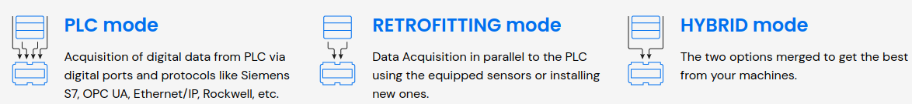
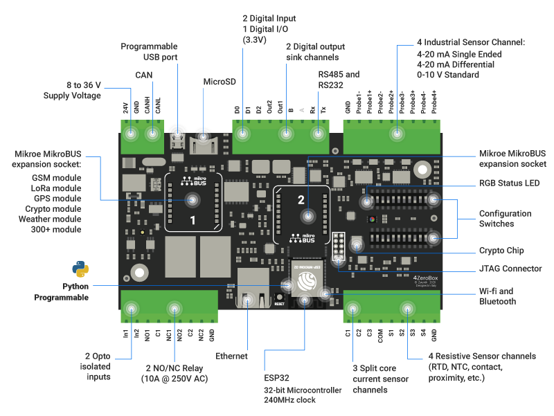

# 4ZeroBox Library

4ZeroBox is a modular hardware electronic unit that simplifies the development of Industrial IoT applications allowing rapid integration with sensors, actuators, and Cloud services.

4ZeroBox lets the user choose the best installation strategy, adapting it to the specific industrial environment. While allowing to acquire data from the PLC via digital ports - filtering the data onboard to avoid bandwidth overload and waste of cloud resources - it also enable the installation and management of external sensors, for a full Industrial IoT experience.

For full list of features of 4ZeroBox : 

!!! note
	For more information about the hardware as: Pin Mapping, Flash Layout, features, Power regulation.
	Please check the following : [4ZeroBox Hardware](/4zp/4ZeroBox/index.md)

## 4ZeroBox Library 

This module contains the driver for enabling and handling all 4ZeroBox onboard features. The 4ZeroBox class permits an easier access to the internal peripherals and exposes all functionalities in simple function calls.

## More Resources:

* [4ZeroBox Library Examples](/latest/reference/libs/zerynth/4zerobox/docs/examples/)
* [4ZeroBox User Manual](https://www.zerynth.com/download/13894/)
* [4ZeroBox Brochure](https://www.zerynth.com/download/13895/)

Contents:

* [Getting started](https://docs.zerynth.com/latest/demos/4zerobox/Hello_4ZeroBox/)
* [4ZeroBox Module](/latest/reference/libs/zerynth/4zerobox/docs/module/#4zerobox-module)
* [Examples](/latest/reference/libs/zerynth/4zerobox/docs/examples/)
    * [Hello 4ZeroBox](/latest/reference/libs/zerynth/4zerobox/docs/examples/#hello-4zerobox)
    * [Sensor Reading](/latest/reference/libs/zerynth/4zerobox/docs/examples/#sensor-reading)
    * [Modbus Serial Interface](/latest/reference/libs/zerynth/4zerobox/docs/examples/#modbus-serial-interface)
    * [4ZeroBox meets ZDM](/latest/reference/libs/zerynth/4zerobox/docs/examples/#4zerobox-meets-zdm)
    * [4ZeroBox meets ZDM with GSM](/latest/reference/libs/zerynth/4zerobox/docs/examples/#4zerobox-meets-zdm-with-gsm)
    * [Firmware Over The Air Update](/latest/reference/libs/zerynth/4zerobox/docs/examples/#firmware-over-the-air-update)