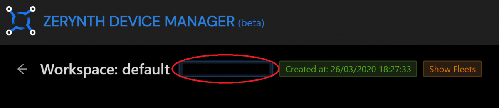
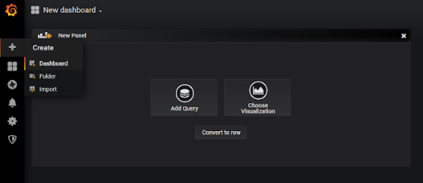
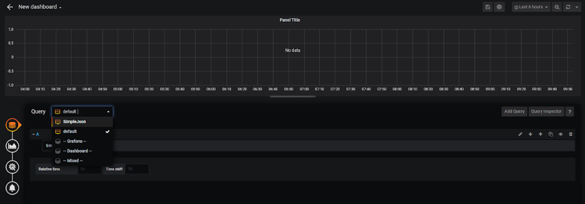
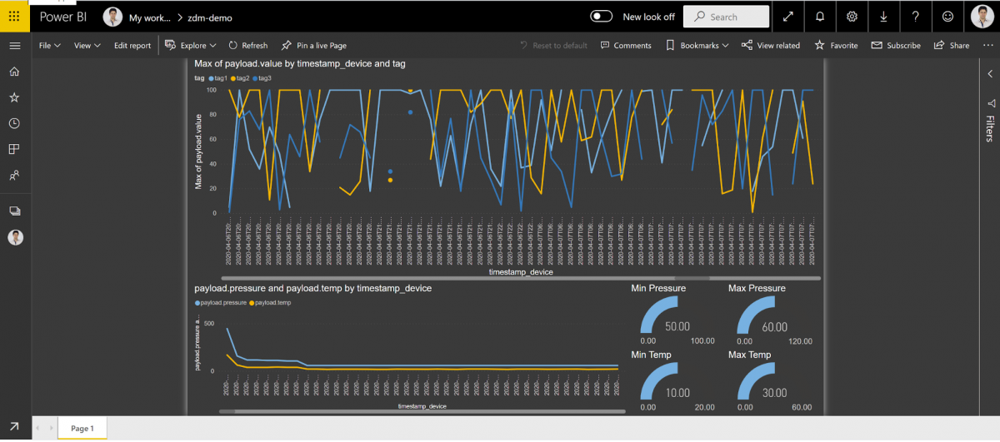

# Learn How to Connect Zerynth Device Manager with Grafana for IoT data Visualization

This guide shows how to connect Grafana with the Zerynth Device Manager and retrieve IOT device data using the ZDM API.

Grafana is an analytics and interactive visualization software that allows building dashboards thanks to the connection with various data sources. It is expandable through a plug-in system allowing users to create complex visualization using an intuitive and interactive query builder.

Components required:

- [Grafana](https://grafana.com/docs/grafana/latest/guides/getting_started/),
- [Python Flask lib](https://pypi.org/project/Flask/),
- [Python Requests lib](https://pypi.org/project/requests/),
- [Python Pytz lib](https://pypi.org/project/pytz/).

First of all, you have to install the Grafana simple JSON data source plugin following this [guide](https://grafana.com/grafana/plugins/grafana-simple-json-datasource/installation).

Download the ZDM simple JSON connector Python (ZDMgrafana.py) file we prepared from [here](https://github.com/zerynth/zdm-grafana-bridge).

Add your Zerynth security token you can retrieve from [here](https://backend.zerynth.com//v1/sso).

Also, insert the ID of the ZDM workspace you want to use as a data source. To retrieve the ZDM workspace ID, open the ZDM web interface at https://zdm.zerynth.com/, click on the workspace you want to use, and copy the Workspace ID from the blue box located in the top-left area of the interface.

Save and launch the ZDMgrafana.py file.

Now, open your Grafana web interface and click add data source, select simple JSON and insert in the URL http://127.0.0.1:5000, save and test. 

Does it work? You are retrieving your ZDM data!

!!! note
    If you don’t find Simple Json in the installed data sources window, manually restart the Grafana service.

Now you can create a new dashboard by clicking on the + button and then on Dashboard.

Click Add query, then open the Query menu and select SimpleJson.

Now, open the Select Metric Menu and choose the ZDM Tag you want to use as IOT data source for the visualization you are building. If you don’t see any tag it means that you don’t have any data in the ZDM storage and no devices streaming. Launch a Python client device by using this [guide](https://www.zerynth.com/blog/docs/zdm/projects/connect-a-raspberry-pi-or-pc-application-to-the-zerynth-device-manager/) or connect a Zerynth IOT device following this [guide](https://www.zerynth.com/blog/docs/zdm/getting-started/the-zdm-web-user-interface/).

Here it is, your ZDM data plotted in Grafana!

Now you can go ahead and build your super cool IoT dashboard!

**Acknowledgement:**
*Thanks to [Francesco Pirro](https://www.linkedin.com/checkpoint/challengesV2/AQE0B9fhEcgJOgAAAXOPQHU_zPS1d39svKS8YuHM25Y7ih9uRvZ8cOn_6F-bej4xezII6d4VwB2Eatpim_bErtfblHG0okwBew) for the contribution in the development of the  ZDM simple JSON connector.*

