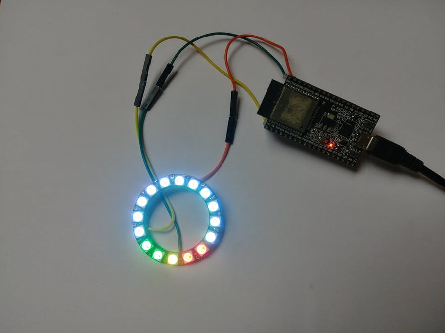
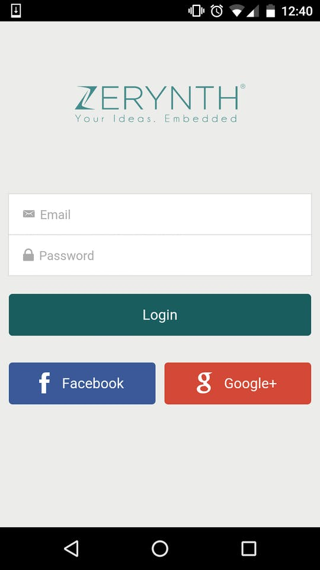
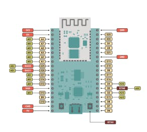
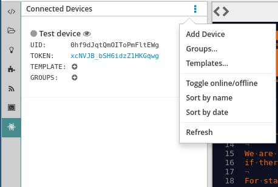
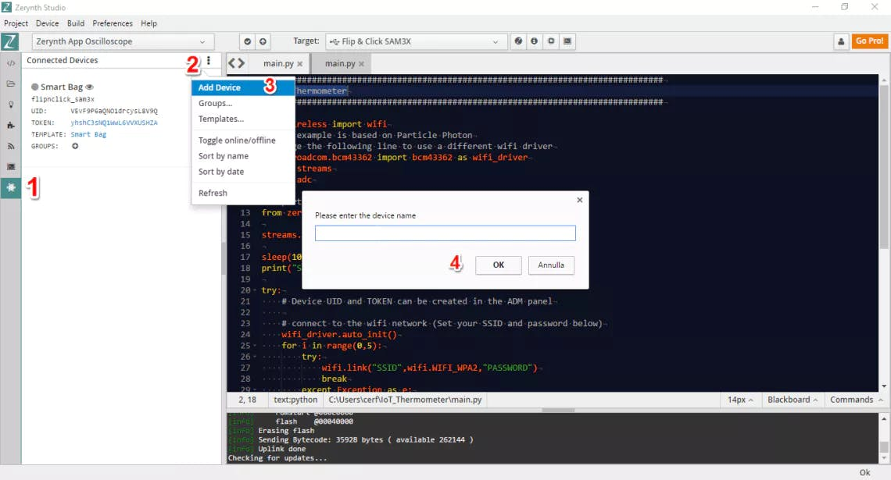
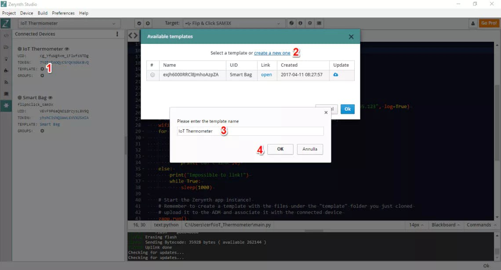
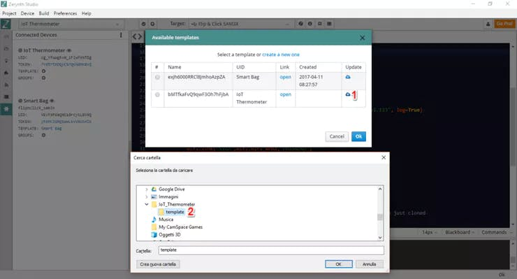
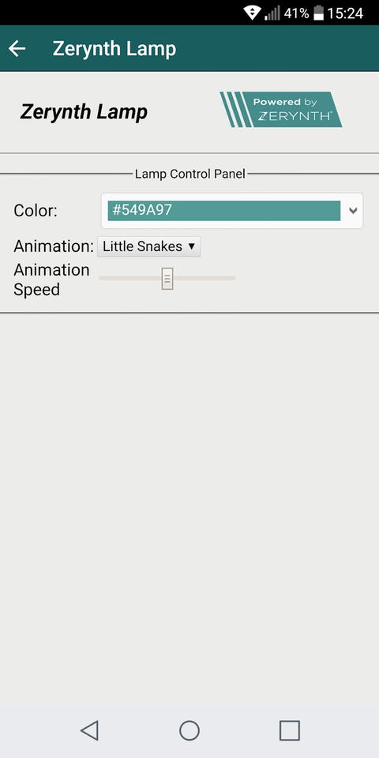
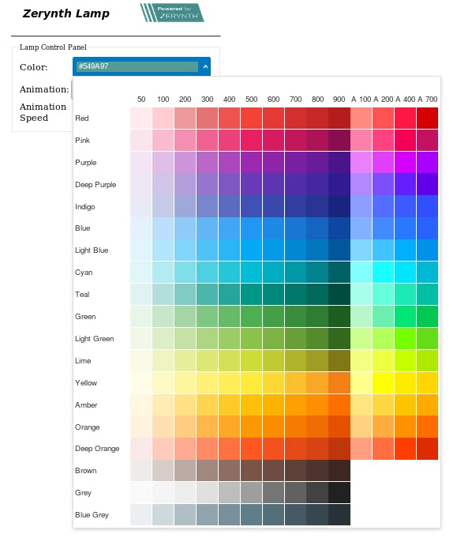

# IoT Ambient Light: Zerynth Lamp (2019 Version)

Taking up the “IoT Ambient Light: Zerynth Lamp” project, making it compatible with the latest version of Zerynth and updating FW and SW.



# Things used in this project

## Hardware components

| Adafruit NeoPixel LEDs Ring | x1 |
|-----------------------------|----|
| Espressif ESP32_DevKitc     | x1 |

## Software apps and online services

| [Zerynth App](https://www.hackster.io/zerynth/products/zerynth-app?ref=project-88ea95)    | x1 |
|----------------|----|
| [Zerynth Studio](https://www.hackster.io/zerynth/products/zerynth-studio?ref=project-88ea95) | x1 |

# Story

## IoT Ambient Light: Zerynth Lamp

The Zerynth Lamp tutorial is a popular project on Hackster with over 8, 000 views and a lot of comments. Everyone wanted to make their own Python programmable ambient light.

<iframe width="560" height="315" src="https://www.youtube.com/watch?v=KMjvH_d8PeQ" frameborder="0" allow="accelerometer; autoplay; encrypted-media; gyroscope; picture-in-picture" allowfullscreen></iframe>

Well, now it got an update, and it’s compatible with the latest version of Zerynth (www.zerynth.com).

In this tutorial we’ll see how to control a NeoPixel LED strip via mobile using the Zerynth App, that shows a color picker and a menu for the selection of various pre-configured animations.Thanks to the Neopixel module, the module is fully supported by Zerynth for developer through a set of APIs that makes handling this device much easier.

## Internet of Things

IoT allows devices around us to be connected together through the Internet. Simply, these devices are connected to a server. As a result, you can use your smartphone to connect it the various devices, This enables you to have real-time communication between the devices and the smartphones.

Zerynth, is the middleware for IoT and Industry 4.0, Zerynth speeds up IoT development.

With Zerynth you can program in Python or hybrid C/Python language the most popular 32-bit microcontrollers, and connect them to the top Cloud infrastructures.

The Zerynth App is a mobile application for Android and iOS that allows fast prototyping of device graphical interfaces for monitoring and control. It is a generic app, it only provides a mechanism to retrieve and access the connected devices, while the graphical interface definition is left to the programmer.



## Step 1: Assembling

- The LED strip uses only one pin to control the whole chain of LEDs. Each LED is addressable through the driver chip inside the LED.
- Connect the VCC pin to a 5V source, The GND to the GND of the microcontroller. Connect the DIN pin to D23 (changeable in the code)



## Step 2: Programming

- Connect and Virtualize your board.Have a look at this documentation for the installation guide.
- Create a new project in Zerynth (already explained here). Attention: you need to create 3 (+1) files: main.py, animation.py, template.html (and project.md is created by default).
- Copy the code posted.


## Step 3: Mobile Integration

- We are going to integrate and use the smartphone to control the micro controller board using the Zerynth Advanced Device manager.On the Left Panel, by clicking the ADM icon, the list of connected devices is retrieved and displayed. New device can be created from the dropdown menu next to the panel title.



As shown in the above image, a newly created connected device is assigned a uid and a security token. A new token can be requested by clicking on the old one.

The circle to the left of the device name is gray, indicating the offline status of the device; it turns to green when the device connects to the ADM. The eye icon to the right of the name, opens the associated template of the device on a system browser tab in order to allow template testing.

## Create and Set Up a Connected Device

Now we have to create a “connected device” and link the Zerynth App instance to it. Below you can see some screenshots with the necessary steps. Take a look at this doc for more technical details.


The device credentials (UID and TOKEN) can be copied and pasted directly from Zerynth Studio (ADM panel).



The graphical interface of each device is hosted on the Zerynth ADM sandbox and consists of a set of HTML5, Javascript, CSS and image files that are loaded and displayed in the app. Adding to the template the ADM Javascript Library allows the app to interact with the connected device both receiving and sending messages.

Templates can be added by clicking the respective “plus” icon.



Then upload the template from the dedicated folder. Note that the file where the template is defined is called “index.html” and you can edit it how you want. In this case, you can leave it as it is.



## Uplink the Script

Remember that “DEVICE UID”, “DEVICE TOKEN”, “SSID” and “PASSWORD” have to be edited to fit with your own parameters.

## Try It On Your Smartphone

You have just to open the Zerynth App, log-in and select the specific device to see your LED strip control dashboard.





Hope this tutorial was useful. For any questions, feel free to leave them in the comments.

*Until next time, happy coding!*

# Code

```python
<!DOCTYPE html>
<html lang="en">
<head>
<title>Zerynth Lamp</title>
    <link rel="stylesheet" href="https://jqwidgets.com/public/jqwidgets/styles/jqx.base.css" type="text/css" />
    <link rel="stylesheet" href="https://jqwidgets.com/public/jqwidgets/styles/jqx.light.css" type="text/css" />
    <meta http-equiv="X-UA-Compatible" content="IE=edge,chrome=1" />
    <meta name="viewport" content="width=device-width, initial-scale=1 maximum-scale=1 minimum-scale=1" />
    <script type="text/javascript" src="https://code.jquery.com/jquery-1.11.1.js"></script>
    <script type="text/javascript" src="https://jqwidgets.com/public/jqwidgets/jqxcore.js"></script>
    <script type="text/javascript" src="https://jqwidgets.com/public/jqwidgets/jqxdropdownbutton.js"></script>
    <script type="text/javascript" src="https://jqwidgets.com/public/jqwidgets/jqxcolorpicker.js"></script>
    <!-- LOAD THE ZERYNTH ADM JS LIBRARY -->
    <script src="https://api.zerynth.com/zadm/latest/z.js"></script>
    <script>

    $(document).ready(function() {
      // initialize the Z object
	     //console.log("INIT");
      Z.init({
        on_connected:  function(){console.log("CONNECTED");},
        on_error:  function(){console.log("ERROR");},
        on_disconnected:  function(){console.log("DISCONNECTED"); return true},
        on_online:  function(evt){console.log("ONLINE");},
        on_offline:  function(evt){console.log("OFFLINE");},
        on_event:  function(evt){
            //display received event
            alert("EVENT!"+JSON.stringify(evt));
        }
      })
    });

        /* tslint:disable */
        /* eslint-disable */
        (function ($) {

            $.jqx.jqxWidget('jqxMaterialColorPicker', '', {});

            $.extend($.jqx._jqxMaterialColorPicker.prototype, {
                defineInstance: function () {
                    var settings = {
                        events: ['colorchange']
                    };
                    if (this === $.jqx._jqxMaterialColorPicker.prototype) {
                        return settings;
                    }
                    $.extend(true, this, settings);
                    return settings;
                },

                createInstance: function () {
                    var that = this;

                    that._renderGrid();
                    that._addHandlers();
                },

                _renderGrid() {
                    var that = this;
                    var labelsAndPaletteContainer = document.createElement('div');

                    that._renderShades();
                    that._renderColorPalette();
                    that._renderColorLabels();

                    labelsAndPaletteContainer.classList = 'jqx-labels-and-palette'
                    labelsAndPaletteContainer.appendChild(that._colorLabelsContainer);
                    labelsAndPaletteContainer.appendChild(that._paletteContainer);
                    that.element.appendChild(labelsAndPaletteContainer);
                },

                _renderColorPalette: function () {
                    var that = this;
                    var colorsArray = [
                        ['#ffebee', '#ffcdd2', '#ef9a9a', '#e57373', '#ef5350', '#f44336', '#e53935', '#d32f2f', '#c62828', '#b71c1c', '#ff8a80', '#ff5252', '#ff1744', '#d50000'],
                        ['#fce4ec', '#f8bbd0', '#f48fb1', '#f06292', '#ec407a', '#e91e63', '#d81b60', '#c2185b', '#ad1457', '#880e4f', '#ff80ab', '#ff4081', '#f50057', '#c51162'],
                        ['#f3e5f5', '#e1bee7', '#ce93d8', '#ba68c8', '#ab47bc', '#9c27b0', '#8e24aa', '#7b1fa2', '#6a1b9a', '#4a148c', '#ea80fc', '#e040fb', '#d500f9', '#aa00ff'],
                        ['#ede7f6', '#d1c4e9', '#b39ddb', '#9575cd', '#7e57c2', '#673ab7', '#5e35b1', '#512da8', '#4527a0', '#311b92', '#b388ff', '#7c4dff', '#651fff', '#6200ea'],
                        ['#e8eaf6', '#c5cae9', '#9fa8da', '#7986cb', '#5c6bc0', '#3f51b5', '#3949ab', '#303f9f', '#283593', '#1a237e', '#8c9eff', '#536dfe', '#3d5afe', '#304ffe'],
                        ['#e3f2fd', '#bbdefb', '#90caf9', '#64b5f6', '#42a5f5', '#2196f3', '#1e88e5', '#1976d2', '#1565c0', '#0d47a1', '#82b1ff', '#448aff', '#2979ff', '#2962ff'],
                        ['#e1f5fe', '#b3e5fc', '#81d4fa', '#4fc3f7', '#29b6f6', '#03a9f4', '#039be5', '#0288d1', '#0277bd', '#01579b', '#80d8ff', '#40c4ff', '#00b0ff', '#0091ea'],
                        ['#e0f7fa', '#b2ebf2', '#80deea', '#4dd0e1', '#26c6da', '#00bcd4', '#00acc1', '#0097a7', '#00838f', '#006064', '#84ffff', '#18ffff', '#00e5ff', '#00b8d4'],
                        ['#e0f2f1', '#b2dfdb', '#80cbc4', '#4db6ac', '#26a69a', '#009688', '#00897b', '#00796b', '#00695c', '#004d40', '#a7ffeb', '#64ffda', '#1de9b6', '#00bfa5'],
                        ['#e8f5e9', '#c8e6c9', '#a5d6a7', '#81c784', '#66bb6a', '#4caf50', '#43a047', '#388e3c', '#2e7d32', '#1b5e20', '#b9f6ca', '#69f0ae', '#00e676', '#00c853'],
                        ['#f1f8e9', '#dcedc8', '#c5e1a5', '#aed581', '#9ccc65', '#8bc34a', '#7cb342', '#689f38', '#558b2f', '#33691e', '#ccff90', '#b2ff59', '#76ff03', '#64dd17'],
                        ['#f9fbe7', '#f0f4c3', '#e6ee9c', '#dce775', '#d4e157', '#cddc39', '#c0ca33', '#afb42b', '#9e9d24', '#827717', '#f4ff81', '#eeff41', '#c6ff00', '#aeea00'],
                        ['#fffde7', '#fff9c4', '#fff59d', '#fff176', '#ffee58', '#ffeb3b', '#fdd835', '#fbc02d', '#f9a825', '#f57f17', '#ffff8d', '#ffff00', '#ffea00', '#ffd600'],
                        ['#fff8e1', '#ffecb3', '#ffe082', '#ffd54f', '#ffca28', '#ffc107', '#ffb300', '#ffa000', '#ff8f00', '#ff6f00', '#ffe57f', '#ffd740', '#ffc400', '#ffab00'],
                        ['#fff3e0', '#ffe0b2', '#ffcc80', '#ffb74d', '#ffa726', '#ff9800', '#fb8c00', '#f57c00', '#ef6c00', '#e65100', '#ffd180', '#ffab40', '#ff9100', '#ff6d00'],
                        ['#fbe9e7', '#ffccbc', '#ffab91', '#ff8a65', '#ff7043', '#ff5722', '#f4511e', '#e64a19', '#d84315', '#bf360c', '#ff9e80', '#ff6e40', '#ff3d00', '#dd2c00'],
                        ['#efebe9', '#d7ccc8', '#bcaaa4', '#a1887f', '#8d6e63', '#795548', '#6d4c41', '#5d4037', '#4e342e', '#3e2723'],
                        ['#fafafa', '#f5f5f5', '#eeeeee', '#e0e0e0', '#bdbdbd', '#9e9e9e', '#757575', '#616161', '#424242', '#212121'],
                        ['#eceff1', '#cfd8dc', '#b0bec5', '#90a4ae', '#78909c', '#607d8b', '#546e7a', '#455a64', '#37474f', '#263238'],
                    ]
                    var paletteContainer = document.createElement('div');

                    for (var index = 0, length = colorsArray.length; index < length; index++) {
                        var currentRow = colorsArray[index];
                        var currentUl = that._renderRow(currentRow, 'jqx-color-cell', false);

                        paletteContainer.appendChild(currentUl);
                    }

                    paletteContainer.className = 'jqx-palette';
                    that._paletteContainer = paletteContainer;
                },

                _renderShades: function () {
                    var that = this;
                    var shadesContainer = document.createElement('div');
                    var shadesArray = [50, 100, 200, 300, 400, 500, 600, 700, 800, 900, 'A 100', 'A 200', 'A 400', 'A 700'];
                    var shadesRow = that._renderRow(shadesArray, 'jqx-shade-cell', true);

                    shadesContainer.className = 'jqx-shades';
                    shadesContainer.appendChild(shadesRow);
                    that.element.appendChild(shadesContainer);
                },

                _renderColorLabels: function () {
                    var that = this;
                    var colorLabelsContainer = document.createElement('div');
                    var colorLabelsArray = ['Red', 'Pink', 'Purple', 'Deep Purple', 'Indigo', 'Blue', 'Light Blue', 'Cyan', 'Teal', 'Green', 'Light Green', 'Lime', 'Yellow', 'Amber', 'Orange', 'Deep Orange', 'Brown', 'Grey', 'Blue Grey'];
                    var colorLabelsColumn = that._renderRow(colorLabelsArray, 'jqx-color-label', true);

                    colorLabelsContainer.className = 'jqx-color-labels';
                    colorLabelsContainer.appendChild(colorLabelsColumn);
                    that._colorLabelsContainer = colorLabelsContainer;
                },


                _renderRow: function (array, cellClass, addInnerHtml) {
                    var ul = document.createElement('ul');

                    for (var index = 0, length = array.length; index < length; index++) {
                        var currentElement = array[index];
                        var li = document.createElement('li');

                        if (addInnerHtml) {
                            li.innerHTML = currentElement;
                        } else {
                            li.style.background = currentElement;
                            li.setAttribute('data-color', currentElement);
                        }

                        li.className = cellClass;

                        ul.appendChild(li);
                    }

                    return ul;
                },

                _addHandlers: function () {
                    var that = this;

                    this.host.find('.jqx-color-cell').on('click', function (event) {
                        that._currentColorHex = event.target.getAttribute('data-color');
                        that._currentColorRgb = event.target.style.background;
                        that._raiseEvent(0, { color: that.getColor() });
			                  Z.call('change_color',[cur_color.r,cur_color.g,cur_color.b])
                    });
                },

                _raiseEvent: function (id, arg) {
                    if (arg == undefined)
                        arg = { owner: null };

                    var evt = this.events[id];
                    var args = arg ? arg : {};

                    args.owner = this;
                    var event = new $.Event(evt);
                    event.owner = this;
                    event.args = args;

                    var result = this.host.trigger(event);

                    return result;
                },

                getColor: function () {
                    var that = this;
                    var rgb = that._currentColorRgb.match(/\d+/g);

                    return {
                        hex: that._currentColorHex.substring(1),
                        r: parseInt(rgb[0]),
                        g: parseInt(rgb[1]),
                        b: parseInt(rgb[2])
                    };
                },

                destroy: function () {
                    var that = this;

                    that.host.remove();
                }
            });

        })(jqxBaseFramework);
    </script>

    <style>
        .jqx-labels-and-palette {
            display: flex;
        }

        .jqx-shades {
            width: 560px;
            padding-left: 100px;
        }

            .jqx-palette > ul,
            .jqx-shades > ul,
            .jqx-color-labels > ul {
                display: flex;
                list-style: none;
                padding: 0;
                margin: 0;
            }

        .jqx-color-labels > ul {
            flex-direction: column;
        }

        .jqx-color-cell {
            width: 39px;
            height: 39px;
            margin: 0.5px;
            cursor: pointer;
        }

            .jqx-color-cell:hover {
                border-radius: 8px;
            }

        .jqx-shade-cell {
            width: 38px;
            height: 47px;
            display: flex;
            justify-content: center;
            align-items: flex-end;
            padding: 0 1px 5px 1px;
            text-align: center;
        }

        .jqx-color-label {
            width: 100px;
            height: 40px;
            display: flex;
            align-items: center;
        }
    </style>

    <script type="text/javascript">
        var cur_color = { r: 0x54, g: 0x9a, b: 0x97 };
        function getTextElementByColor(color) {
            if (color == 'transparent' || color.hex == "") {
                return $("<div style='text-shadow: none; position: relative; padding-bottom: 2px; margin-top: 2px;'>transparent</div>");
            }
            var element = $("<div style='height: 100%; display: flex; align-items: center;'><div style='text-shadow: none; position: relative; margin:2px;padding-left:4px; width: 100%; padding-bottom: 2px; margin-top: 2px;'>#" + color.hex + "</div></div>");
            var nThreshold = 105;
            var bgDelta = (color.r * 0.299) + (color.g * 0.587) + (color.b * 0.114);
            cur_color.r = color.r;
            cur_color.g = color.g;
            cur_color.b = color.b;
            var foreColor = (255 - bgDelta < nThreshold) ? 'Black' : 'White';

            element.children()[0].style.color = foreColor;
            element.children()[0].style.backgroundColor = "#" + color.hex;

            return element;
        }

        $(document).ready(function () {
            $("#colorPicker").jqxMaterialColorPicker();

            $("#colorPicker").bind('colorchange', function (event) {
                $("#dropDownButton").jqxDropDownButton('setContent', getTextElementByColor(event.args.color));
            });

            $("#dropDownButton").jqxDropDownButton({ theme: 'light', width: 250, height: 35 });
            $("#dropDownButton").jqxDropDownButton('setContent', getTextElementByColor(new $.jqx.color({ hex: "549a97" })));

            $("#animselect").change(function() {
		            //console.log("animation --> "+parseInt($('#animselect').val()));
       	        Z.call('change_animation',[parseInt($('#animselect').val())]);
            });
            $("#speedslider").change(function() {
		            //console.log("speed --> "+parseInt($('#speedslider').val()));
                Z.call('change_speed',[parseInt($('#speedslider').val())]);
            });
        });
    </script>

</head>

<body>
<table align="center" border="0" cellpadding="1" cellspacing="1" height="74" width="88">
	<tbody>
		<tr>
			<td style="text-align: center; vertical-align: middle;">
			<p><strong><span style="font-size:20px;"><span style="font-family:verdana,geneva,sans-serif;"><em>Zerynth Lamp</em></span></span></strong></p>
			</td>
			<td style="text-align: center; vertical-align: middle;"></td>
		</tr>
		<tr>
			<td colspan="3" style="text-align: center;">
			<hr /></td>
		</tr>
		<tr>
			<td colspan="3" style="text-align: center; vertical-align: middle;">
			<fieldset>
			<table align="center" border="0" cellpadding="1" cellspacing="1" style="width:300px;">
				<tbody>
					<tr>
						<td style="ont-size:12px; text-align: left; vertical-align: middle;">Color:</td>
						<td style="text-align: left; vertical-align: middle;">            <div style="margin: 3px; float: left;" id="dropDownButton">
                <div style="padding: 3px;">
                    <div id="colorPicker"></div>
                </div>
            </div></td>
					</tr>
					<tr>
            <td style="ont-size:12px; text-align: left; vertical-align: middle;">Animation:</td>
						<td style="text-align: left; vertical-align: middle;">
              <div data-role="fieldcontain">
                    <select name="animselect" id="animselect">
                        <option value="0">Little Snakes</option>
                        <option value="1">Spinner</option>
                        <option value="2">Rainbow</option>
                        <option value="3">Pulse</option>
                    </select>
                </div></td>
					</tr>
					<tr>
						<td style="ont-size:12px; text-align: left; vertical-align: middle;">Animation Speed</td>
						<td style="text-align: left; vertical-align: middle;"><input type="range" name="speedslider" id="speedslider" data-highlight="true" min="0" max="100" value="50"></td>
					</tr>
				</tbody>
			</table>
			<legend style="font-size:12px;">Lamp Control Panel</legend></fieldset>
			</td>
		</tr>

	</tbody>
</table>
</body>
</html>
```