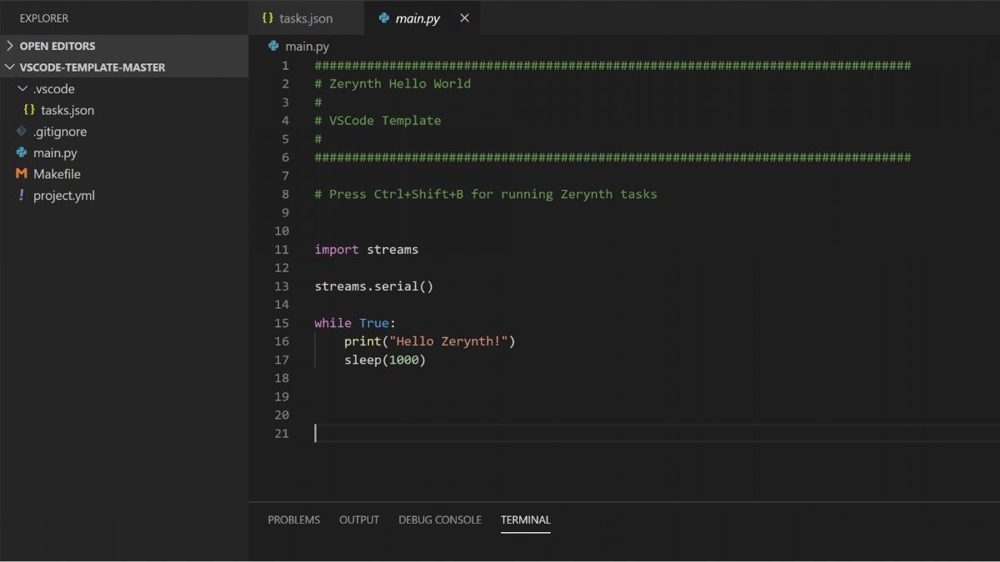
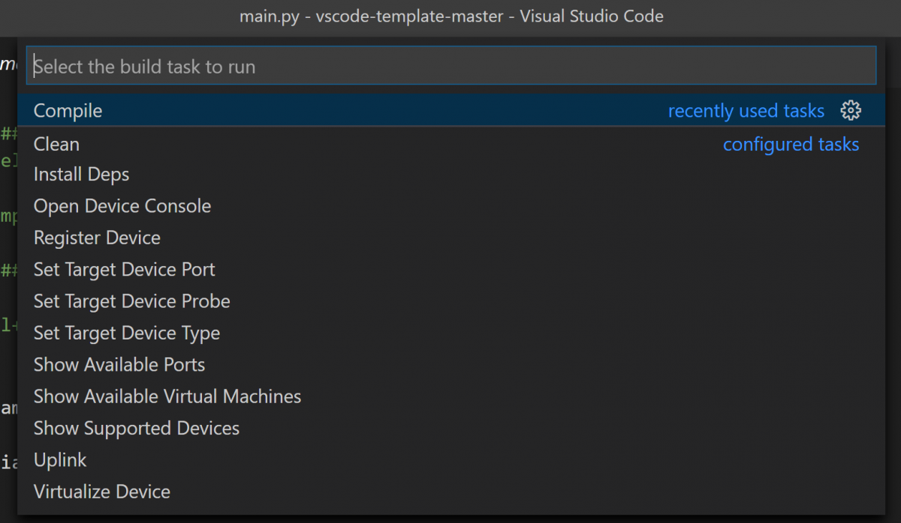
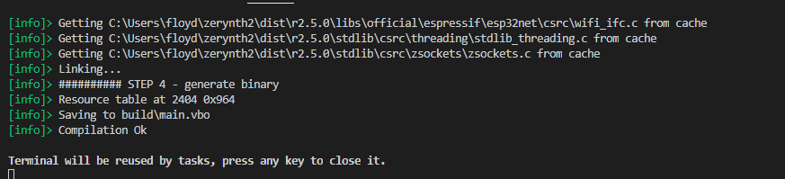

# IoT applications development using Visual Studio Code and Zerynth

This is a step by step guide for enabling Zerynth programming in Microsoft Visual Studio Code for developing Internet of Things applications.

VSCode is a free multi-language editor that can be downloaded and installed from [here](https://code.visualstudio.com/download).

This guide shows how to develop Zerynth Projects in VSCode. 

We prepared a VSCode template project that enables the execution of compilation, uplink, and other functions of the Zerynth toolchain (ZTC) directly from VSCode while also adding support for Zerynth libraries auto-completion.

!!! note
    This guide requires Zerynth Version 2.5.1 or later.

Download the VSCode project template for your platform from here:

- [Windows](https://github.com/zerynth/vscode-template-windows)
- [Linux](https://github.com/zerynth/vscode-template-linux)
- [Mac](https://github.com/zerynth/vscode-template-mac)

!!! note
    The templates follow the Zerynth distribution versioning. Go to the Github release section and download the template for your Zerynth installation version. We strongly suggest having Zerynth always updated to the last version thus install the last release fo the VSCode templates.

The template is a ready-to-use VSCode project for Zerynth. Open the template folder and you are ready to code.

The most important files in the template are:

- main.py: Write your Zerynth code here
- Project.yml: The project configuration file where the target board, board port, and other info need to be added in order to allow compilation, uplink, and other functionalities of the Zerynth tool-chain. The Zerynth commands integrated into the VSCode will support you in preparing the project.yml, see below.

### Commands Usage

Press CTRL+SHIFT+B and select the ZTC command to launch.

The following ZTC commands are available:

- **Login:** Open a browser for authentication; paste the authentication token into the vscode terminal
Show Supported Device: the list of supported devices is shown on the terminal, find the “target” name of your device. Jtag probe support is also displayed.
- **Set Target Device Type:** change the target device of the current project. Type your device target name found in the previous step
Register Device: starts the device registration procedure (mandatory for new devices). It updates the project configuration with the device identifier
- **Show Available Virtual Machines:** displays the various virtual machine available for the device. Choose one and note down version, features, and RTOS. Open project.yml and type the version, RTOS and feature fields in the VM section
- **Virtualize Device:** starts the device virtualization procedure (mandatory for new boards). Create, download, and transfer the selected VM on the device. Automatically updates project configuration
- **Compile:** Compiles the current project. If you get an error about missing dependencies, run the Install Deps command below
- **Show Available Ports:** list the serial ports on your system; Note down the one corresponding to your device
- **Set Target Device Port:** set the serial port of the device from the previous list
- **Set Target Device Probe:** if the device is programmable with a jtag probe, set the correct value
- **Uplink:** uplink the current project on the selected target device (must be virtualized at least once)
- **Clean:** clean the project cache and allows full recompilation of sources
- **Install Deps:** Installs missing dependencies and libs required by the project
- **Open Device Console:** Opens the serial console on the target device port; Press Ctrl+C twice to close it
- **Prepare FOTA:** create and uploads new firmware to the ZDM. The device_id to prepare the firmware for needs to be specified in the project.yml file under the zdm section (zdm: {device_id: XXXX} ); the firmware version must also be specified in the zdm fota section ( zdm: { fota: {version: X }}); By running the command on a new project, the required fields with empty values are automatically added to the configuration. Edit them with your device data.

To add other commands or customize them you can follow this [guide](https://code.visualstudio.com/docs/editor/tasks#vscode).