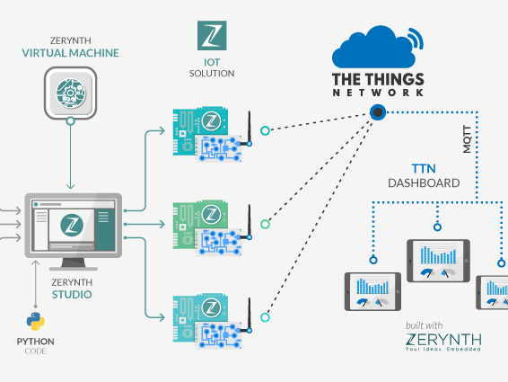
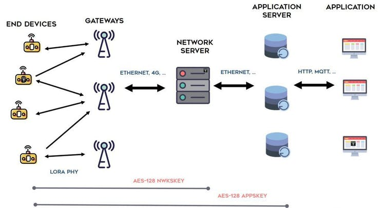
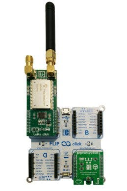
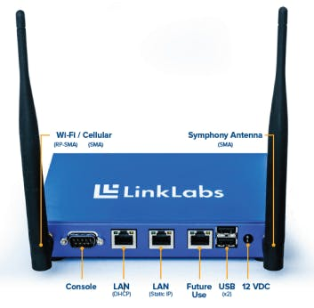
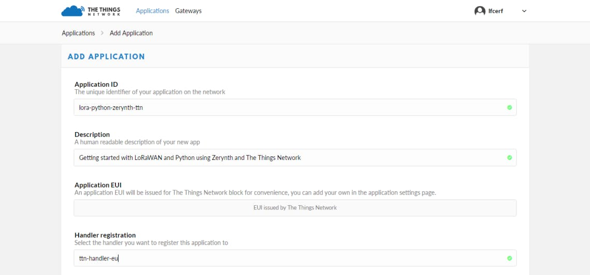
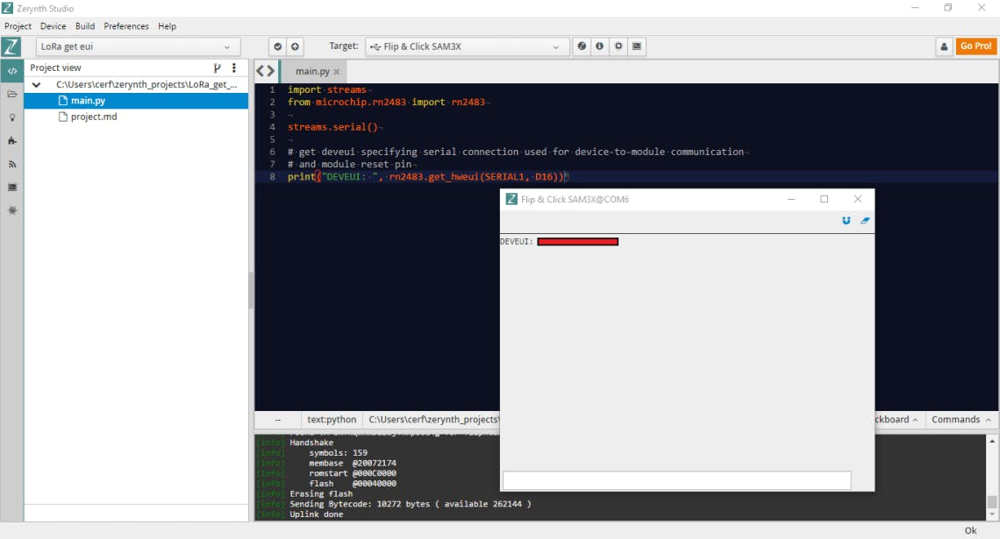
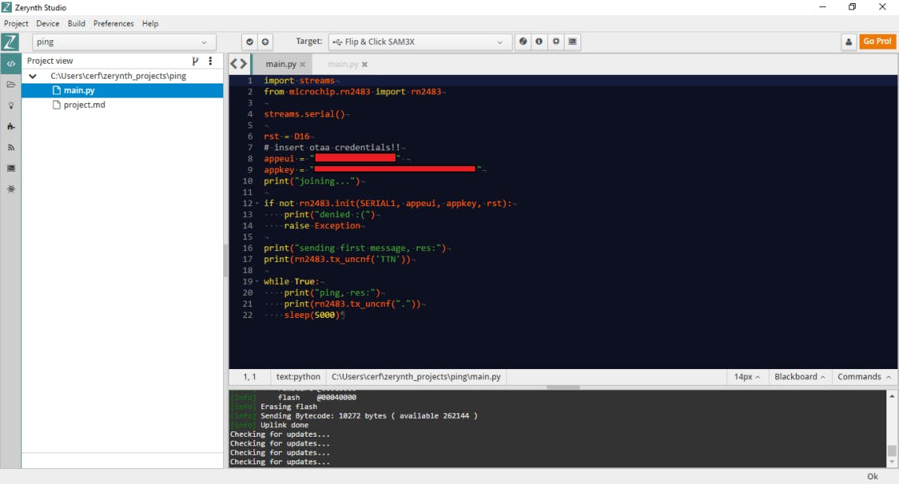
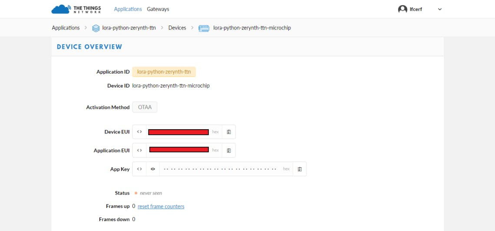
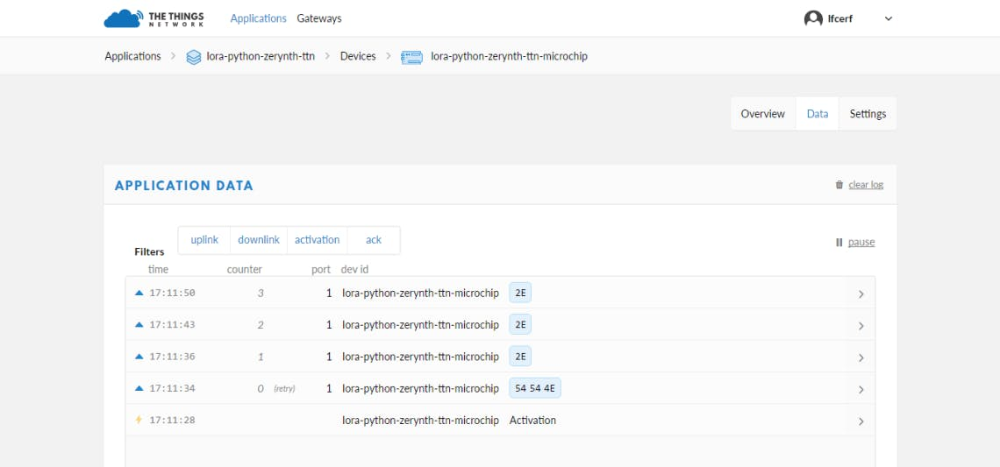

# LoRaWAN Using Python, Zerynth and The Things Network

In this tutorial, we’ll see how to create a LoRaWAN network programmed in Python using Zerynth and connected to The Things Network.



# Things used in this project

## Hardware components

| MikroElektronika Flip & Click | x1 |
|-------------------------------|----|
| MikroElektronika LoRa Click   | x1 |
| [Microchip RN2483](https://www.hackster.io/microchip/products/rn2483?ref=project-a96cd5)              | x1 |

## Software apps and online services

| [Zerynth Studio](https://www.hackster.io/zerynth/products/zerynth-studio?ref=project-a96cd5)     | x1 |
|--------------------|----|
| [The Things Network](https://www.hackster.io/the-things-network/products/the-things-network?ref=project-a96cd5) | x1 |

# Story

The IoT revolution also depends on the spread of **LPWAN** (Low Power Wide Area Network) and the **LoRaWAN** protocol, defined by the “**LoRa Alliance**“. In more detail, LoRaWAN is a media access control (MAC) protocol for wide area networks. It is designed to allow low-powered devices to communicate with Internet-connected applications over long range wireless connections.

The TTN (The Things Network), a global community of people over 84 countries, is building a global Internet of Things data network based on LoRaWAN. Tale a look at these terms to have a better overview of this technologies:

- **Node, End Device** – an object with an embedded low-power communication device
- **Gateway** – antennas that receive broadcasts from Nodes and send data back to Nodes
- **Network Server** – route messages from Nodes to the right Application, and back.
- **Application Server** – a piece of software, running on a server
- **Uplink Message** – a message from a Device to an Application
- **Downlink Message** – a message from an Application to a Device



In this tutorial, we’ll see how to create a LoRaWAN network programmed in **Python** using [Zerynth](https://www.zerynth.com/) and connected to **The Things Network**. In particular, we’ll see how to:

- Configure a **Link Labs** Gateway.
- Program a Node in Python using Zerynth. In this case, the node is a Flip&Click by **Mikroelektronika** (based on the microcontroller SAM3X by Microchip). The LoRa module is a “LoRa Click” by Mikroelektronika (based on the **RN2483** chip by **Microchip**).
- Connect the node to TTN (The Things Network) Console.

## Required Material

- **LoRaWAN Gateway:** In this case, we’ve used a Link Labs BS-8, an industrial-grade IoT/M2M gateway for use with LoRa networks. It’s capable of supporting thousands of endpoints with 8 simultaneous receive channels.
- **LoRaWAN endpoints:** In this case, we’ve used Flip&Click as MCU board and a LoRa Click, that carry Microchip’s RN2483 fully certified LoRa Sub-GHz, 433/868 MHz European R&TTE Directive Assessed Radio Modem. Two antenna connectors allow you to choose which of the two frequency bands will be employed. In the figure below is also present a Temp&Hum Click (not necessary for this tutorial).



- **Zerynth Studio:** A professional IDE that provides a platform for developing your Python or hybrid C/Python code and managing your boards. It includes a compiler, debugger and an editor, alongside tutorials and example projects for an easy learning experience.
- **TTN (The Things Network) Console:** you need to create/register an account entering a username and an email address.

## Link Labs LoRaWAN Gateway configuration

- **LoRaWAN Gateway:** In this case, we’ve used a Link Labs BS-8, an industrial-grade IoT/M2M gateway for use with LoRa networks. It’s capable of supporting thousands of endpoints with 8 simultaneous receive channels.
- **LoRaWAN endpoints:** In this case, we’ve used Flip&Click as MCU board and a LoRa Click, that carry Microchip’s RN2483 fully certified LoRa Sub-GHz, 433/868 MHz European R&TTE Directive Assessed Radio Modem. Two antenna connectors allow you to choose which of the two frequency bands will be employed. In the figure below is also present a Temp&Hum Click (not necessary for this tutorial).



- **Turn on the gateway:** connect the antennas and apply power.
- **Connect a PC:** wait a minute for the gateway to bootstrap, then connect a PC to the local Ethernet jack (the middle one) using an Ethernet cable.
- **Navigate to the local webpage:** on the connected PC, open a browser and navigate to 192.168.3.3. Log in using username “admin” and password “password.”
- The local webpage provides an interface to view the status of the gateway and to connect it to the Internet.
- To connect using WiFi select the Enabled checkbox in the Wireless tab of the local webpage. Then select a Wifi network from the SSID drop-down listbox and enter the password in the SHARED KEY editbox and click Submit. After a few moments, the Wireless tab updates with the connection information.

Follow the official Link Labs guide for more detailed info.

## Connecting the LoRaWAN gateway to The Things Network

The first step is to get the root password, so you can install whatever packages are needed. To get the root password you have to send your gateway ID, which is accessible on the local web page, at community@link-labs.com, as reported in this thread on the TTN forum.

Once you have the root password, access to the gateway through ssh protocol and follow this guide to setup and configure the router to auto connect to TTN.

Now you have to register your gateway to TTN, following this link.

## LoRaWAN Node configuration

First of all, you have to build an Application through the TTN console. So, go to the Application page and clicking on “add application” a new page, similar to the one below, will open.



Enter a unique Application ID as well as a Description & Handler Registration.

Then, to send data up to the new Application you just registered, you need to register your LoRaWAN nodes.

To do this, navigate to the “Devices” tab on the Application home page and click the “Register Device” button.


In the Register Device panel, you’ll need to complete the forms for the Device ID and the Device EUI, that must consist of exactly 8 bytes, given in hexadecimal. You can get this code directly from your board, following the instructions below.

## Programming the LoRaWAN Node in Python using Zerynth

It’s time to use Zerynth to program your board in Python and get the needed Device EUI of you LoRaWAN module. In particular, we’ll use the Zerynth library for the RN2483 LoRaWAN chip, mounted on the LoRa Click by Mikroelektronika.

Once you have installed Zerynth Studio and created a Zerynth user, you can clone the example “get ui“. You can find the example in the “Examples Browser” panel or you can use the “Quick Search” feature, searching for “rn2483”.

Once you have cloned the example, uplink the code to your board. As you can see below, the Python script is very very simple.

```python
################################################################################
# Wifi Sniffer
################################################################################

import streams
from espressif.esp32net import esp32wifi as wifi_driver


try:
    streams.serial()
    #let's init the driver
    wifi_driver.auto_init()
except Exception as e:
    print("ooops, something wrong with the driver", e)
    while True:
        sleep(1000)

try:

    while True:
        # loop over all channels
        for channel in  [1,2,3,4,5,6,7,8,9,10,11,12,13]:
            print("Sniffing channel",channel)
            print("================")
            # start the sniffer for management and data packets
            # on the current channel
            # filtering packets going in and out of DS, and also packets with no direction
            # keep a buffer of 128 packets
            # but don't store the payloads (max_payloads=0)
            wifi_driver.start_sniffer(
                packet_types=[wifi_driver.WIFI_PKT_DATA,wifi_driver.WIFI_PKT_MGMT],
                channels = [channel],
                direction = wifi_driver.WIFI_DIR_TO_DS_FROM_NULL | wifi_driver.WIFI_DIR_TO_NULL_FROM_DS | wifi_driver.WIFI_DIR_TO_NULL_FROM_NULL,
                pkt_buffer=128,
                max_payloads=0)

            # The sniffer is sniffing :)
            # let's loop for 10 seconds on each channel
            seconds = 0
            while seconds<10:
                sleep(1000)
                seconds+=1
                pkts = wifi_driver.sniff()
                for pkt in pkts:
                    print(pkt[:-1])  # print everything except the payload
                # let's also check some sniffing stats 
                print("Stats",wifi_driver.get_sniffer_stats())

            # This is not necessary, we can go back to the loop and call start_sniffer again
            # but let's call stop nonetheless
            wifi_driver.stop_sniffer()

except Exception as e:
    print(e)
```
Note that the LoRa Click has to be connected to the block A of the Flip&Click. If you want to use another block you have to change the parameter of the function rn2483.get_hweui().

Opening the serial monitor you can get the Device UEI you need to register the device in the TTN console.



Now return to the Register Device Panel on the TTN Console, insert the code and click on the “Register” button.

We are almost ready to send our first data from the LoRaWAN module to the TTN console. To do this we need to uplink another very simple Python script into our board. Cloning the example “ping” you’ll see something like this:



Edit the lines 8 and 9 with the “appeui” and the “appkey” that you can find in the Device Overview on the TTN Console.



Uplink the code and you’re done!

Now click on the “Data” tab of the TTN Console and you can see your data sent by the LoraWAN module!



**That’s all!**